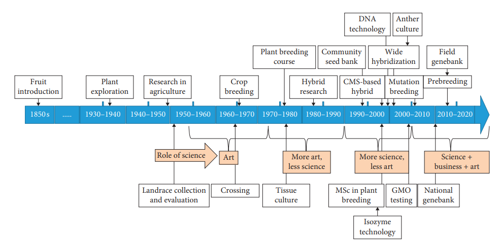
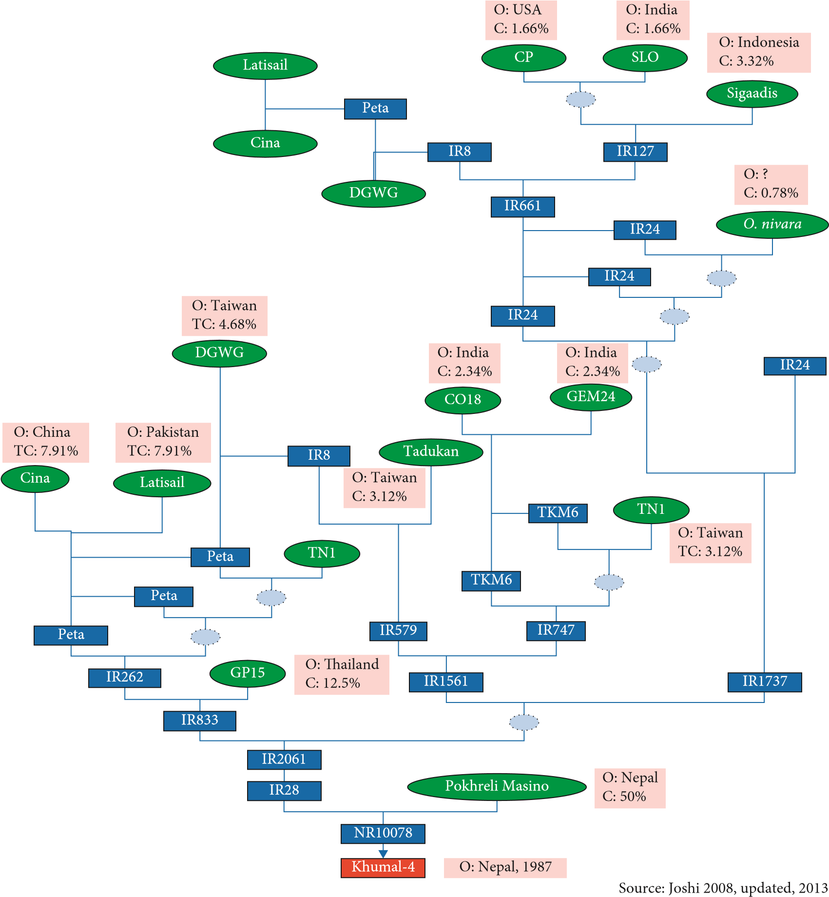

# Genetics: Introduction, history, scope and achievements

## History

### Spontaneous generation and fixity of species

- Initial belief was that there is no need of transfer of biological material between generations (for at least mid $18^{th}$ century).
- Leeuwenhoek (1632-1723) observed spontaneous appearance of flies from refuse (small infusoria "arising" from apparently clear infusions of hay)
- Redi's and Spallanzani's (1621-1697 and 1729-1799) experiment questioned this doctrine of "spontaneous generation". They showed fly larvae would not develop if adult flies are excluded from laying eggs on meat. 
- They sealed boiled the flasks and inferred on the non-appearance of tiny "animalcules" observed by Leeuwenhoek. However, they did left the possibility, citing their experiment of "tainted" (heated, in their sense of words) air, that whether unheated air could generate new organisms.
- Seventeenth and eighteenth centuries marked the beginnings of systematics. Linnaeus (1707-1778) mostly contributed to the knowledge.
- According to him, there was a "fixity of species".
- Two doctrines -- spontaneous generation and fixity of species -- were difficult to reconcile with each other.
- Both theories were put to rest by Pasteur (1822-1895) and by Tyndall (1820-1893) who showed that putrefaction of organic matter only occured under conditions that permitted solid particles to enter a nutrient culture. (These solid particles were identified to be microbes, later.)
- Consesus was that "every living thing from a living thing" ( _Omne vivum e vivo_).

### Preformationism and epigenesis

- Originally aristotle had proposed that an organism formed through sexual reproduction receives the "substance" of the female egg and a contribution of "form" by the male seminal fluid.
- The idea (generated by biologists during 17th and 18th century) that one of the sex cells, or gametes, either sperm or egg, contained within itself the entire organism in perfect miniature form ( _preform_ - ationism).
- Wolff advanced the idea that organisms develop from uniform embryonic tissues, idea of _epigenetics_, and later his successor von Baer (1792-1876) proposed the view that gradual transformation of increasingly specialized tissue make up an organism during development, and not the _de novo_ appearance of organs.

### Pangenesis and the history of acquired characters

- Charles Darwin (1809-1882) believed that very small, exact, but invisible copies of each body organ and component (gemmules) were transported by the bloodstream to the sex organs and there assembled into the gametes.
- This doctrine of "pangenesis" provided attraction for believers of evolution.
- According to this theory, the excess use or disuse of organ would alter its gemmules and consequently lead to a changed inheritance in the decendents -- inhertance of acquired characters take place.
- Most popular proponent was Lamarck (1744-1829).
- Work during later part of 19th century and beginning of 20th set the stage for characterization of source of heredity.

### Modern history of genetics

\small

- Developments in cytology in the 1800s had a strong influence on genetics. Building on the work of others, Matthias Jacob Schleiden (1804-1881) and Theodor Schwann (1810-1882) proposed the concept of the cell theory in 1839. Biologists began to examine cells to see how traits were transmitted in the course of cell division.
- Charles Darwin (1809-1882), one of the most influential biologists of the nineteenth century, put forth the theory of evolution through natural selection and published his ideas in On the Origin of Species in 1859.
- Walther Flemming (1843-1905) observed the division of chromosomes in 1879 and published a superb description of mitosis. By 1885, it was generally recognized that the nucleus contained the hereditary information.
- Near the close of the nineteenth century, August Weismann (1834-1914) finally laid to rest the notion of the inheritance of acquired characteristics. He cut off the tails of mice for 22 consecutive generations and showed that the tail length in descendants remained stubbornly long.
- Weismann proposed the germplasm theory, which holds that the cells in the reproductive organs carry a complete set of genetic information that is passed to the egg and sperm.

### Towards the end of 19th century and further

```{r genetics-history}
history <- readxl::read_xlsx("./data/history_genetics.xlsx", skip = 1)

history %>% 
  knitr::kable(caption = "History of modern genetics", booktabs = TRUE, longtable = TRUE) %>% 
  kableExtra::kable_styling(font_size = 8, position = "center", latex_options = "striped") %>% 
  kableExtra::column_spec(1:2, width = c("5em", "40em"))
```

## Scope

## Achievements

# Plant Breeding: Introduction, history, objectives and achievements

## Introduction

## History

- 9000 BC: First evidence of plant domestication in the hills above the Tigris river
- 3000 BC: Domestication of all important food crops in the Old World completed
- 1000 BC: Domestication of all important food crops in the New World completed
- 700 BC: Assyrians and Babylonians hand pollinate date palms
- 1694: Camerarius of Germany first to demonstrate sex in plants and suggested crossing as a method to obtain new plant types
- 1716: Mather of the USA observed natural crossing in maize
- 1717: Thomas Fairchild - Developed the first interspecific hybrid between sweet William and carnation species of Dianthus
- 1727: Vilmorin Company of France introduced the pedigree method of breeding
- 1753: Linnaeus published Species Plantarum. Binomial nomenclature born
- 1761-1766: Kölreuter of Germany demonstrated that hybrid offspring received traits from both parents and were intermediate in most traits and produced the first scientific hybrid using tobacco
- 1800: Knight, T.A. (English) - First used artificial hybridization in fruit crops
- 1840: John Le Couteur - Developed the concept of progeny test for individual plant selection in cereals
- 1847: "Reid's Yellow Dent" maize developed
- 1866: Mendel published his discoveries in Experiments on Plant Hybridization, cumulating in the formulation of laws of inheritance and discovery of unit factors (genes)
- 1899: Hopkins described the ear-to-row selection method of breeding in maize
- 1856: de Vilmorin (French biologist) - Further elaborated the concept of progeny test and used the same in sugar beet
- 1890: Rimpu (Sweden) - First made inheritance cross between bread wheat (Triticum aestivum) and rye (Secale cereale), which later on gave birth to triticale
- 1900: de Vries (Holland), Correns (Germany) and von Tschermak (Austria) - Rediscovered Mendel laws of inheritance independently
- 1900: Nilson, H. (Swedish) - Elaborated individual plant selection method
- 1903: Chromosome theory of inheritance by Sutton 1903
- 1903: Johannsen, W.L. - Developed the concept of pure line
- 1904-1905: Nilsson-Ehle proposed the multiple-factor explanation for inheritance of colour in wheat pericarp
- 1905: Linkage theory by Bateson and Punnet
- 1908: Shull, G.H. (USA) and East, E.M. (USA) - Proposed overdominance hypothesis independently working with maize
- 1908: Davenport, C.B.: First proposed dominance hypothesis of heterosis
- 1908-1909: Hardy of England and Weinberg of Germany developed the law of equilibrium of populations
- 1908-1910: East published his work on inbreeding
- 1909: Shull conducted extensive research to develop inbreds to produce hybrids
- 1910: Chromosome theory of inheritance by Morgan
- 1910: Bruce, A.B.; Keable, F.; and Pellew, C. - Elaborated the dominance hypothesis of heterosis proposed by Davenport
- 1913: First ever linkage map created by Sturtevant
- 1914: Shull, G.H. - First used the term heterosis for hybrid vigour
- 1917: Donald Forsha Jones invented the double-cross method of hybrid seed production, which helped produce the first commercial hybrid corn in the 1920s. Jones developed first commercial hybrid maize
- 1919: Hays, H.K. and Garber, R.J. - Gave initial idea about recurrent selection. They first suggested the use of synthetic varieties for commercial cultivation in maize
- 1920: East, E.M. and Jones, D.F. also gave initial idea about recurrent selection
- 1925: East, E.M. and Mangelsdorf, A.J. - First discovered the gametophytic system of self- incompatibility in Nicotiana sanderae
- 1926 Pioneer Hi-Bred Corn Company established as the first seed company
- 1926: Vavilov, N.I. - Identified eight main centres and three sub-centres of crop diversity. He also developed concept of parallel series of variation or law of homologous series of variation
- 1928: Stadler, L.J. (USA) - First used X-rays for induction of mutations
- 1934: Dustin discovered colchicines
- 1935: Vavilov published The Scientific Basis of Plant Breeding
- 1936: East, E.M. - Supported overdominance hypothesis of heterosis proposed by East and Shull in 1908
- 1939: Goulden, C.H. - First suggested the use of single-seed descent method for advancing segregating generations of self-pollinating crops
- 1940: Jenkins, M.T. - Described the procedure of recurrent selection
- 1940: Harlan used the bulk breeding selection method in breeding
- 1941: One gene encodes on protein by Beadle and Tatum
- 1944: Avery, MacLeod and McCarty discovered DNA is hereditary material
- 1945: Hull proposed recurrent selection method of breeding
- 1945: Hull, F.H. - Coined the terms recurrent selection and overdominance working with maize
- 1950: Hughes and Babcock - First discovered sporophytic system of self-incompatibility in Crepis foetida
- 1950: McClintock discovered the Ac-Ds system of transposable elements
- 1952: Jensen, N.F. - First suggested the use of multilines in oats
- 1953: Borlaug, N.E. - First outlined the method of developing multilines in wheat
- 1953: Watson, Crick and Wilkins proposed a model for DNA structure
- 1962: Murashige-Skoog developed the MS media in 1962 containing nutrition factors that allowed the in vitro growth of many tissue types
- 1964: Borlaug, N.E. - Developed high-yielding semi-dwarf varieties of wheat which resulted in Green Revolution
- 1965: Grafius, J.E. - First applied single-seed descent (SSD) method in oats
- 1970: Borlaug received Nobel Prize for the Green Revolution
- 1973: Paul Berg, Stanley Cohen and Herbert Boyer introduced the recombinant DNA technology
- 1976: Yuan Longping et al. - Developed the world's first rice hybrid (CMS based) for commercial cultivation in China
- 1983: Beckmann and Soller - RFLPs for genome-wide QTL detection and breeding
- 1987: Monsanto - Developed world's transgenic cotton plant in the USA
- 1964: Maheshwari and Guha - Produced haploid plant in vitro from pollen grain
- 1991: ICRISAT - Developed the world's first pigeon pea hybrid (ICPH 8) for commercial cultivation in India
- 1994: "FlavrSavr" tomato developed as first genetically modified food produced for the market
- 1995: Bt corn developed
- 1996: Roundup Ready(R) soybean introduced
- 1998: Potatoes, genetically engineered by Charles Arntzen and Hugh Mason, are used in the first ever clinical trial of a genetically engineered food to deliver a pharmaceutical. The trial determines the safety and efficacy of an edible vaccine
- 1999: Andrew Hamilton and David Baulcombe discover a short antisense RNA that can induce gene silencing
- 2000: Arabidopsis genome sequenced by Arabidopsis Genome Initiative
- 2000: Tasios Melis and Liping Zhang of UC Berkeley along with Maria Ghiardi and Marc Forestier of the National Renewable Energy Laboratory discover a metabolic "switch" in algae that allows the plant to produce hydrogen gas. The finding has the potential to create a commercial source of hydrogen gas produced by photosynthesis
- 2001: Meuwissen et al. - Genomic selection proposed
- 2001: Ingo Potrykus and Peter Beyer succeed in developing "golden rice", a modified rice plant yellowish in colour that contains beta-carotene, a building block of vitamin A. The crop could help prevent blindness in malnourished children. However, a lack of awareness concerning GMOs curtails production of the crop for over a decade
- 2002: Production of golden rice (through genetic engineering) that can biosynthesize beta- carotene, a precursor of vitamin A
- 2002: Rice genome sequenced by the International Rice Genome Sequencing Project
- 2003: Researchers at Duke, New York University, and the University of Arizona develop an Arabidopsis root gene expression map
- 2004: Roundup Ready(R) wheat developed
- 2005: Aaron Liepman and Kenneth Keegstra characterize enzymes responsible for synthesizing fibrous carbohydrates that make up plant cell walls. The work enables development of plants that provide increased nutrition, cheaper food additives and easily digestible animal feed
- 2005: US Postal Service honours plant genetics pioneer and Nobel Prize winner Barbara McClintock with a postage stamp. The International Rice Genome Sequencing Project publishes DNA blueprint for the crop in Nature. The final "map" reveals the location and sequence of more than 37,500 protein-encoding genes among 389 million base pairs of DNA
- 2005: The International Rice Genome Sequencing Project publishes DNA blueprint for rice. In a consortium led by the University of California, Davis initiates research to advance technology that rapidly identifies genes that may produce higher-quality wheat
- 2006: Pamela Ronald, Keong Xu, Takeshi Fukao, Abdelbagi Ismail and Julia Bailey-Serres identify a gene in rice that renders the crop tolerant to water submergence
- 2006: X. Zhang and colleagues describe the first genome-wide high-density methylation map of an entire genome using Arabidopsis thaliana
- 2006: Clone from Wild Wheat Alters Content in the Grain. Researchers clone a gene from wild wheat that increases the protein, zinc and iron content in the grain
- 2007: Nanotechnology Penetrates Plant Cell Walls. Kan Wang, Victor Lin, Brian Trewyn and Francois Torney demonstrate the first use of nanotechnology to penetrate plant cell walls and simultaneously deliver a gene and a chemical that triggers its expression with controlled precision
- 2008: iPlant forms, the first national cyber infrastructure centre dedicated to tackling global "grand challenge" questions in plant biology. University of Arizona researchers led by Richard Jorgensen initiate the effort. Supported by NSF, iPlant aims to identify problems in the plant sciences that could benefit from cyber infrastructure and develop methods to coordinate delivery of hardware and software to solve those problems
- 2008: The BioCassava - A Day's Worth of Nutrition in a Single Meal. The BioCassava Plus project genetically modifies the cassava plant to fortify it with enough vitamins, minerals and protein to provide a day’s worth of nutrition in a single meal
- 2008: Next-generation sequencing (NGS) by Schuster
- 2009: The corn genome published by a consortium led by Richard Wilson. The maize sequence contains more than twice as many genes as the human genome2009
- 2011: Over 1 million farmers plant Sub1 rice. The new variety could increase food security for 70 million of the world’s poorest people
- 2012: Tomato genome published
- 2012: Draft genome of pigeon pea ( _Cajanus cajan_) published

### Crop improvement efforts of Nepal in recent past

- During 1990-2014, production of potato, sugarcane, wheat, maize and rice increased by 319.4%, 235.5%, 122.3%, 90.1% and 48.9%, respectively.
- Agricultural research and breeding works initiated since 1950 and 1951 respectively. During latter, selection of crops with desired characteristics was practiced.
- Systematic research in major cereals started from 1972 (Commodity programs were launched for Rice, wheat, maize, sugarcane, potato)
- First breeder of Nepal, Netra Bahadur Basnyat introduced rice genotypes from Japan early in 1951. This followed a series of introduction of rice germplasm from India as well as evaluation (in Parwanipur agriculture station) and release as first variety. Simple mass selection was practiced for recommending CH-45 rice variety in 1959 and Lerma-52 in 1960.
- Rice breeding began with the introduction of indica type semi-dwarf Taiwanese varieties in Terai and intermediate types for Kathmandu valley.
- First successful attempts on hybridization was made by Gopal R. Rajbhandary in Potato during 1964.
- In early days (upto 1985), major breeding objective was to increase yield of main stable crops i.e. rice, wheat and maize. Later, it extended to other crops.
- In mid period (1985-2005), priority was given to developing biotic stresses, mainly disease resistant variety, followed by yield. Rice blast and wheat rust were the main diseases in the country from very beginning to current period of breeding history. 
- Later between 2005 and 2015, abiotic stresses mainly drought and quality aspects got priority in the breeding programs. 
- Majority breeding programs focused on screening the introduced germplasm, and genetics of specific traits in the local germplasm were not studied.
- Agriculture Botany Division started the preliminary plant breeding works mainly on rice, wheat and maize since 1966.
- Extensive plant breeding started after the establishment of five commodities (rice, wheat, maize, potato and sugarcane) research programs in 1972.
- Year 1966 saw improvements in field evaluation of pipeline genotypes. CVT, IET and observation nurseries were established in several locations for various cereal crops.
- First attempts on crossing of Rice and Wheat were made during 1968 by breeders.
- Tissue culture technique was first demonstrated in 1976 at National Herbarium and Plant Laboratories.
- Maintenance breeding works of Rice, wheat and maize were started in 1980s at NRRP, NWRP and NMRP respectively.
- Hybrid were first introduced for commercial cultivation of vegetables and maize by private sector during 1985. Prospects of hybrid development in maize started being explored since 1988 at NMRP, Rampur.
- Community engagement in plant breeding endeavor intensified between 1993 and 1996, wherein concepts of PPB, Community seed bank and PVS was being put into practice.
- Heterosis breeding in vegetable (commercial hybrid development) in tomato by Kedar Budathowki in 1998.
- Application of CMS lines in development of hybrids was first practiced by Bal K. Joshi during 1999.
- In 2000, application of DNA marker (SSR) in Rice for rapid characterization of genotypes was demonstrated in ABD.
- Wide hybridization $\longrightarrow$ Rice during 2001.
- In 2002 PCR based diagnosis protocol were developed for Citrus HLB detection at NAST and during 2005 SQCC started GMO testing.
- National genebank was established in 2010, starting with germplasm collection and preservation of cereals. Later during 2012/13 concept of field genebanks and DNA and tissue banks were introduced for various other crops.

- More than 100 organizations are currently involved in breeding activities in Nepal:
  - NARC, NAST (1982), Li-BIRD (1995), CEAPRED (1991), SEAN (1989)
- CIMMYT has been working since 1970 and IRRI started collaboration in Nepal since 1985.
- Universities:
  - Established: IAAS, TU (1972); Department of Plant Breeding and Genetics, AFU (2010)
  - HICAST, PU (2000)
  - AFU (2010)
  - IAAS, Rampur started degree course on plant breeding since 1998.

- Before 2005, varietal breeding programs laid focus on wider adaptability of a test genotype without due regard to evolutionary breeding. Current trend is exactly opposite, due to recognition of diversity in climate and geography, needs of the farmers, and several other factors.
- Among three different breeding methods, namely, conventional, participatory, and modern plant breeding, conventional breeding dominates institutional research. 
- Introduction, mass selection, heterosis breeding, and maintenance breeding are practiced in Nepal for both self-pollinated and cross-pollinated crops. Mutation breeding, back crossing, pure line selection, bulk method, cultivars mixture, single seed descent, and pedigree method have been practised in self pollinated crops, while recurrent selection, synthetic variety, and population improvement are conducted out in cross pollinated crops. For vegetatively reproduced crops, different methods such as introduction, selection through clonal, and heterosis breeding are practiced.
- Shuttle breeding and participatory plant breeding are also practiced in Nepal.

```{r plant-breeding-timeline, out.width="98%", fig.cap="History of plant breeding works in Nepal", fig.pos = "H"}

```

## Objectives

### Broad objectives

1. Yield and stability of yield of economic parts of plants
  - Cereal $\longrightarrow$ grain size
  - Tomato $\longrightarrow$ fruit size
  - Cotton $\longrightarrow$ fiber quantity
  - Oil crops $\longrightarrow$ oil content
  - Carrot $\longrightarrow$ root
2. Quality of product
  - Milling and baking $\longrightarrow$ wheat
  - Protein content $\longrightarrow$ legumes
  - Starch content $\longrightarrow$ potato
  - Aroma and taste $\longrightarrow$ rice
  - Stronger, longer and fine fiber $\longrightarrow$ cotton
  - Sugar content $\longrightarrow$ sugarcane
  - Nicotine content $\longrightarrow$ tobaccoo
3. Efficiency of production
  - Determinate growth habit $\longrightarrow$ tomato, pulses
4. Conservation of natural resources
  - Biological nitrogen fixation in non-legumes
  - Deep root system for erosion check

### Specific objectives

- High yield $\longrightarrow$ hybrid varieties like maize
- Plant height, number of branches, number of pods per branch and number of grains per pod $\longrightarrow$ legumes
- Number of tillers per plant, spike length, number of grains per spike $\longrightarrow$ rice
- Shorter maturity duration
- Synchronous maturity $\longrightarrow$ legumes
- Low shattering $\longrightarrow$ legumes

## Achievements

```{r rice-variety-development}
readr::read_csv("./data/rice_varieties_from_landraces.csv", show_col_types = FALSE) %>% 
  knitr::kable(format = "latex", caption = "Rice varieties from landraces", booktabs = TRUE, align = "l") %>% 
  kableExtra::kable_styling(latex_options = c("striped", "HOLD_position")) %>% 
  kableExtra::column_spec(column = 1:4, width = c("6em", "16em", "8em", "10em"))
```

```{r rice-pureline-variety-development}
readr::read_csv("./data/rice_varieties_pureline_from_landraces.csv", show_col_types = FALSE) %>% 
  knitr::kable(format = "latex", caption = "Rice varieties (pureline) from landraces", booktabs = TRUE, longtable = TRUE, align = "l") %>% 
  kableExtra::kable_styling(latex_options = c("striped", "HOLD_position")) %>% 
  kableExtra::column_spec(column = 1:5, width = c("2em", "6em", "8em", "8em", "10em"))
```

```{r khumal-4-development, out.width="98%", fig.cap="Development of khumal-4 rice variety", fig.pos="H"}

```

```{r maize-national-hybrids}
readxl::read_xlsx("./data/maize_hybrids_released_registered.xlsx") %>% 
  knitr::kable(format = "latex", caption = "Maize hybrids released or registered in Nepal", booktabs = TRUE, longtable = TRUE, align = "l") %>% 
  kableExtra::kable_styling(latex_options = c("striped", "HOLD_position")) %>% 
  kableExtra::column_spec(column = 1:7, width = c("1em", "5em", "5em", "6em", "6em", "6em", "12em"))
```

### Biofortication

Essential mineral micronutrients are a prerequisite to maintain metabolism in all living organisms, and man obtains these from his diet. But, wheat, rice and maize as staple grains contain suboptimal quantities of micronutrients, especially iron (Fe) and zinc (Zn). However smaller in quantities they are, most of this is removed by milling leading to micronutrient deficiency. Estimates of WHO point that nearly 25% of the world population has anaemia. Inadequate Zn intake and Zn deficiency faced by 17.3% of people lead to nearly 433,000 deaths among children aged below 5 years. Also, vitamin A deficiency (VAD) is yet another serious form of malnutrition causing blindness while weakening the body's immune system causing morbidity and mortality.

Quantity of vitamins and minerals can be increased through biofortification, achieved by means of transgenic techniques. Rice was genetically engineered to produce beta-carotene, a precursor of vitamin A, that finally culminated in the derivation of golden rice. Rice was later biofortified with lysine. Chinese researchers developed a gene-stacking approach capable of delivering many genes at once for rice endosperm to produce high levels of anthocyanin. Purple endosperm holds potential for reducing the risk of certain cancers, cardiovascular disease, diabetes and other chronic disorders. China developed a highly efficient "TransGene Stacking II" that can assemble a large number of genes into a single vector for plant transformation. This system can transform up to eight anthocyanin pathway genes in the endosperm of the japonica and indica rice varieties. This system could provide a versatile toolkit for transgene stacking. The toolkit possesses a huge potential for synthetic biology (redesigning of existing biological systems).
