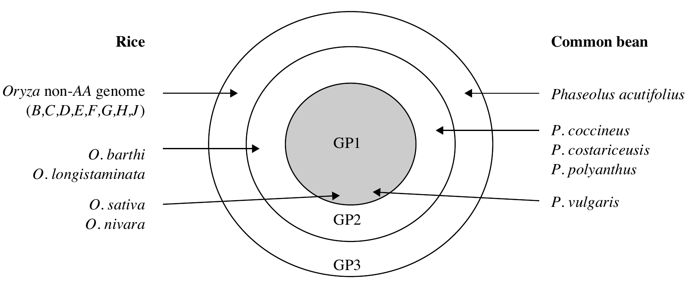

# Domestication, origin, germplasm types, introduction, conservation, acclimatization and regulation

## Domestication

For many of the more widely grown food crops, domestication resulted in evolutionary changes making them genetically distinct from their closest wild relatives today, and most became dependent on humans for reproduction (Harlan, 1992; Simmonds and Smartt, 1999).

Domestication seems likely to have been the result of indirect selection and unintentional direct selection (e.g. when farmers select for large seed size or brittle rachis as a result of their seed collection behaviour; Harlan, 1992), and perhaps some intentional selection for evolutionary change. However, it is very difficult or impossible to determine the type of selection that resulted in past crop evolution. Allard argue of direct, intentional selection expressing the view that early farmers were competent biologists. In contrast, Simmonds and Smartt emphasize indirect selection.

Similar to studies based on archaeological data, results of molecular analyses support the hypothesis that farmers' selection has been successful in achieving evolutionary change for traits in the 'domestication syndrome' that might be indirectly or unintentionally favoured because of agronomic superiority as well as other preferences. For example, three major genes involved in starch metabolism in maize were found to have unusually low genetic diversity compared with its closest wild relative (teosinte, _Zea mays_ subsp. _parviglumis_), which is strong evidence of selection for specific processing and culinary qualities important for the primary manner in which maize has been consumed in its regions of origin and diversity.

Similarly, it appears that strong directional selection for sticky, glutinous grain quality resulted in a selective sweep affecting an area over 250 kb long that includes the locus coding for this quality (low amylase production) and other linked loci. The presence of this sweep distinguishes the sticky rice favoured by upland northeast Asian peoples from the non-glutinous rice varieties used by other Asian groups, and presumably would be among their fundamental choice criteria, perhaps as an adaptation for eating with chopsticks.

Increasing evidence for a number of crops suggests that domestication could have occurred over short periods relative to the ~12 000 years that crop plants have been cultivated (Gepts, 2004). Domestication syndrome traits often appear to be determined by a small number of genes with large effects, suggesting that domestication could proceed relatively rapidly. In common bean ( _Phaseolus vulgaris_ L.), control of the domestication syndrome involves genes that have a large effect (>25–30 percent) and account for a substantial part of the phenotypic variation observed (>40–50 percent) (Koinange, Singh and Gepts, 1996).

Domestication in sexually propagated crops may have resulted in increased autogamy and therefore homozygosity, expressed phenotypically in greater trueness to type in a population over generations. In contrast, some vegetative propagation may have selected for heterozygosity (via heterosis) and therefore for allogamy, as contemporary evidence suggests for cassava.

Domestication generally decreased the fitness of plants in natural environments, and made them more dependent on humans and human-managed environments. The geographical spread of domesticated crops led to great varietal diversification as a result of the increase in diversity of natural and artificial selection pressures encountered, followed by choice among preferred populations.

### Domestication syndrome (Changes in plant species under domestication)

```{r domestication-syndrome, tidy=FALSE}
domestication_syndrome <- readxl::read_xlsx("./data/domestication_plant_introduction_and_acclimatization.xlsx", sheet = "domestication_syndrome")
# DT::datatable(
#   domestication_syndrome,
#   fillContainer = FALSE, options = list(pageLength = 6)
# ) %>% 
#   DT::formatStyle(columns = colnames(.), fontSize = "50%")

domestication_syndrome %>% 
  knitr::kable(booktabs = TRUE, caption = "Domestication syndrome in plants") %>% 
  kableExtra::kable_styling(font_size = 8, latex_options = "striped") %>% 
  kableExtra::column_spec(column = 1:2, width = c("16em", "28em"))
```

## Center of origin and estimated time of cultivation

```{r center-of-origin-cultivation}
tribble(
  ~"Crop",	~"Length of time domesticated (years)",	~"Possible region of origin",
  "Maize, Zea mays",	"7000",	"Mexico, Central America",
  "Rice, Oryza sativa",	"4500",	"Thailand, Southern China",
  "Wheat, Triticum spp.",	"8500",	"Syria, Jordan, Israel, Iraq",
  "Barley, Hordeum vulgare",	"9000",	"Syria, Jordan, Israel, Iraq",
  "Sorghum, Sorghum bicolor",	"8000",	"Equatorial Africa",
  "Soybean, Glycine max",	"2000",	"North China",
  "Oil palm, Elaeis guineensis",	"9000", "Central Africa",
  "Coconut palm, Cocos nucifera",	"100", "Southern Asia",
  "Rapeseed, Brassica napus",	"500",	"Mediterranean Europe",
  "Sunflower, Helianthus annus",	"3000",	"Western United States",
  "Beans, Phaseolus spp",	"7000",	"Centra America, Mexico",
  "Lentil, Lens culinaris",	"7000",	"Syria, Jordan, Israel, Iraq",
  "Peas, Pisum sativum",	"9000",	"Syria, Jordan, Israel, Iraq",
  "Potato, Solanum tuberosum",	"7000",	"Peru",
  "Cassava, Manihot esculenta",	"5000",	"Brazil, Mexico",
  "Sweet potato, Ipomoea batatas",	"6000",	"South Central America",
  "Sugar beet, Beta vulgaris",	"300",	"Mediterranean Europe",
  "Tomato, Lycopersicum esculentum",	"3000",	"Western South America",
  "Cabbage, Brassica oleracea",	"3000",	"Mediterranean Europe",
  "Onion, Allium spp.",	"4500",	"Iran, Afganistan, Pakistan",
  "Orange, Citrus sinensis",	"9000",	"South-east Asia",
  "Apple, Malus spp.",	"3000",	"Asia Minor, Central Asia",
  "Grape, Vitis spp.",	"7000",	"Eastern Asia",
  "Banana, Musa acuminata, M. balbisiana",	"4500",	"South-east Asia",
  "Cotton, Gossypium spp.",	"4500",	"Centra America, Brazil",
  "Coffee, Coffea spp.",	"500",	"West Ethiopia",
  "Rubber, Hevea brasiliensis",	"200",	"Brazil, Bolivia, Paraguay",
  "Alfalfa, Medicago sativa",	"4000",	"Iran, Northern Pakistan",
) %>% 
  knitr::kable(booktabs = TRUE, longtable = TRUE) %>% 
  kableExtra::kable_styling(position = "center", latex_options = "striped", font_size = 8) %>% 
  kableExtra::column_spec(column = 1:3, width = c("14em", "12em", "12em"))

```

### Crops of indian origin

```{r indian-main-center-origin}
indian_origin_crop <- bind_rows(
  read_csv("./data/agronomy_crops_origin_indian_main_center1.csv", col_names = c("Group", "Crops")) %>% 
    tidyr::fill(Group, .direction = "down"),
  read_csv("./data/agronomy_crops_origin_indian_main_center2.csv", col_names = c("Group", "Crops")) %>% 
    tidyr::fill(Group, .direction = "down"))

indian_origin_crop %>% 
  separate(col = "Crops", sep = ", ", into = c("Common name", "Scientific name")) %>% 
  mutate(`Scientific name` = paste0("\\textit{", `Scientific name`, "}")) %>% 
  knitr::kable(booktabs = TRUE, caption = "Crops with their origin in Indian Main center", escape = FALSE, longtable = TRUE) %>% 
  # kableExtra::kable_styling(font_size = 8, latex_options = "striped") %>%
  kableExtra::kable_styling(font_size = 8) %>% 
  kableExtra::column_spec(column = 1:3, width = c("8em", "8em", "15em")) %>% 
  kableExtra::collapse_rows(1:2, row_group_label_position = "stack")
```

```{r indian-indo-malayan-origin}
read_csv("./data/agronomy_crops_origin_indo_malayan_center.csv", col_names = c("Group", "Crops")) %>% 
  tidyr::fill(Group, .direction = "down") %>% 
  separate(col = "Crops", sep = ", ", into = c("Common name", "Scientific name")) %>% 
  mutate(`Scientific name` = paste0("\\textit{", `Scientific name`, "}")) %>% 
  knitr::kable(booktabs = TRUE, caption = "Crops with their origin in Indo-Malyan center", escape = FALSE, longtable = TRUE) %>% 
  # kableExtra::kable_styling(font_size = 8, latex_options = "striped") %>% 
  kableExtra::kable_styling(font_size = 8) %>% 
  kableExtra::column_spec(column = 1:3, width = c("8em", "8em", "15em")) %>% 
  kableExtra::collapse_rows(1:2, row_group_label_position = "stack")
```

```{r indian-central-asiatic-origin}
read_csv("./data/agronomy_crops_origin_central_asiatic_center.csv", col_names = c("Group", "Crops")) %>%
  tidyr::fill(Group, .direction = "down") %>%
  separate(col = "Crops", sep = ", ", into = c("Common name", "Scientific name")) %>%
  mutate(`Scientific name` = paste0("\\textit{", `Scientific name`, "}")) %>%
  knitr::kable(booktabs = TRUE, caption = "Crops with their origin in Central Asiatic center", escape = FALSE, longtable = TRUE) %>%
  # kableExtra::kable_styling(font_size = 8, latex_options = "striped") %>%
  kableExtra::kable_styling(font_size = 8) %>%
  kableExtra::column_spec(column = 1:3, width = c("6em", "8em", "15em")) %>%
  kableExtra::collapse_rows(1:2, row_group_label_position = "stack", longtable_clean_cut = FALSE)
```

## Gene pool concept

J.R. Harlan and J.M.J. de Wet proposed a categorization of gene pools of cultivated crops according to the feasibility of gene transfer or gene flow from those species to the crop species.

```{r gene-pools, fig.cap="Crop gene pools; A system proposed by Harlan", out.height="60%", out.width="0.7\\textwidth, keepaspectratio"}
# pdftools::pdf_convert("./../../references_plb/George Acquaah(auth.) - Principles of Plant Genetics and Breeding, Second Edition-Wiley-Blackwell (2012).pdf", format = "png", pages = 211, filenames = "./images/crop_gene_pools.png", dpi = 300)

```

A spectrum of different vegetables could be derived from the same wild progenitor. Brassica oleracea stands as an excellent example for this biological process. Wild progenitor is a weedy herb that grows on limestone in the Mediterranean region. Domestication of several distinct lineages of _B. oleracea_ produced several vegetable varieties or cultivar groups or subspecies ("ssp."): kale and collard greens (ssp. acephala), Chinese broccoli (ssp. alboglabra), red and green cabbages (ssp. capitata), savoy cabbage (ssp. sabauda), kohlrabi (ssp. gongylodes), Brussels sprouts (ssp. gemmifera), broccoli (ssp. italica) and cauliflower (ssp. botrytis). Though these varieties look dramatically different, they are considered the same species since they are all inter-fertile, capable of mating with one another and producing fertile offspring.

### Types of gene pool

- *Primary gene pool (GP1)* 
  - GP1 consists of biological species that can be intercrossed easily (interfertile) without any problems with fertility of the progeny. That is, there is no restriction to gene exchange between members of the group. This group may contain both cultivated and wild progenitors of the species.

- *Secondary gene pool (GP2)* 
  - Members of this gene pool include both cultivated and wild relatives of the crop species. They are more distantly related and have crossability problems. Nonetheless, crossing produces hybrids and derivatives that are sufficiently fertile to allow gene flow. GP2 species can cross with those in GP1, with some fertility of the F1, but more difficulty with success.
  - Example: _Glycine max_ x _Glycine tomentolla_
  
- *Tertiary gene pool (GP3)*
  - GP3 involves the outer limits of potential genetic resources. Gene transfer by hybridization between GP1 and GP3 is very problematic, resulting in lethality, sterility, and other abnormalities. To exploit germplasm from distant relatives, tools such as embryo rescue and bridge crossing may be used to nurture an embryo from a wide cross to a full plant and to obtain fertile plants.

## Vavilov concept

- Nikolai I. Vavilov (1887-1942), the Russian botanist and plant breeder, demonstrated the existence of 'centres of origin' of cultivated plants (more correctly named today as 'centres of diversity'), in which can be found the highest level of genetic variability of a species. This variability, which arises in nature by mutation spontaneous hybridization, introgression and changes in chromosome form and number, provides the means by which adaptation to heterogenous environments can occur.

- It allows the breeder to identify sources of variation for specific characteristics. The extension of this principle to related species was formulated by Vavilov in his 'law of homologous series of variation'. This law allows the prediction of the appearance of a given type of mutation in a plant species when such a type has been found in another species phylogenetically related to the first. As a result of his studies Vavilov defined plant breeding as 'plant evolution directed by man'. He recognized that in a breeding programme, by growing variable populations in conditions favouring the expression of the characters, selection may be facilitated. Also, by creating variability in a parallel way to nature the breeder exploits genetical methods. Plant breeding can thus also be defined as 'applied plant genetics'.

## Germplasm resources

- Germplasm refers to the genetic material that can be used to perpetuate a species or population. It may be defined as the sum total heriditary material (all allele of all genes) present in a crop species and its wild relatives.
- Germplasm may include seed or other plant organs such as leaf, stem, pollen, or cultured cells, which could be grown into mature plants.
- Germplasm provides the material used to initiate a breeding program
- Sometimes only germplasm screening and evaluation is practiced for introduction of improved variety in a region
- Certain institutional sets-ups such as gene banks are charged with the responsibility of assembling, cataloguing, storing and managing large number of germplasm. This allows for quick retrieval.

### Components

1. Landraces

- Are primitive varieties that evolved over centuries through both natural and artificial selection but without systematic plant breeding methods.
- They are storehouse of genetic variability, souces of valuabel genes and adapted to the local soil and climatic condition.
- Have low but stable yields.

2. Obsolete varieties

- Developed by systematic breeding efforts, once commercially cultivated but are not longer grown.

3. Varieties in cultivation

- Developed by systematic breeding, generally homozygous and genetically variable.
- Source of genes like that for yield and quality, can be introduced into a new area and be directly released for cultivation.

4. Breeding lines

- They are lines/populations developed in breeding programs which contain valuable gene combinations.
- Includes homozygous lines, mutant lines, lines derived from biotechnology programs and transgenic lines.
- These lines usually have narrow genetic bases.

5. Special genetic stocks

- Includes those carrying gene mutations, chromosomal aberrations and marker genes, etc.
- These are useful in genetic analysis and in breeding programs alike.
- Obtained naturally or artificially.

6. Wild forms and wild relatives

- Wild forms are the wild species from which crop species were directly derived. They are easy to cross with concerned crop species.
- Wild relatives are all other species which are related to the crop species by descent during their evolution. They are difficult to cross with concerned crops than wild forms.
- Both groups are source of valuable genes for insect and disease resistance, tolerance to abiotic stresses like drought, cold, salinity and even quality traits and yield.

### Germplasm resources of Nepal

- About 30,000 landraces of 250 cultivated crops.
- Indigenous crops and their landraces have significant contribution to overall food secure being of rural Nepal, globally recognized landraces include "Bhate Phaper" of tartary buckwheat, "Jumli Marshi" and "Anadi" of rice and "Akabare" of chili pepper. 
- Only about 20% of notified germplasm in Nepal have origin in the country itself.
- Pedigree analysis reveals that 13 landraces originated in 8 different countries were used to develop Khumal-4 rice variety.
- A total of 47 ancestors (landraces) originated in 12 different countries were used to develop 20 mid and high hill rice cultivars and a total of 35 ancestors originated in 11 different countries were used to develop 28 rice cultivars for terai region by 2016.

```{r landraces-unique-features}
landraces <- tribble(~"Crop", ~"Local name", ~"Unique character", 
        "Buckwheat", "Bhate pahper", "Loose husk", 
        "Buckwheat", "Kagpani phaper", "Highest rutin content", 
        "Cauliflower", "Garve cauli", "Very large head, perinniality gene, vegetatively propagated", 
        "Chilly" ,"Akabare khursani", "Medicinal value, very spicy and does cause inflammatory of stomach", 
        "Chilly", "Jire khursani", "All year round fruiting", 
        "Finger millet", "Dailekh local", "Higher yielder and adapted to low fertility soils", 
        "Maize", "Pani makkia", "Tolerant to water logged conditions", 
        "Sarsoon", "Gorlikharka", "Highest oil content", 
        "Wheat", "Dabdabe local", "For low fertility and moisture deficient land")

readxl::read_xlsx("./data/rice_varieties_unique_characters.xlsx") %>% 
  mutate(Crop = "Rice") %>% 
  select(-SN) %>% 
  rename(`Local name` = Genotypes) %>% 
  relocate(Crop, .before = 1) %>%
  full_join(landraces, by = c("Crop", "Local name", "Unique character")) %>% 
  arrange(Crop, `Local name`) %>% 
  kableExtra::kbl(booktabs = TRUE, caption = "Some landraces of cultivated crop unique to Nepal", format = "latex", align = "l", longtable = TRUE) %>%
  kableExtra::kable_styling(font_size = 8, repeat_header_continued = TRUE) %>% # do not use use latex_options = "striped" together with collapse_rows, it has unintended results.
  kableExtra::column_spec(column = 2:3, width = c("10em", "18em")) %>% # specifying width for the column that is being collapsed! in a single column_spec statement produces latex error!
  kableExtra::column_spec(column = 1, width = "8em") %>% # interestingly, specifying a separate column_spec for the row that is being collapsed works well. also collapsing a row with long cell contents borks the vertical alignment (valign). so for long texts/labels better stack the row_group_label_position.
  kableExtra::collapse_rows(columns = 1, latex_hline = "full", valign = "middle")

```


## Germplasm/plant introduction

The plant breeder may import new, unadapted genotypes from outside the production region, usually from another country (called plant introductions). These new materials may be evaluated and adapted to new production regions as new cultivars, or used as parents for crossing in breeding projects.

- Primary Introduction
  - When the introduced variety is well adapted to the new environment, it is released for commercial cultivating without any alteration in the original genotype; this constitutes primary introduction. It is less common, particularly in countries having well organized crop improvement programmes.

- Secondary introduction
  - The introduced variety may be subject to selection in order to isolate a superior variety. Alternatively, it may be hybridized with local varieties to transfer one or few characters from these varieties to the local ones. Such introduction constitutes secondary introduction. It is much common than primary introduction.

**Purpose of plant introduction**

1. To obtain entirely new crop species
2. To serve as new varieties
3. For use in crop improvement programmes
4. To introgress variability to existing genetic materials
5. For scientific studies
6. To augment aesthetics
7. For germplasm collection and comparison

**Procedure for plant introduction**

1. Procurement
2. Quarantine
3. Cataloguing
4. Evaluation
6. Multiplication and distribution
7. Utilization

### Plant export and import

Plant germplasm can be moved in the form of as true seed, in vitro cultures or vegetative material. True seed is the best material to be transported, as they pose minimum threat with pests and diseases. In vitro material must undergo quarantine procedures. Such quarantine procedures must be amply documented as germplasm health statement.

The import of germplasm needs to complete the following formalities:

- Make a formal request to donor organization/country through NPPO (National Plant Protection Organization).
- Generate import conditions through Pest Risk Analysis (PRA).
- NPPO or the organization responsible to screen the plant material at the port of entry shall inform the donor country (through the institute importing the material) the utility of the material being imported.
- The donor country NPPO evaluates conditions of the importing country and confirms compliance of norms.
- If import conditions are met, NPPO of the donor country prepares a phytosanitary certificate.
- The recipient country issues a Plant Import Permit (PIP). While importing a material, PIP and phytosanitary certificate of the donor country must accompany the material.
- Materials with "Q label" are subjected to quarantine formalities.
- There are countries that do not allow transgenic material. If allowed, such materials are subjected for the verification of the National Biosafety Committee.
- Plant breeders' rights are to be protected while importing any material.
- If the material is imported for cultivation directly, then such materials must undergo formalities of variety release system.

The export of germplasm needs to complete the following formalities:

- The donor country provides import conditions of recipient country.
- Some species that are restricted from export are protected plant varieties as per CITES (Convention on International Trade in Endangered Species of Wild Fauna and Flora, Geneva).
- NPPO (National Plant Protection Organization) of the donor country verifies compliance to the import conditions and prepare phytosanitary certificates.
- Under exceptional circumstances, Material Transfer Agreement (MTA) may be required between exporting and importing institutions.

## Germplasm collection

Collecting and organizing genetic diversity as a conservation strategy emerged in the 1960s and now plays an important role in ensuring the world's collective food security. Seed saving organizations have helped secure over 100,000 seeds during wartime in Syria, preserve 13 million seeds from over 70 species of native trees in the United Kingdom, and contribute to over US$77 million in pastoral agriculture revenue in New Zealand. As the climate crisis continues, seed preservation may also be critical in research and innovation to help farmers adapt to changing conditions.

According to FAO, there are more than 1,750 ex situ seed banks across the world–both international and local–that preserve over 7 million samples of seeds, cuttings, or genetic material. Following comprise a subset list of selected seed saving organizations working to promote seed diversity through seed banks, exchange networks, and educational programs.

- ASEED Europe, Netherlands
- Australian PlantBank
- Cherokee National Seed Bank, United States
- Crop Trust, Germany: Through its Crop Diversity Endowment Fund, the Crop Trust funds the world’s largest genebanks, including the Consultative Group for International Agriculture Research (CGIAR) genebank platform, Svalbard Global Seed Vault, and Seeds for Resilience–a project supporting five seed banks in Sub-Saharan Africa. 
- Federal Research Center All-Russian Institute of Plant Genetic Resources/VIR, Russia
- Hawai'i Public Seed Initiative, United States
- International Center for Tropical Agriculture (CIAT), Columbia
- Millennium Seed Bank at Wakehurst, England
- SeedChange, Canada
- Svalbard Global Seed Vault, Norway
- The Germplasm Bank of Wild Species, China
- The World Vegetable Center, Taiwan
- Vrihi, India: "Vrihi" is the Sanskrit word for "rice".

## Germplasm conservation

### Importance

(a) Preservation of genetic diversity of various strains and species is conservation. Such preserved accessions can be used in the future.
(b) The valuable genetic traits present in primitive plants will be lost unless such endangered types are conserved.
(c) In clonally multiplied species, the seeds are not feasible material to be conserved due to genetic heterogeneity. In this case, their genes are to be conserved.
(d) The preservation of roots and tubers is difficult because they lose viability. Also, they require larger space. Also, GMOs may be unstable. Such accessions are to be conserved carefully following special techniques.

### Types

#### In-situ conservation

In situ conservation of germplasm is conserving species in their natural environment through establishing biosphere reserves (or national parks/gene sanctuaries). This is accomplished by preserving land plants near natural habitat along with several wild relatives with genetic diversity. The in situ conservation is considered as a high-priority germplasm preservation programme. The limitations are as follows:
a. environmental hazards may endanger the preservations and
b. the cost of maintenance is very high.

#### Ex-situ conservation

Otherwise known as gene banking, this is a method for the preservation of both cultivated and wild. There are two types of gene banking: in vivo and in vitro. While in vivo gene banks preserve seeds, vegetative propagules, etc., in vitro gene banks preserve cell and tissues. For this, knowledge of sampling, regeneration, maintenance of gene pools, etc. are essential. The limitations are as follows:
a. viability of seeds is reduced or lost with passage of time;
b. seeds are susceptible to insect or pathogen attack, often leading to their destruction;
c. this approach is exclusively confined to seed propagating plants, and therefore, it is of no use for vegetatively propagated plants, e.g. potato, Ipomoea and Dioscorea; and
d. it is difficult to maintain clones through seed conservation.

### In-vitro germplasm preservation (Methods for Ex-situ conservation)

1. Germplasm can be preserved in vitro through cryopreservation, low-pressure storage and low-oxygen storage. In cryopreservation, the cells are preserved in a frozen state using solid carbon dioxide (at \SI{-79}{\celsius}), low temperature deep freezers (at \SI{-80}{\celsius}), vapor phase nitrogen (at \SI{-150}{\celsius}) and liquid nitrogen (at \SI{-196}{\celsius}).
Cells stay in completely inactive state. So, they can be conserved for long periods. Tissues like meristems, embryos, endosperms, ovules, seeds, cultured plant cells, protoplasts and callus are usually used for cryopreservation. Cryoprotectants are to be added during cryopreservation. They are DMSO (dimethyl sulfoxide), glycerol, ethylene, propylene, sucrose, mannose, glucose, etc. The damage caused by freezing and thawing will be prevented by cryoprotectants.

2. Germplasm conservation by cold storage is done at low and non-freezing temperature (\SIrange{1}{9}{\celsius}). Here, only growth of the tissue is slowed down. So, cold storage prevents cryogenic injuries. An example to this method is virus-free strawberry plants that can be preserved at 10 C for about 6 years. Grape plants can be preserved for 15 years at \SI{9}{\celsius}.

3. In low-pressure and low-oxygen storage, the atmospheric pressure and oxygen concentration are reduced. The lowered partial pressure reduces the in vitro growth of plants. Low oxygen concentration keeps partial pressure of oxygen below 50 mmHg (mmHg is a manometric unit of pressure) which reduces growth. Reduced availability of oxygen leads to reduced photosynthetic activity. This technique can be used in increasing the shelf life of fruits, vegetables and flowers.

#### DNA Banks or Gene Banks

Germplasm can also be conserved as DNA segments cloned in a suitable vector like cosmids, plasmids or YACs (yeast artificial chromosomes). This is sophisticated, technically demanding and expensive. Threatened species can thus be conserved. Till date, there are no cases where DNA banks are being used as a replacement to traditional method of conservation. However, due to small sample size, this technique has promising potential for the storage of genetic information.

It has become routine to extract DNA from the nuclei, mitochondria and chloroplasts. Derivatives like as RNA and cDNA are also being extracted. Technologies are available to allow all these to be stored quickly and at low cost in DNA banks as an insurance policy against loss of crop diversity. DNA storage allows genetic material for molecular applications. However, use of DNA in conservation is limited as whole plants cannot be directly reconstituted. The genetic material must be introduced through transgenic means. However, DNA banks have a potential future as new technologies develop day by day.

## Genetic erosion

- The gradual loss of variability from cultivated species and their wild relatives is called genetic erosion.
- Variability in nature have arisen over an extremely long period of time. If it is allowed to be lost, it would be impossible to create it again during a short period.

**Causes of genetic erosion**

- Replacement of genetically variable land races (local varieties) by improved, genetically uniform pure line and hybrid varieties.
- Crop management practices eliminating weedy form of crop species; selection against genetic diversity.
- Extended farming and grazing into forests (extinction of many wild relatives of crops)
- Development activities like construction of hydroelectric projects, roads, industrial areas, railways, buildings etc., have disrupted and displaced wild habitats.
- Introduction of a pervasive weedy species, or cultivated species may contribute to genetic erosion.

## Acclimatization

- Acclimatization is the reversible process by which an individual becomes adapted to a change in the environment, often involving temperature, moisture, food, often relating to seasonal climate changes. The process that leads to the adaptation of a variety, line or population to a new environment is known as acclimatization. Acclimatization is characterized by a faster multiplication of those genotypes -- adaptive fitness -- (present in the original population) that are better adapted to the new environment.

- Factors affecting extent of acclimatization:
  1. Mode of pollination
  2. The magnitude of genetic variability present in the original population
  3. The duration of life cycle of the crop
  4. Tendency to acquire and augment mutation
  5. Nature and intensity of environmental stresses

## GMOs: A debatable issue for Nepal

### Prevailing policies and legislations on GMO regulation

- Under "Development of a commercial and competitive farming system", National Agricultural Policy (2061 BS) briefly mentions about regulation of use of GMOs.
  - The production and use of hybrid seeds and improved breeds shall be encouraged, and the use of genetically-modified organism shall be regulated.
- Agricultural Development Strategy (2072/73-2091/92 BS) while setting forth strategies to deal with rising energy cost (Strategy 160), strengthening research-education-extension linkages (Strategy  307), implementing biodiversity policy (Strategy 348) have following clauses 
  - Increase efficiency of farming systems and their genetic materials
  - Strengthening of gene bank and genetic resource program for the use of Intellectual Property Rights.
  - Agriculture education institutions to play a role in academic research that promotes genetic enhancement and supports applied research through collaborative projects and research grants funded by NARF and other sources.
  - Develop regulation for the research and experimentation of Nepalese Biodiversity and Genetic Resources.
  - Restrict the import, production and use of Genetically Modified Organism (Seed, crops and livestocks) except for research to avoid negative impact on biodiversity, genetic resources, and human health.

- National Seed Policy (2056 BS, 1999 AD) (refer to the Chapter on Seed system in Nepal for a brief discussion of policy arrangements)
- Seed Regulations (2069 BS)
- Definition/explaination, regulation and policy guidelines on utilization of germplasm and genetic resources are largely well described in NAP, 2061 and ABDP, 2063 (refer to section on Germplasm conservation, access and utilization)

### Shortcomings

- GMOs/LMOs not explicitly defined.
- Technologies encompassing generation (rDNA, transgenesis, CRISPR-CAS, etc.) of GMOs/LMOs are not stated.
- Forms and derivatives of GMOs/LMOs that fit into or are different from such are not stated.
- ...

### Way forward

- Experience of other countries in use and regulation of genetically modified organisms should serve as point of reference, thus helping to make informed decisions.
- Biosafety reports should be extensively consulted and evaluated to form the basis for decision on whether or not to to introduce particular GM seeds, and how its controlled use may be permitted.
- Cultivation on GM non-food crops, like cotton, could bridge a safer transition towards adoption of this technology.
- ...

## National policy and legislation on germplasm conservation, access and utilization

### National Agro-biodiversity Policy

National Agro-biodiversity Policy (2063 BS), implemented in light of Nepal's commitment to Convention on Biological Diversity, 1992 and in coherence to National Agricultural Policy, 2061 for conservation, promotion and utilization of biological diversity defines following terms:

- Genetic material (Sum total of functional units of all flora, fauna and microbes existing within Nepal)
- Genetic resources (In-situ and ex-situ conserved genetic material as well as existing and potential forms of such genetic materials)
- In-situ
- Ex-situ
- Biological diversity (Diversity of aerial, terrestrial, acquatic, oceanic and other ecosystems of organisms; individual organism (plant, animal and microbe) components of such systems as well as relationship between such components. Includes species diversity, genetic diversity and ecosystem diversity)
- Agro-biodiversity (...includes abstract components affecting specific aspects of agro-biodiversity and socio-economic and cultural components, enlisted more extensively in Schedule-1)
- Agro-biodiversity register
- Access
- Utilization
- Farming community
- Sharing of benefit
- Equitable distribution
- Traditional knowledge
- Biological safety (Measures and methods in place to safeguard agricultural biodiversity, human, animal and plant health and safety and environmental threats against commercial and research use of infectious organism, Genetically Modified Organism or Living Modified Organism)
- Committee (Agricultural Biodiversity, National Conservation Committee)

Policy statement 3 and 4 are explicit about access, utilization, distribution of benefits derived from utilization, and sustainable conservation and promotion of agricultural biodiversity.

**Policy statement 3**: Judicious and equitable distribution system of benefits derived from access and utilization agricultural genetic resources

- Foreign institutions shall be granted access to agricultural genetic resources given that they have obtained permission from Nepal Government and have agree to perform in accordance to the prescribed terms notwithstanding that access to individuals shall not be granted.
- Permission shall not be required for the scientific studies and research of genetic resources and traditional knowledge at the national level. However, such Prior informed consent (PIC) is required in due regard to concerned organization and farming community.
- Equitable distribution of benefits derived from commercial use, intellectual property rights obligations of traditional and indigenous food and agricultural genetic resources, as well as ITK.
- Single door-system shall be implemented in registering, specification of ownership, access, andd utilization of benefits of food and agricultural genetic resources.

**Policy statement 4**: Sustainable agro-biodiversity conservation and promotion for fostering ecosystem balance

- Special emphasis on agro-biodiversity while appraising(accessing) environmental impact in implementation of development programs.
- Research and scientific study of infectious organisms, GMOs and LMOs (modified for food and agricultural purpose) shall require export and research study permissions.
- Control and prohibition of GMOs and their derivaties that have potential risks for negatively impacting biological diversity, environment and human health.
- Conduct scientific study, research and investigation of pollinators and other organisms providing agro-ecosystem services for deriving benefits from sustainable use of agro-ecosystem services.

**Schedule 1 (Working scope of agro-biodiversity)** enlists agricultural genetic resources as:

- Plant derived genetic resources (including fodder, pasture and tree species constituting inter-related component of farming system)
- Animal genetic resources
- Acquatic genetic resources
- Insect genetic resources
- Micro-organism genetic resources
- Wild relatives of cultivated and domesticated species

### National Agricultural Policy

Policy statement 4.4 on "Conservation, promotion and utilization of natural resources and the environment" of the National Agricultural Policy, 2061 envisions the following regarding conservation of biodiversity, including germplasm resources:

- Arrangement shall be made for gene banks and in-situ conservation shall be encouraged in order to conserve biodiversity. Participatory biodiversity parks shall be established in feasible areas.
- Bio-diversity shall be conserved, promoted and utilized and the agro-forestry system shall be developed in such a way as to improve the condition of degraded forests and natural reservoirs.

## Changing global climatic scenario and importance and direction of germplasm conservation and utilization
