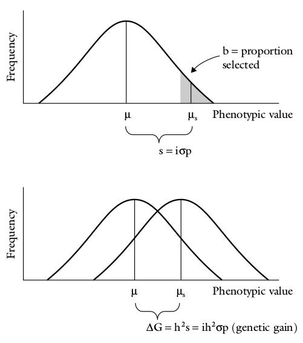

# Biometrics and statistical techniques

## Arithmetic mean and standard deviation

**Arithmetic mean**

It is the arithmetic average of a group of scores/observations. Mathematically,

$$
\mu = \frac{\sum_{i = 1}^N {x}}{N}
$$

Where,

- $\mu$ represents the population mean
- $\sum$ represents the sum
- $x$ represents individual scores/observations
- $N$ represents the number of scores in the distribution

The analogous expression for arithmetic mean of samples is,

$$
\bar{X} = \frac{\sum_{i = 1}^n{x}}{n}
$$
Where,

$\bar{X}$ represents sample mean.

Arithmetic mean is a better measure of central tendency whenever the observation do not contain the extreme values and ordinal data is not being used. It is affected by all every observation in the dataset thus accounting for all their weights, while the medium and a mode are only the positional indicators and frequency dependent concepts for describing a distribution.

**Standard deviation**

It is a measure of variation: the average difference between the scores in the distribution and the mean or central point of the distribution, or more precisely, the square root of the average squared deviation from the mean. Mathematically,

$$
\sigma = \sqrt{\frac{\sum_{i = 1}^N{(x_i - \mu)^2}}{N}}
$$
Where the term, $\frac{\sum_{i = 1}^N{|x_i - \mu|}}{N}$, is the average deviation.

Analogous to the population standard deviation is the formulation of sample standard deviation:

$$
\sigma = \sqrt{\frac{\sum_{i = 1}^n{(x_i - \mu)^2}}{n-1}}
$$

Standard deviation provides a measure of dispersion. The weights provided to the scores lying at the either side of the far ends of distribution is greater in standard deviation than that in average deviation. Hence, similar to the arithmetic mean, it is unaffected by quantile distribution of the data.

## Correlation

- The systematic interrelationship between the two continuous related variables say, X and Y is termed as correlation. When only two variables are involved, the correlation is called simple correlation. If more than two variables are involved, the correlation is said to be multiple correlation.
- When the variables move in the same direction, i.e., increase in one variable causes and increase in other variable and vice versa, such type of correlation is called positive/direct correlation. In general, grain yield of wheat and the number of grains per spike are positively correlated. 
- By analogy, negative correlation is said to occur when increase in one variable is followed by decrease in other. For example, grain yield of wheat and severity of disease in the field are negatively correlated.


### Karl pearson's coefficient of correlation (linear correlation)

### Correlation coefficient for bivariate frequency distribution

(Procedure for calculation detailed in Numerical problem 3)

## Regression

## Relationship between correlation coefficient and regression


## Using $\Large \chi^2$ test on monohybrid and dihybrid ratios

### Checking observation against expectation

- Often the question is whether the obtained results are close to an expected ratio, although it is not identical to.
- A statistical test ($\chi^2$) checks the observation against expectation.
- The general situation is one in which observed results are compared with those predicted by a hypothesis. 
- In a simple genetic example, suppose you have bred a plant that you hypothesize on the basis of a preceding analysis to be a heterozygote, A/a. 
- To test this hypothesis, you cross this heterozygote with a tester of genotype a/a and count the numbers of phenotypes with genotypes A/− and a/a in the progeny. Then, you must assess whether the numbers that you obtain constitute the expected 1 : 1 ratio. 
- If there is a close match, then the hypothesis is deemed consistent with the result, whereas if there is a poor match, the hypothesis is rejected.
- As part of this process, a judgment has to be made about whether the observed
numbers are close enough to those expected.
- The $\chi^2$ test is simply a way of quantifying the various deviations expected by chance if a hypothesis is true. 

### Probabilistic testing of data

We can model this idea with a barrelful of equal numbers of red and white marbles. If we blindly remove samples of 100 marbles, on the basis of chance we would expect samples to show small deviations such as 52 red : 48 white quite commonly and to show larger deviations such as 60 red : 40 white less commonly. Even 100 red marbles is a possible outcome, at a very low probability of $\left(\frac{1}{2}\right)^{100}$ . 

However, if any result is possible at some level of probability even if the hypothesis is true, how can we ever reject a hypothesis? A general scientific convention is that a hypothesis will be rejected as false if there is a probability of less than 5 percent of observing a deviation from expectations at least as large as the one actually observed. The implication is that, although results this far from expectations are expected 5 percent of the time even when the hypothesis is true, we will mistakenly reject the hypothesis in only 5 percent of cases and we are willing to take this chance of error.

**Numerical problem 1: Dihybrid testcross ratio**

Consider a general dihybrid testcross, in which it is not known if the genes are linked or not: A/a.B/b x a/a.b/b

If there is _no_ linkage, that is, the genes assort independently, we have seen that the following phenotypic proportions are expected in progeny:

```{r dihybrid-phenotypes-independent-assortment, fig.cap="Equal proportions of phenotype appearing from a test cross of F1 dihybrid with a recessive tester. "}
tribble(~"Phenotype", ~"Proportion", 
        "AB", 0.25,
        "Ab", 0.25,
        "aB", 0.25,
        "ab", 0.25) %>% 
  knitr::kable(booktabs = TRUE) %>% 
  kableExtra::kable_styling(position = "center", font_size = 8)
```

A cross of this type was made and the following phenotypes obtained in a progeny sample of 200.

```{r dihybrid-phenotypes-example-case}
tribble(~"Phenotype", ~"Count", 
        "AB", 60,
        "Ab", 37,
        "aB", 41,
        "ab", 62) %>% 
  knitr::kable(booktabs = TRUE) %>% 
  kableExtra::kable_styling(position = "center", font_size = 8)
```

$\longrightarrow$

- There is clearly a deviation from the prediction of no linkage which would have given the progeny numbers 50:50:50:50. 
- The results suggest that the dihybrid was a cis configuration of linked genes, A B / a b, because the progeny A B and a b are in the majority. 
- The recombinant frequency would be $\frac{37 + 41}{200} = 39\%$, or 39 m.u.
- However, we know that chance deviations can provide results that resemble those produced by genetic processes; hence we, need the $\chi^2$ test to help calculate the probability of a chance deviation of this magnitude form a 1:1:1:1 ratio. 

- The test statisic $\chi^2$ is obtained by:

$$
\chi^2 = \frac{\left[\sum|observed-expected|-\frac{1}{2}\right]^2}{expected}
$$

- First, let us examine the allele ratios for both loci. These are 97:103 for A:a, and - 101:99 for B:b. Such numbers are close to the 1:1 allele ratios expected from mendel's first law, so skewed allele ratios cannot be responsible for the quite large deviations from the expected numbers of progenies.

- We must apply the $\chi^2$ analysis to test a hypothesis of no linkage. If that hypothesis is rejected, we can infer linkage. (Why can't we test a hypothesis of linkage directly ?)

```{r chi-sqrt-linkage, message=FALSE, warning=FALSE, echo=FALSE}
chi_sqrt_linkage <- tibble::tribble(
  ~AB, ~Ab, ~aB, ~ab, ~Totals,
  "60", "37", "41", "62", 200,
  "$\\frac{1}{4}\\times 200 = 50$", "$\\frac{1}{4}\\times 200 = 50$", "$\\frac{1}{4}\\times 200 = 50$", "$\\frac{1}{4}\\times 200 = 50$", 200,
  "10", "-13", "-9", "12", NA, 
  "100", "169", "81", "144", NA,
  "2", "3.38", "1.62", "2.88", NA,
  NA, NA, NA, NA, 9.88
)

kable(chi_sqrt_linkage, 
      booktabs = TRUE, escape = FALSE, 
      caption = "Chi-square calculations for the hypothesis that the observations of four phenotypic classes is obtained due to no linkage between loci A and B.") %>% 
  kableExtra::kable_styling(latex_options = "striped", font_size = 8)
```


```{r chi-sqrt-values, echo=FALSE, message=FALSE}
# Set p-values
p <- c(0.995, 0.99, 0.975, 0.95, 0.90, 0.10, 0.05, 0.025, 0.01, 0.005)
# Set degrees of freedom
df <- c(seq(1,20),25,30,35,40,50,100)

# Calculate a matrix of chisq statistics
m <- outer(p, df, function(x,y) qchisq(x,y))

# Transpose for a better view
m <- t(m)

# Set column and row names
colnames(m) <- rev(p)
rownames(m) <- df

kable(m, format = "latex", booktabs = TRUE, escape = TRUE, 
      caption = "The probabilities of exceeding different chi-square values for degrees of freedom from 1 to 50 when the expected hypothesis is true", longtable = TRUE) %>% 
  kableExtra::kable_styling(latex_options = "striped", font_size = 8) %>% 
  kableExtra::column_spec(6, border_left = TRUE)
```

- Since there are four genotypic classes, we must use 4-1 = 3 degrees of freedom.
- Consulting the $\chi^2$ table, we see our values of 9.88 and 3 df give a p value of ~0.025, or 2.5%. 
- This is less than the standard cut-off value of 5 percent, so we can reject the hypothesis of no linkage. 
- Hence, we are left with the conclusion that the genes are very likely linked, approximately 39 m.u. apart.

## Heritability and components of variation

Quantitative characters are more affected by environments. Thus phenotypic mean may be described according to a mathematical model to facilitate statistical analysis and interpretation:

$$V_{P} = V_{G} + V_{E} + V_{GE}$$

Where,

$V_P$ = Observed phenotypic variance

$V_G$ =  Genotypic variance

$V_E$ = Environmental variance

$V_{GE}$ = Variance due to interaction of Genotype and Environment

### Heritability

- To make economically meaningful progress in an organized programme of selective breeding, two conditions must be met;
  - There must be some observable phenotypic variation within the crop. This would normally be expected, even if it were due entirely to the effects of a variable environment.
  - At least some of this phenotypic variation must have a genetic basis.
- This leads to the concept of heritability ( $h^2$), which is the proportion of phenotypic variance that is genetic in origin.
- The values of $h^2$ can range from 0 to 1. If $h^2$ is close to zero, there will be little scope for advancement and there would be little point in trying to improve this character in a plant breeding program.
- There are three main ways of estimating heritability:
  1. Carrying out particular genetic crosses and observing the performance of their progeny so that the resulting data can be partitioned into genetic and environmental components.
  2. Based on the direct measurement of the degree of resemblance between offspring and one, or both, of their parents. This is achieved by regression of the former onto the latter in the absence of selection.
  3. Measuring the response of a population to given levels of selection.

- Dominance model of quantitative inheritance dictates that total genetic variance will contain dominance genetic variance (denoted by $V_D$) and additive genetic variance (denoted by $V_A$). 
- Dominance genetic variance is variation caused by heterozygotes loci in the individuals in the population, whereas additive genetic variance is the variation existing between homozygous loci in the segregating population.

#### Broad sense heritability

- The total genetic varinace divided by the total phenotypic variance is Broad-sense heritability ( $h_b^2$). 
- This estimation uses the total genetic variance in a additive-dominance model, while the total phenotypic variance is obtained by adding environmental variance to this genetic variance.

$$
h_b^2 = \frac{V_A + V_D}{V_A + V_D + V_E}
\tag{i}
$$

- Dominant genetic variance will be dependent upon the degree of heterozygosity in the population and will differ between fillial generations.

#### Narrow sense heritability

The ratio of additive genetic variance to total phenotypic variance is called the narrow-sense heritability.

$$
h_n^2 = \frac{\frac{1}{2}V_A}{\frac{1}{2}V_A + \frac{1}{4}V_D + \sigma_E^2}
\tag{v}
$$

In order to estimate $h_n^2$, it is therefore necessary to partition the genetic variance into its two components ($V_A$ and $V_D$). This is done by considering the phenotypic variance of the two backcross families ($\sigma_{\bar{B_1}}^2$ and $\sigma_{\bar{B_2}}^2$).

The expected variances of $\sigma_{\bar{B_1}}^2$ and $\sigma_{\bar{B_2}}^2$ are:

$$
\begin{aligned}
\sigma_{\bar{B_1}}^2 = \frac{1}{4}V_A + \frac{1}{4}V_D - \frac{1}{2}\left[\sum(a)\times\sum(d)\right] + \sigma_E^2 \\
\sigma_{\bar{B_2}}^2 = \frac{1}{4}V_A + \frac{1}{4}V_D + \frac{1}{2}\left[\sum(a)\times\sum(d)\right] + \sigma_E^2
\end{aligned}
$$
Note the sign before expression $\frac{1}{2}\left[\sum(a)\times\sum(d)\right]$. Adding together the equations,

$$
\sigma_{\bar{B_1}}^2 + \sigma_{\bar{B_2}}^2 = \frac{1}{2}V_A + \frac{1}{2}V_D + 2\sigma_E^2
\tag{vi}
$$

From the relationship we addressed earlier of $\sigma_{\bar{F_2}}^2$ in terms of variance components, provided that numerical values for $\sigma_{\bar{B_1}}^2$ and $\sigma_{\bar{B_2}}^2$ can be estimated, we have sufficient information to calculate both $V_A$ and $V_D$, and hence the $h_n^2$.

$$
\begin{aligned}
\sigma_{\bar{B_1}}^2 + \sigma_{\bar{B_2}}^2 - \sigma_{\bar{F_2}}^2 &= \frac{1}{2}V_A + \frac{1}{2}V_D + 2\sigma_E^2 - \left(\frac{1}{2}V_A + \frac{1}{4}V_D + \sigma_E^2\right) \\
&= \frac{1}{4}V_D + \sigma_E^2
\end{aligned}
$$

Therefore,

$$
V_D = 4\left(\sigma_{\bar{B_1}}^2 + \sigma_{\bar{B_2}}^2 - \sigma_{\bar{F_2}}^2 - \sigma_E^2 \right)
\tag{vii}
$$

### Variance partitioning of filial generation

- In the first filial generation ( $F_1$), after hybridization between two homozygous parents, there is not genetic variance between individuals of a progeny (they will be genetically alike) and all the variation observed between $F_1$ plants will be entirely environmental. 
- In the generation following ( $F_2$ and forth) there are both genetic and environmental components of phenotypic variance.
- The genetic variance of the $F_2$ generation is:

$$
\sigma_{\bar{F_2}}^2 = \frac{1}{2}V_A + \frac{1}{4}V_D + \sigma_E^2
$$

- Thus broad sense heritability of the $F_2$ generation is:

$$
\label{eqn:hbs-filial}
h_b^2 = \frac{\frac{1}{2}V_A + \frac{1}{4}V_D}{\frac{1}{2}V_A + \frac{1}{4}V_D + \sigma_E^2}
\tag{iii}
$$

- In simple terms, to estimate the $h_b^2$ of $F_2$ family (or any other segregating family), only following estimates are required:

1. Total phenotypic variance (Obtained from measurement on plants within $F_2$ families)
2. Environmental variance (Obtained from measurement on $F_1$ families)

Note that denominator has variation of simple $V_P = V_A + V_D + V_E$. This is because total phenotypic variation of $F_2$ has larger contribution of environmental and additive components than dominance component.

### Partitioning environmental variance

The other generation in which the phenotypic variance is also entirely attributable to environmental effects is the $F_1$. On the other hand, if the phenotypic variances of all these three generations were available, the environmental component of the phenotypic variance of the $F_2$ generation could be estimated as follows (in a simplified way):

$$\sigma_E = \frac{\sigma_{\bar{P_1}}^2 + 2\sigma_{\bar{F_1}}^2 + \sigma_{\bar{P_2}}^2}{4}$$

### Partitioning genetic variance

The ratio of additive genetic variance to total phenotypic variance is called the narrow-sense heritability.

$$
h_n^2 = \frac{\frac{1}{2}V_A}{\frac{1}{2}V_A + \frac{1}{4}V_D + V_E}
\tag{v}
$$

In order to estimate $h_n^2$, it is therefore necessary to partition the genetic variance into its two components ( $V_A$ and $V_D$). This is done by considering the phenotypic variance of the two backcross families ( $\sigma_{\bar{B_1}}^2$ and $\sigma_{\bar{B_2}}^2$ ).

Following known relation can be used for estimating genetic components of $F_2$ generation:

$$V_D = 4\left(V_{\bar{B_1}} + V_{\bar{B_2}} - V_{\bar{F_2}} - V_E \right)$$

$$V_A = 2V_{\bar{F_2}} - (V_{B_1} + V_{B_2})$$

Expressions for both $V_D$ and $V_A$ are derived from known relations:

$$V_{\bar{F_2}} = \frac{1}{2}A + \frac{1}{4}D + V_E$$ and

$$V_{B_1} + V_{B_2} = \frac{1}{2}A + \frac{1}{2}D + 2V_E$$

### Variance component estimation summary

Variances from additive, dominant and environmental effects may be obtained as follows:

$V_{P1} = E; \quad V_{P2} = E; \quad V_{F1} = E; \quad \frac{V_{P1} + V_{P2} + 2V_{F1}}{4} \sim \frac{V_{P1} + V_{P2} + V_{F1}}{3} = E$

$V_{F2} = \frac{1}{2}A + \frac{1}{4}D + E$

$V_{B1} = \frac{1}{4}A + \frac{1}{4}D + E$

$V_{B2} = \frac{1}{4}A + \frac{1}{4}D + E$

$V_{B1} + V_{B2} = \frac{1}{2}A + \frac{1}{2}D + 2E$

### Estimates of heritability

- Variance based approaches - ratio of variance estimates

$$h_{bs}^2 = \frac{V_G}{V_P} \\ h_{ns}^2 = \frac{V_A}{V_P}$$

- Mean based approaches: 
  
  - realized heritability: If divergence (R) has been estimated and the accumulated effects of selection (S) are known, an estimate for the trait heritability can be calculated. This is known as the realized heritability

$$
h^2 = \frac{R}{S}
$$
  
  - Six generation mean analysis method

### Parent offspring regression

- This method is based on how much does the resemblance parents and offspring exist. 
- If there is perfect resemblance between parents and offspring, then, $b = 1$ and there is perfect heritable genetic effect. 
- On contrary if there is no resemblance between parents and offspring $b = 0$, and there is no heritable effect but variation is only due to environment.

- Therefore, narrow sense heritability ( $h_{ns}$ )

$$b= h_{ns}^2 = \frac{V_A}{V_P}$$

- If only one parent is known (animal experiments or polycrosses)


\begin{eqnarray}
b &=& \frac{1}{2}.\frac{V_A}{V_P} \\
h_{ns}^2 &=& 2b 
\end{eqnarray}

$b$ = slope of parent offspring regression line

```{r heritability-estimates}
readxl::read_xlsx("./data/qualitative_and_quantitative_characters.xlsx", "h2_estimates") %>% 
  knitr::kable(booktabs = TRUE, format = "latex",
               caption = "Heritability estimates of some common plant architectural traits; Source: Acquaah, 2014") %>% 
    kableExtra::kable_styling(latex_options = "striped")
```

### Numerical problems

#### Problem 1

Consider a field experiment with an inbreeding species such as wheat or barley. Parent 1 included 20 plants, Parent 2 included 20 plants and $F_2$ family derived from selfing of $F_1$ generation, which was obtained by intercrossing the two parents (i.e. Parent 1 x Parent 2), consisted of 100 individuals. These 140 plants were completely randomized within the experiment, and at harvest the weight of seeds from each plant was recorded. The variances in seed weight of the two parents were $\sigma_{\bar{P_1}}^2 = 16.8~kg^2$ and $\sigma_{\bar{P_2}}^2 = 18.4~kg^2$. The phenotypic variance (which included both genetic and environmental variation) of the $F_2$ was $\sigma_{\bar{F_2}}^2 = 56.9~kg^2$. The total phenotypic varinace of the $F_2$ generation is represented by denominator term of $h_b^2$ is estimated to be $56.9 kg^2$.

But the problem is what is the value of environmental component of the phenotypic variance $\sigma_E^2$?

$\longrightarrow$

It now follows that the $h_b^2$, from given inform is:

$$
h_b^2 = \frac{56.9-\sigma_E^2}{56.9}
$$

Since, both parents are homozygous inbreds, any variance displayed by either must be attributable exclusively to the environment. The best esimate of the $\sigma_E^2$ is therefore:

$$
\begin{aligned}
\sigma_E^2 &= \frac{\sigma_{\bar{P_1}}^2 + \sigma_{\bar{P_2}}^2}{2} \\
&= \frac{16.8 + 18.4}{2} = 17.6~kg^2
\end{aligned}
$$

And, therefore,

$$
h_b^2=\frac{56.9-17.6}{56.9} = 0.691
$$
Thus 69.1% of the phenotypic variance of the $F_2$ generation is estimated to be genetic in origin.

#### Problem 2

Estimate heritability (Broad sense and narrow sense) from given information.

```{r heritability-estimation-filial-population}
he_filial_pop <- tidyr::tribble(~"Population", ~"Variance",
        "P1",	11,
        "P2",	10.32,
        "F1",	5.23,
        "F2",	90.35,
        "BC1",	47.35,
        "BC2",	54.29)

he_filial_pop %>% 
  knitr::kable(booktabs = T, format = "latex") %>% 
  kableExtra::kable_styling(latex_options = "striped")
```

$\longrightarrow$

Elaborate solution:

```{r heritability-estimates-filial-population2-1}
Vp <- function(Va, Vd, Ve){
  1/2*Va + 1/4*Vd + Ve
}

Ve <- (he_filial_pop[he_filial_pop$Population == "P1", 2, drop=T] +
         he_filial_pop[he_filial_pop$Population == "P2", 2, drop=T] +
         2*(he_filial_pop[he_filial_pop$Population == "F1", 2, drop=T]))/4

Vd <- 4*(he_filial_pop[he_filial_pop$Population == "BC1", 2, drop=T] + 
           he_filial_pop[he_filial_pop$Population == "BC2", 2, drop=T] -
           he_filial_pop[he_filial_pop$Population == "F2", 2, drop=T] - 
           Ve)

Va <- 2*(he_filial_pop[he_filial_pop$Population == "F2", 2, drop=T]) - 
  (he_filial_pop[he_filial_pop$Population == "BC1", 2, drop=T] + 
     he_filial_pop[he_filial_pop$Population == "BC2", 2, drop=T])

heritability_ns <- (1/2)*Va/Vp(Va, Vd, Ve)
heritability_bs <- ((1/4)*Vd + (1/2)*Va)/Vp(Va, Vd, Ve)
```

$h^2_{bs}$ = `r heritability_bs`

$h^2_{ns}$ = `r heritability_ns`

Simplified solution (refer to Acquaah, P 86.):

```{r heritability-estimates-filial-population2-2}
# # narrow sense and broad sense alternative estimation
# Vp <- he_filial_pop[he_filial_pop$Population == "F2", 2, drop=T]
# Ve <- (he_filial_pop[he_filial_pop$Population == "P1", 2, drop=T] +
#          he_filial_pop[he_filial_pop$Population == "P2", 2, drop=T] +
#          2*(he_filial_pop[he_filial_pop$Population == "F1", 2, drop=T]))/4
# Vg <- Vp-Ve
# 
# Vd <- 4*(he_filial_pop[he_filial_pop$Population == "BC1", 2, drop=T] + 
#            he_filial_pop[he_filial_pop$Population == "BC2", 2, drop=T] -
#            he_filial_pop[he_filial_pop$Population == "F2", 2, drop=T] - 
#            Ve)
# 
# Va <- Vg-Vd
# heritability_ns <- (1/2)*Va/Vp
# heritability_bs <- ((1/4)*Vd + (1/2)*Va)/Vp

# narrow sense and broad sense alternative estimation
Vp <- he_filial_pop[he_filial_pop$Population == "F2", 2, drop=T]
Ve <- (he_filial_pop[he_filial_pop$Population == "P1", 2, drop=T] +
         he_filial_pop[he_filial_pop$Population == "P2", 2, drop=T] +
         2*(he_filial_pop[he_filial_pop$Population == "F1", 2, drop=T]))/4
Vg <- Vp-Ve

Vd <- 4*(he_filial_pop[he_filial_pop$Population == "BC1", 2, drop=T] + 
           he_filial_pop[he_filial_pop$Population == "BC2", 2, drop=T] -
           he_filial_pop[he_filial_pop$Population == "F2", 2, drop=T] - 
           Ve)

Va <- Vg-Vd
heritability_ns <- Va/Vp # yet another variation could use 1/2 as factor!
heritability_bs <- Vg/Vp

```

$h^2_{bs}$ = `r heritability_bs`

$h^2_{ns}$ = `r heritability_ns`

#### Problem 3

Estimate heritability through parent offspring regression method from the following available data.

```{r question3}
po_regression <- readxl::read_xlsx("./data/qualitative_and_quantitative_characters.xlsx", "question3")

po_regression %>% 
  knitr::kable(format = "latex", booktabs = TRUE, longtable = TRUE) %>% 
  kableExtra::kable_styling(latex_options = "striped")
```

$\longrightarrow$

First calculate Mean of X, Mean of Y, and SD and Variance of X and Y;

```{r po-regression-sdvar}
po_regression %>% 
  magrittr::set_colnames(c("x", "y")) %>% 
  add_column(.before = 1, ` ` = NA) %>% 
  janitor::adorn_totals("row") %>%
  bind_rows(tibble(" " = "Average", 
                   "x" = mean(po_regression$`Mid parent value (X)`), 
                   "y" = mean(po_regression$`Individual offspring (Y)`))) %>% 
  bind_rows(tibble(" " = "SD", 
                   "x" = sd(po_regression$`Mid parent value (X)`), 
                   "y" = sd(po_regression$`Individual offspring (Y)`))) %>% 
  bind_rows(tibble(" " = "Variance", 
                   "x" = sd(po_regression$`Mid parent value (X)`)^2, 
                   "y" = sd(po_regression$`Individual offspring (Y)`)^2)) %>% 
  knitr::kable(booktabs = TRUE, escape = FALSE, caption = "Calculation of mean, standard deviation and variance of Mid parent value (X) and Individual offspring (Y)", longtable = TRUE) %>% 
  kableExtra::kable_styling(latex_options = "striped")

# sqrt(sum(po_regression_devsq$deviance_x_squared)/(nrow(po_regression_devsq)-1))
sd_x <- sd(po_regression$`Mid parent value (X)`)
sd_y <- sd(po_regression$`Individual offspring (Y)`)
```

SD (also denoted as $\sigma$) is given by:

$$
\sigma = {\sqrt \frac{\sum _{i=1}^{n}(x-\bar{x})^2}{n-1}}\text{ and, variance} = \sigma^2
$$

Where, $n$ = `r nrow(po_regression)`

Now add deviance and squared deviance as well as product of deviances of x and y;

```{r po-regression-solution-tab}
po_regression_devsq <- po_regression %>% 
  magrittr::set_colnames(c("x", "y")) %>%
  mutate(`deviance_x` = `x`-mean(x), 
         `deviance_y` = `y`-mean(y)) %>% 
  mutate(deviance_x_squared = deviance_x^2, 
         deviance_y_squared = deviance_y^2) %>% 
  mutate(devxy = (deviance_x * deviance_y))

po_regression_devsq %>%
      knitr::kable(format = "latex", col.names = c("x", "y", "$x-\\bar{x}$", "$y-\\bar{y}$", "$(x-\\bar{x})^2$", "$(y-\\bar{y})^2$", "$x-\\bar{x}\\times y-\\bar{y}$"), booktabs = TRUE, escape = FALSE, caption = "Calcuation of deviances, squared deviances and product of deviance of both X and Y.") %>% 
  kableExtra::kable_styling(latex_options = "striped")

```


Then find sum of squared deviances of x and y and sum of product of deviances of x and y;

```{r po-regression-solution-summary}
po_regression_devsq_summary <- po_regression %>% 
  magrittr::set_colnames(c("x", "y")) %>%
  mutate(`deviance_x` = `x`-mean(x), 
         `deviance_y` = `y`-mean(y)) %>% 
  mutate(deviance_x_squared = deviance_x^2, 
         deviance_y_squared = deviance_y^2) %>% 
  mutate(devxy = (deviance_x * deviance_y)) %>% 
  add_column(.before = 1, NA) %>% 
  bind_rows(summarise_all(., list(~if(is.numeric(.)) sum(.) else "Total"))) %>% 
  bind_rows(summarise_all(., list(~if(is.numeric(.)) mean(.) else "Average")))

# po_regression_devsq_summary

po_regression_devsq_summary %>%
      knitr::kable(format = "latex", col.names = c(" ", "x", "y", "$x-\\bar{x}$", "$y-\\bar{y}$", "$(x-\\bar{x})^2$", "$(y-\\bar{y})^2$", "$x-\\bar{x}\\times y-\\bar{y}$"), booktabs = TRUE, escape = FALSE) %>% 
  kableExtra::kable_styling(latex_options = "striped")

```


Then calculate correlation coefficient;

$$r_{xy}={\frac {\sum _{i=1}^{n}(x_{i}-{\bar {x}})(y_{i}-{\bar {y}})}{{\sqrt {\sum _{i=1}^{n}(x_{i}-{\bar {x}})^{2}}}{\sqrt {\sum _{i=1}^{n}(y_{i}-{\bar {y}})^{2}}}}}$$

Mathematically, the correlation coefficient is unit free and always between -1 and 1. The sign of the correlation indicates the sign of the relationship and matches the sign of the slope of the regression line: positive (increasing) or negative (decreasing).

Since we have,

${\sum _{i=1}^{n}(x_{i}-{\bar {x}})(y_{i}-{\bar {y}})}$ = `r sum(po_regression_devsq$devxy)`

${\sum _{i=1}^{n}(x_{i}-{\bar {x}})^{2}}$ = `r sum(po_regression_devsq$deviance_x_squared)`

${\sum _{i=1}^{n}(y_{i}-{\bar {y}})^{2}}$ = `r sum(po_regression_devsq$deviance_y_squared)`

$r_{xy}={\frac {...}{...}}$ = `r cor.test(po_regression[,1,drop=T], po_regression[,2,drop=T])[[4]]`

Now, the coefficient of regression of $y$ on $x$ ( $b$) can be calculated from Pearson's correlation coefficient ( $r$) as:

$b_{yx} = r_{xy}\frac{\sigma_y}{\sigma_x}$ = `r (cor.test(po_regression[,1,drop=T], po_regression[,2,drop=T])[[4]])*sd(po_regression[,2,drop=T])/sd(po_regression[,1,drop=T])`

```{r}
# verify from,
# (lm(po_regression[,2,drop=T]~po_regression[,1,drop=T]) %>% coefficients())[[2]]
```

The sample correlation coefficient between $Y$ and $X$ is

$$r_{yx} = \frac { \operatorname{\hat Cov}(Y,X)}{\hat \sigma_y\hat \sigma_x}$$

while in a simple regression $Y = \beta_0 + \beta_1X+ u$, the OLS estimator for the slope coefficient is

$$\hat \beta_1 = \frac { \operatorname{\hat Cov}(Y,X)}{\hat \sigma_x^2}$$

Combining, we have the relation

$$\hat \beta_1 = \frac {\hat \sigma_y}{\hat \sigma_x}r$$

## Response to selection

- Selection entails discriminating among genetic variation to identify and choose a number of individuals to establish the next generation.
- This results in differential reproduction of genotypes, i.e. those that are selected have chance to increase their gene frequencies.
- Subsequently, the genotypic and phenotypic values of the targeted traits also improve.
- By selecting and advancing superior individuals (with high genetic potential) from a mixed population, the breeder aims to change population mean of the trait in a positive way in the next generation.

The difference between the mean phenotypic value of the offspring of the selected parents and the whole of the parental generation before selection. 

- Response to selection is related to heritability by the following equation (**Breeder's equation**):

$$
R = \Delta G = h^2 S
$$

### Selection differenatial (S)

The selection differential (S) is the mean phenotypic value of the individuals selected as parents expressed as a deviation from the population mean (i.e., from the mean phenotypic value of all the individuals in the parental generation before selection). 

$$
S = X_s - X_o = i \sigma
$$

- The genetic advance achieved through selection depends on three factors:

  1. The total variation (phenotypic) in the population in which selection will be conducted.
  2. Heritability of the target trait.
  3. Selection pressure to be imposed by the plant breeder (i.e., the proportion of the population that is selected for the next generation).
- For desirable gain from selection
  - Phenotypic variance should be large and clearly distinguishable
  - Heritability of the selected phenotype should be high
  - Selection pressure should be optimal.
- In principle, the prediction of response is valid for only one generation of selection. - To predict the response in subsequent generations, heritabilities must be determined in each generation. Heritabilities are expected to change from one generation to the next because, if there is a response, it must be accompanied by change in gene frequencies on which heritability depends.
- Also, selection of parents tends to reduce phenotypic variance especially in early generations.

```{r response-to-selection, fig.cap="Genetic gain or genetic advance from selection indicates the progress plant breeders make from one generation to another based on the selection decisions they make.", out.width="45%", fig.align='center'}

```

Selection will only be successful if there is sufficient phenotypic variation and if at least some of this variation is genetic in origin. Response to selection is related to heritability.

$$
X_1 - X_{n-1} = R = i\sigma h^2
$$

Where, $X_1$ is the mean phenotype of progenies obtained from breeding of selected genotypes, $X_{n-1}$ is the mean phenotype of the base population, R is the advance as a result of one round of selection, $h^2$ is the heritability (narrow sense for sexually reproducing species, or broad sense for clonally or apomictic breeding crops), $\sigma$ is the phenotypic standard deviation of the whole population, and $i$ is the intensity of selection.

The intensity of selection is related to the proportion (or percentage) of the population that is selected (k), and takes the values:

```{r}
knitr::kable(tibble::tribble(
  ~"proportion selected($k$)", ~"$i$",
  0.01, 2.665,
  0.05, 2.063,
  0.10, 1.755,
  0.20, 1.400
)
  , caption = "This is first of mtcars table",
             booktabs = TRUE, format = "latex", escape = FALSE) %>%
  kableExtra::kable_styling(latex_options = c("HOLD_position"))
```

In cases where the initial population is large (i.e. greater than 50 genotypes) and the proportion of genotypes selected is less than 20%, then the following equation can provide an estimate of $i$.

$$
i = 0.77 + \left(0.96 \times log\left(\frac{1}{k}\right)\right)
$$

It can be seen that there is not a linear relationship between higher selection rates (k) and greater response to the selection applied. Retaining 10% of the selected population results in an intensity of selection value of 1.755, while retaining only 1% (i.e. a 10 fold reduction in selections) results in an intensity of selection value fo only 1.52 times larger (i.e., $i = 2.665$).

### Problem 1

In a random mating population, the mean plant height and variance are 120 cm and 121 $cm^2$ respectively. A plant breeder selected the top 5% plants from the base population and found mean plant height 110 cm in the next generation. Find the genetic gain, selection differential and the heritability of this trait.

\underline{Numerical}

$\longrightarrow$

Given,

Mean ($X_0$) = `r (X0 = 120)`

Variation ($\sigma^2$) = `r (sigma_sq = 121)`

Mean of next (progeny) generation ($X_p$) = `r (Xp = 110)`

Selection intensity ($k$) = `r (k = 0.05)`

Here, 

Response to selection (a.k.a. Genetic gain; R) = `r (Xp-X0)` ($\because$ height has decreased in progeny, the gain is negative in value).

Selection differential (S) = $-\sigma i$ = $\sqrt{121} \times 2.06$ = `r -(sqrt(sigma_sq)*2.06)` ($\because$ selection has reduced the mean phenotype, selection differential is expressed as negative in value).

To estimate heritability ($h^2$), we have:

\begin{align}
R &= i \sigma h^{2} \notag \\
|110-120|  &= \sqrt{121} \times 2.06 h^{2} \notag \\
h^2 &= \frac{10}{2.06 \times 11} \notag \\
  &= 0.44 \notag
\end{align}

### Problem 2

For a quantitative trait in RMP, mean is 100 and variation is 240. The regression of the offspring on mid-parent value is 0.25. Truncation selection is practiced with a selection differential of 32. What is the expected mean in the next generation ?

\underline{Numerical}

$\longrightarrow$

Given,

Mean ($X_0$) = `r (X0 = 100)`

Variation ($\sigma^2$) = `r (sigma_sq = 240)`

Regression of offspring on mid-parent value ($b$) = `r (b = 0.25)`

Selection differential ($X_s - X_0$) = `r (S = 32)`

We know that the performance of a selected population after applying selection differential:

\begin{align}
S &= \sqrt{\sigma^2} i \notag \\
  &= \sqrt{240} i \notag \\
i &= \frac{S}{\sqrt{240}} \notag
\end{align}

Thus, $\rightarrow$ $i$ = `r (S/sqrt(sigma_sq))`. And we know that $b = h^2_{ns}$, so:

$\rightarrow$ $R = \sigma i h^2$ = `r (R = sqrt(sigma_sq)*S/sqrt(sigma_sq)*b)`

Hence, the expected mean of next (progeny) generation ($P$) = $X_0 + \sigma i h^2$ = `r (X0 + R)`.

## Mating designs and estimation of combining ability

(refer to tufte handout on Crossing Plans, generated for Plant Breeding course.)

## Binomial expansion

- The set of terms, along with their coefficients, obtained by expanding the general binomial $(a + b)^n$ is known as binomial expansion. 
- Expansion involves:
  - Determination of various terms of the expansion
  - Determination of coefficients of the expansion
- Simplification of $(a + b)^n$ yields following expansion:

$$
(a + b)^n = a^n + a^{n-1}b^1 + a^{n-2}b^2 + .... + a^1b^{n-1} + b^n
$$

- The coefficient for a term can be calculated by the following general formula:

$$
\text{Coefficient} = \frac{n!}{s! t!}
$$

- Where, n = index of binomial, s = index of a in the given term and t = index of b in the term.
- It is applicable to those events in which the number of mutually exclusive events is two.

**Numerical problem 1**

If 5 coins are tossed together, determine the probability of getting

1. 3H and 2T
2. At least 3H
3. More than 3H
4. Less than 3H
5. Not more than 3H

$\longrightarrow$

Let $a$ represent probability of turning head ($P(H) = \frac{1}{2}$) and $b$ represent the probability of turning tail ($P(T) = \frac{1}{2}$), then, Binomial expansion can be used to mimic all 5 tosses.

$$
(a + b)^5 = a^5 + 5a^4b + 10 a^3 b^2 + 10 a^2 b^3 + 5 ab^4 + b^5
$$

Now,

1. Probability(P) of 3H and 2T is given by $\mathrm{3^{rd}}$ term, which is: $10 a^3 b^2$ equals $\frac{5}{16}$.
2. Probabilities of having (3H or 4H or 5H)
3. Probabilities of having (4H or 5H)
4. Probabilities of having (1H or 2H)
5. Probabilities of having (1H or 2H or 3H)

**Numerical problem 2**

Two heterozygous brown-eyed (Bb) individuals have five children. What is the probability that two of the couple's five children will have blue eye ?

$\longrightarrow$

Applying binomial expansion

1. Calculate individual probabilities (Using punnet square)

$$
\begin{aligned}
P_{(\text{blue eyes})} &= p = \frac{1}{4} \\
P_{(\text{brown eyes})} &= q = \frac{3}{4}
\end{aligned}
$$

2. Determine the number of events

$$
\begin{aligned}
n &= \text{total number of children} = 5 \\
x &= \text{total number of blue-eyed children} = 2
\end{aligned}
$$

3. Substituting the values in the following binomial equation, $2^{nd}$ term ($\frac{n!}{s! t!} p^2 q^3$) and its coefficient gives the probability of having two children with blue eyes. That is,

$$
P = \frac{5!}{2! \times 3!} \left(\frac{1}{4}\right)^2 \left(\frac{3}{4}\right)^3 = 0.26
$$

This yields that 26% of the time, a heterozygote couples' five of the children will contain two with blue eyes and three with brown eyes.

**Numerical problem 3**

In a family with 5 children, what is the probability that it has 3 boys and 2 girls among them.

$\longrightarrow$

Let us assume the probability of having a boy child as $p$ = 0.5, and the probability of having a girl child as $q$ = 0.5. Now the combined probability of having, among 5 children, 3 boys and 2 girls can determined by following term of the $(p + q)^5$ binomial expansion.

$$
p^3q^{5-3} = p^3q^{2} = \left(\frac{1}{2}\right)^3 \times \left(\frac{1}{2}\right)^2
$$

This has the following coefficient: $5\choose{3}$

The probability is, therefore, computed as: `r choose(5, 3)*(1/2)^3*(1/2)^2`.

## Probability distributions

### Discrete uniform distribution

A r.v. $X$ is said to have a discrete uniform distribution over the range $[1, n]$ if its p.m.f is expressed as follows:

\[
P(X = x) =
\begin{cases}
\frac{1}{n} & \text{for}~ x = 1,2,..,n \\
0, & \text{otherwise}
\end{cases}
\]


### Bernoulli distribution

A r.v. $X$ is said to have a Bernoulli distribution with parameter $p$ if its p.m.f is given by:

\[
P(X = x) =
\begin{cases}
p^x(1-p)^{1-x} & \text{for}~ x = 0,1 \\
0, & \text{otherwise}
\end{cases}
\]

A Bernouli Disribution is the probability distribution of a random variable which takes the value 1 with probability $p$ and value 0 with probability $1-p$^[http://benalexkeen.com/discrete-probability-distributions-bernoulli-binomial-poisson/], i.e.

<!-- $$ -->
<!-- \left\{ -->
<!--   \begin{aligned} -->
<!--   \begin{array}{ll} -->
<!--   1- p & \textrm{for} & k = 0 \\ -->
<!--   p & \textrm{for} & k = 1 -->
<!--   \end{array} -->
<!--   \end{aligned} -->
<!-- \right\} -->
<!-- $$ -->

\[
\begin{cases}
1-p & \text{for } k = 0 \\
p & \text{for } k = 1
\end{cases}
\]

**Numerical problem 1**

In a population, approximately 10% of the people are left-handed ($p = 0.1$). We want to know, out of a random sample of 10 people, what is the probability of 3 these 10 people being left handed ?

We assign a 1 to each person if they are left handed and 0 otherwise:

\[
\begin{aligned}
P(X = 1) &= 0.1 \\
P(X = 0) &= 0.9
\end{aligned}
\]

A Binomial distribution is derived from the Bernoulli distribution. Let's start with a simpler problem.

What is the probability of the first 3 people we pick being left-handed, followed by 7 people being right-handed ?

This is given by: $0.1^3 \times 0.9^7$. Which is: `r round(0.1^3 * 0.9^7, 4)`.

What if we wanted the last 3 people to be left-handed ? This is given by: $0.9^7 \times 0.1^3$. This is same as previous.

The fact is it does not matter how we arrange the 3 people, we always have the same probability.

So we have to add up all the ways we can arrange the 3 people being picked.

There are $10!$ ways to arrange 10 people and there are $3!$ ways to arrange the 3 people that are picked and $7!$ ways to arrange the 7 that aren't picked.

Thus ways in which 3 people being picked are picked is given by: $\frac{10!}{3!7!}$, which is: `r factorial(10)/(factorial(3)*factorial(7))`

This can be generalized to say that, "10 choose 3". The "n choose k" notation is written as:

$$
\binom{N}{k} = \frac{n!}{k!(n-1)!}
$$

We can now calculate the probability that there are 3 left-handed people in a random selection of 10 people as:

$$
P(X = 3) = \binom{10}{3}(0.1)^3(0.9)^7
$$

This equals `r (factorial(10)/(factorial(3)*factorial(7)))*0.1^3*0.9^7`.

<!-- or  -->
<!-- This expression of "n choose k" is implemented in r function `choose`. -->

<!-- ```{r} -->
<!-- choose(10, 3) -->
<!-- ``` -->

This can be further generalized as:

$$
P(X = k) = \binom{n}{k} (p)^k(1-p)^{n-k}
$$

This probability can be calculated using r's native `dbinom` function. This is also known as binomial density.

```{r echo=FALSE, results='asis'}
cat(dbinom(x = 3, size = 10, prob = 0.1))
```

For obtaining different 0, 1, 2, 3 and 4 successful outcomes (left handed people) (assuming each have same frequency of occurance (10%) in the population), binomial density function approximation could be used. Corresponding probabilities for given set of successes are as follows:

```{r}
dbin_df <- tibble(selection_of = 0:4, probability = dbinom(x = c(0:4), size = 10, prob = 0.1))
dbin_df %>% 
  rename_all(function(x)str_to_sentence(str_replace_all(x, "_", " "))) %>% 
  knitr::kable(booktabs = TRUE, format = "latex") %>% 
  kableExtra::kable_styling(position = "center", font_size = 8)

```

We could plot our probabilities for each values upto all 10 people being left-handed:

```{r dbinom-graph-right-left-hand, fig.cap="Probability of respective number of individuals among 10 people being left handed", fig.width=4, out.width="48%"}
ggplot(data = dbin_df, aes(x = selection_of, y = probability)) +
  geom_col() +
  labs(y = "P(X = Number of people being selected)", 
       x = "Number of people being selected", 
       title = "Binomial PMF") +
  theme_light()
```

We can see there is almost negligible chance of getting more than 6 left-handed people in a random group of 10 people.

The probability of obtaining either 0, 1, 2, 3 **or** 4 successes (left handed people) (it can be restated as: the probability of having less than 4 successes) in a random selection of 10 people, can be obtained by summing over the binomial density vector.

```{r dbinom-combined-probability, results='asis'}
cat(sum(dbinom(x = c(0:4), size = 10, prob = 0.1)))
```

This is same as calculating cumulative probability density using `pbinom` function.

```{r dbinom-combined-using-pbinom, results='asis'}
cat(pbinom(q = 4, size = 10, prob = 0.1, lower.tail = TRUE))
```

The quantile is defined as the smallest value x such that $F(x) \geq p$, where F is the distribution function.

### Exact binomial test

Note that exact probability of success in Bernoulli experiment is different from probability values for acceptance of hypothesis from exact test of a simple null. Like all other hypothesis testing, it requires sides of alternative be defined and (defaults to "two.sided") and confidence level be specified.

Under (the assumption of) simple Mendelian inheritance, a cross between plants of two particular genotypes produces progeny $\frac{1}{4}$ of which are "dwarf" and $\frac{3}{4}$ of which are "giant", respectively (@conover1980practical; p. 97f.)

In an experiment to determine if this assumption is reasonable, a cross results in progeny having 243 dwarf and 682 giant plants.

If "giant" is taken as success, the null hypothesis is that $p = \frac{3}{4}$ and the alternative that $p!= \frac{3}{4}$.

```{r exact-binom-test, results='asis'}
print(binom.test(c(682, 243), p = 3/4))
# binom.test(682, 682 + 243, p = 3/4)   # The same.
```

Data are in agreement with the null hypothesis.

Assuming data of P(probability values) and V(observation values) for a discrete probability distribution. Calculation of mean and variances of discrete probability distribution can be done as follows:

```{r discrete-probability-distribution-mean-variance, results='asis'}
probability_data <- tibble(probability = c(0.301, 0.176, 0.125, 0.097, 0.079, 0.067, 0.058, 0.051, 0.046),
       values = seq(1:9))

probability_data %>% 
  rename_all(function(x)str_to_sentence(x)) %>% 
  knitr::kable(booktabs = TRUE, caption = "A series of discrete probability distribution with binomial outcomes", longtable = TRUE) %>%
  kableExtra::kable_styling(latex_options = "striped")

# the mean, variance and sd of a discrete probability distribution
probability_data %>% 
  summarise(`Probability sum` = sum(values*probability), 
            `Probability variance` = sum(probability*(values-mean(values))^2), 
            `Probability sd` = sqrt(`Probability variance`)) %>% 
  knitr::kable(booktabs = TRUE, caption = "Mean, variance and sd of a discrete probability distribution", longtable = TRUE) %>% 
  kableExtra::kable_styling(latex_options = "striped")
```

Let's make use of dataset about sales of car on a saturday by a car-salesman.

```{r saturday-sales, results="asis"}
saturday_sales <- tribble(
  ~numsold, ~prob,
  0, 0.60,
  1, 0.15,
  2, 0.10,
  3, 0.08,
  4, 0.05,
  5, 0.02
)

saturday_sales %>% 
  rename(`Number sold` = numsold, `Probability` = prob) %>% 
  knitr::kable(booktabs = TRUE) %>% 
  kableExtra::kable_styling(latex_options = "striped")

mu <- sum(saturday_sales$numsold * saturday_sales$prob)
cat("Mean: ", mu)
cat("\n")
variance <- sum((saturday_sales$numsold-mu)^2 * saturday_sales$prob)
cat("Variance: ", variance)

tibble(numsold = saturday_sales$numsold, 
       probability = (dbinom(saturday_sales$numsold, size = 5, prob = .5))) %>% 
    rename(`Number sold` = numsold, `Probability` = probability) %>% 
  knitr::kable(booktabs = TRUE, caption = "Probability densities for respective number of sales on a saturday given a total of five sales each with binomial outcome of success (sold) or failure (not-sold) equal to 0.5") %>% 
  kableExtra::kable_styling(latex_options = "striped")
```

Probability of exactly 8 successes out of 10 times = `r dbinom(8, size = 10, prob = 0.76)`

Probability of successes 6 times or less = `r sum(dbinom(c(1:6), size = 10, prob = 0.76))`.

<!-- ```{r} -->
<!-- # pbinom(6, 10, 0.76) # same -->
<!-- ``` -->

Question: why is the probability of success 6 times or less is smaller than individual probabilities?

$\longrightarrow$ Because individual probability of success is high i.e., 0.76)

<!-- Generate 100 sample of successes in times out of 10 trials with given probability of success -->

<!-- ```{r} -->
<!-- randombinom <- rbinom(100, 10, 0.76) -->
<!-- ``` -->

<!-- Having confidence limits below, we can say with 95% confidence that out of 10 trials between "lower confidence limit" successes and "uper confidence limit" successes will occur. -->

<!-- ```{r} -->
<!-- quantile(randombinom, 0.025)# lower limit -->
<!-- quantile(randombinom, 0.975)# upper limit -->
<!-- ``` -->

### Binomial distribution

A r.v. $X$ is said to follow binomial distribution if it assumes only non-negative values and its p.m.f. is given by:

\[
P(X = x) = p(x) =
\begin{cases}
\binom{n}{x} p^xq^{n-x} & x = 0, 1, 2..., n; q = 1-p \\
0, & \text{otherwise}
\end{cases}
\]

#### Simplified explaination of Binomial distribution

Given that the probabilities of success or failure at each of the outcome is assumed to be same throughout the experiment (Bernoulli trial), let $p$ represent the probability of success and $q$ represent the probability of failure.

For any single trial, the combined probability of success and failure sums to unity ($p + q = 1$). There will be $n \choose x$ ways in which $x$ successes can occur in $n$ trials. The probability of each combination of $x$ successes and $(n - x)$ failures is $p^x q^{n-x}$. Since each trial is independent (Bernoulli trial) from the other, the $n \choose x$ combinations are mutually exclusive and therefore their probabilities are added. The probability of $x$ success out of $n$ trials (or at least or utmost $x$ successes out of $n$ trials) is obtained by $\binom{n}{x}p^x q^{n-x}$.

The assignment of probabilities in the above (formal) definition of binomial distribution is permissible because,

\[
\sum^n_{x = 0} p(x) = \sum^n_{x = 0} \binom{n}{x} p^xq^{n-x} = (q + p)^n = 1
\]

Let us suppose that $n$ trials constitute an experiment. Then, if this experiment is repeated $N$ times, the frequency function of the binomial distribution is given by:

$$
f(x) = Np(x) = N\sum^n_{x = 0} \binom{n}{x} p^xq^{n-x}; x = 0, 1, 2, ..., n
$$

and the expected frequencies of 0, 1, 2,..., n successes are the successive terms of a binomial expansion, $N (q + p)^n$, $q + p = 1$.

#### Binomial theorem

We know the fact that,

$$
k\binom{n}k=\frac{kn!}{k!(n-k)!}=\frac{n!}{(k-1)!(n-k)!}=\frac{n(n-1)!}{(k-1)!(n-k)!}=n\binom{n-1}{k-1}\;:
$$

So,

$$
\small
\begin{aligned}
\sum^n_{k=0}k\binom nkp^k(1-p)^{n-k}&=\sum_{k=0}^nn\binom{n-1}{k-1}p^k(1-p)^{n-k}\\
&=n\sum_{k=0}^n\binom{n-1}{k-1}p^k(1-p)^{n-k}\\
&=n\sum_{k=0}^{n-1}\binom{n-1}kp^{k+1}(1-p)^{n-k-1}\\
&=np\sum_{k=0}^{n-1}\binom{n-1}kp^k(1-p)^{n-k-1}\\
&=np\Big(p+(1-p)\Big)^{n-1}&&\text{binomial theorem}\\
&=np\ .
\end{aligned}
$$

**Physical/Experimental conditions for Binomial distribution**

1. Each trial results in two exhaustive and mutually disjoint outcomes, termed as success and failure.
2. The number of trials 'n' is finite.
3. The trials are independent of each other.
4. The probability of success 'p' is constant in each trial.

Note: The trials satisfying the conditions 1, 3 and 4 are also called **Bernoulli trials**.

**Numerical problem 3**

A coffee connoisseur claims that he can distinguish between a cup of instant coffee and a cup of percolator coffee 75% of the time. It is agreed that his claim will be accepted if he correctly identifies at least 5 of the 6 cups. Find his chances of having the claim (i) accepted, (ii) rejected, when he does have the ability he claims.

If $p$ denotes the probability of a correct distinction between a cup of instant coffee and a cup of percolator coffee, then we are given:

$$
p = \frac{75}{100} = \frac{3}{4} \implies q = 1-p = \frac{1}{4}, \text{and } n = 6
$$

If the random variable $X$ denotes the number of correct distinctions, then by the Binomial probability law, the probability of correct identification out of 6 cups is:

\[
P(X = x) = p(x) = \binom{6}{x} {\left(\frac{3}{4}\right)}^x {\left(\frac{1}{4}\right)}^{6-x};  x = 0, 1, 2, ..., 6
\]

1. The probability of the claim being accepted is:

$$
\small
P(X \geq 5) = p(5) + p(6) = \binom{6}{5} {\left(\frac{3}{4}\right)}^5 {\left(\frac{1}{4}\right)}^{6-5} 
+ 
\binom{6}{6} {\left(\frac{3}{4}\right)}^6 {\left(\frac{1}{4}\right)}^{6-6}
= 0.534
$$

2. The probability of claim being rejected is:

$$
\small
P(X \leq 4) = 1 - P (X \geq 5) = 1-0.534 = 0.466
$$

**Numerical Problem 4**

In a binomial distribution consisting of 5 independent trials, probabilities of 1 and 2 successes are 0.4096 and 0.2048 respectively. Find the parameter 'p' of the distribution.

Let $X \sim B(n, p)$. In usual notations, we are given: $n = 5$, $p(1) = 0.4096$ and $p(2) = 0.2048$.

According to Binomial probability law:

$$
P(X = x) = p(x) = \binom{5}{x}p^x (1-p)^{5-x}; x = 1, 2, ..., 5
$$

Now, 

$$
\begin{aligned}
p(1) &= \binom{5}{1} p(1-p)^4 &= 0.4096 & ... \text{ (expression 1) } \\ 
p(2) &= \binom{5}{2} p^2(1-p)^3 &= 0.2048 & ... (\text{expression 2}).
\end{aligned}
$$

Dividing (expression 1) by (expression 2), we get:

$$
\frac{\binom{5}{1} p(1-p)^4}{\binom{5}{2} p^2(1-p)^3} = \frac{0.4096}{0.2048} \implies \frac{5(1-p)}{10p} = 2 \implies p = \frac{1}{5} = 0.2
$$

### Poisson distribution

A random variable X is said to follow Poisson distribution if it assumes only non-negative values and its probability mass function is given by:

\[P(k, \lambda) = P(X = k) =  
  \begin{cases} 
    e^{-\lambda}\frac{\lambda^k}{k!}; x = 0, 1, 2, ..., n; \lambda > 0 \\
    0, \text{ otherwise}
  \end{cases}
\]

Here, $\lambda$ is known as the parameter of the distribution. We shall use the notation $X \sim p(\lambda)$, to denote that $X$ is a poisson variate with parameter $\lambda$.

A poisson distribution is a limiting version of the binomial distribution, where $n$ becomes large and $np$ approaches some $\lambda$, which is the mean value.

The poisson distribution can be used for the number of events in other specified intervals such as distance, area or volume. Examples that may follow a Poisson include the number of phone calls received by a call center per hour and the number of decay events per second from a radioactive source.

**Numerical problem 5**

The average number of goals in a World Cup football match is 2.5.

Probability of 4 goals in a match can be calculated as:

$$
e^{-\lambda} \frac{\lambda^k}{k!} = e^{-2.5} \times \frac{2.5^4}{4!}
$$

```{r poisson-numerical, results='asis'}
lambda = 2.5
k = 4

cat(exp(-lambda)*lambda^k/factorial(k))
```

<!-- This can be accomplished using built-in function -->

<!-- ```{r} -->
<!-- dpois(4, 2.5) -->
<!-- ``` -->

Find probabilities of occurrence of 1:10 goals and plot the poisson probability distribution

```{r poisson-probability-distribution, fig.align='center', fig.cap="Probability of occurance of 1 through 10 goals given average goal of a match is 2.5.", fig.width=4, fig.height=2, out.width="45%"}
dpo_df <- tibble(goals = 1:10, probability = dpois(1:10, 2.5))

ggplot(data = dpo_df, aes(x = goals, y = probability)) +
  geom_col() +
  labs(y = "P(X = Number of goals)", 
       x = "Number of goals", 
       title = "Poisson PMF") +
  theme_bw()
```


## Coefficient of variation (A numerical example) 

The consistency of the data is measured by coefficient of variation -- CV. Mathematically,

CV = $\frac{\sigma}{\bar{X}}$

Considering the following two set of data for panicle length of rice, which of the data is more consistent, why ?

- Data 1: Panicle length; mean ($\bar{X_1}$) = 21 cm, standard deviation ($\sigma_1$) = 3.71 cm
- Data 2: Panicle length; mean ($\bar{X_2}$) = 27 cm, standard deviation ($\sigma_2$) = 4.23 cm

$\longrightarrow$

For Data 1, $CV_1$ = $\frac{3.71}{21}$ = 0.177
For Data 2, $CV_2$ = $\frac{4.23}{27}$ = 0.157

Since the second data set has lesser coefficient of variation, it is more consistent that the first data in terms of panicle length of rice.


# Principles of field plot experiments

## Replication

Replication is the repetition of experimental conditions so that the effects of interest can be estimated with greater precision and the associated variability can be estimated.

Experiments make use of replication when they contain multiple trials that are executed under circumstances that are nominally identical. The word "nominally" refers to the degree of experimental control that can actually be exerted in the study. Within this degree of attainable control, replication effectively reduces the random variation or noise in the comparisons examined in the analysis, and provides an opportunity to estimate the typical size of this random component in individual measurements.

There is a difference between "replication" and "repeated measurements." For example, suppose four subjects are each assigned to a drug and a measurement is taken on each subject. The result is four independent observations on the drug. This is "replication." On the other hand, if one subject is assigned to a drug and then measured four times, the measurements are not independent. We call them "repeated measurements." The variation recorded in repeated measurements taken at the same time reflects the variation in the measurement process, while the variation recorded in repeated measurements taken over a time interval reflects the variation in the single subject’s response to the drug over time.

## Blocking 

If a potential source of systematic variation is known, the experiment can sometimes be designed in blocks to minimize its effect.
 
Experiment involves the application of treatments to experimental units to assess the effects of the treatments on some response. The "experimental units," which may be subjects, materials, conditions, points in time, or some combination of these, will be variable and induce variation in the response. Such variation in experimental units may be intentional, as the experimental conditions under which an experiment is run should be representative of those to which the conclusions of the experiment are to be applied. For inferences to be broad in scope, the experimental conditions should be appropriately varied. In this regard, blocking mainly serves two purpose: 
- Control and adjust for some of the variation in experimental units, hence increase the precision by grouping together a set of experimental units that are more or less homogeneous.
- Increase convenience, to allow different sizes of experimental units, link an insurance policy against disturbances that may or may not arise during the course of an experiment.

Block an experiment involves dividing, or partitioning, the experimental units into groups called blocks in such a way that the experimental units in each block are intended to be relatively similar, so that treatments assigned to experimental units in the same block can be compared under relatively similar experimental conditions.

## Randomization

The purpose of randomization is to prevent *systematic and personal biases* from being introduced into the experiment by the experimenter. A random assignment of subjects or experimental material to treatments prior to the start of the experiment ensures that observations that are favored or adversely affected by unknown sources of variation are observations "selected in the luck of the draw" and not systematically selected.

Lack of a random assignment of experimental material or subjects leaves the experimental procedure open to experimenter bias. For example, a horticulturist may assign his or her favorite variety of experimental crop to the parts of the field that look the most fertile, or a medical practitioner may assign his or her preferred drug to the patients most likely to respond well. The preferred variety or drug may then appear to give better results no matter how good or bad it actually is.

To understand the meaning of randomization, consider an experiment to compare the effects on blood pressure of three exercise programs, where each program is observed four times, giving a total of 12 observations. Now, given 12 subjects, imagine making a list of all possible assignments of the 12 subjects to the three exercise programs so that 4 subjects are assigned to each program. (There are $\frac{12!}{(4!4!4!)}$, or 34,650 ways to do this.) If the assignment of subjects to programs is done in such a way that every possible assignment has the same chance of occurring, then the assignment is said to be a completely random assignment.

The most frequently used objective mechanism for achieving a random assignment in experimental design is a random number generator or a random number table. A random number generator is a computer program that gives as output a very long string of digits that are integers between 0 and 9 inclusive and that have the following properties. All integers between 0 and 9 occur approximately the same number of times, as do all pairs of integers, all triples, and so on. Furthermore, there is no discernible pattern in the string of digits, and hence the name "random" numbers.

The most common random number generators on computers or calculators generate n-digit real numbers between zero and one. Single digit random numbers can be obtained from an n-digit real number by reading the first digit after the decimal point. Pairs of digits can be obtained by reading the first two digits after the decimal point, and so on.

## Comparison and local control

Experiments are controlled as carefully as possible so as to isolate the differences between the treatments of interest, and to minimize extraneous variability so as to enable the sharpest possible statistical analyses (e.g., narrow confidence intervals or powerful tests). In many instances, this high degree of control means that the data collected are actually representative of only a very special situation, reflecting the particular laboratory procedures, batch of experimental material, et cetera, used in the performance of the experiment. As a result, meaningful inferences usually need to be based on comparisons within an experiment, with the idea that anything unusual, but common, to all trials in the experiment will "cancel out" in the analysis.

This emphasis on comparison often leads to the inclusion of one or more experimental controls, or simply controls, in the experimental plan. For example, in addition to the four carefully defined "experimental treatments", in an experiment evaluating pipeline varieties, one or two "locally adapted" cultivars are included so as to provide a comparison to what might have happened in a "normal" scenario or how would the "local check" perform in controlled experimental conditions.

A large difference between responses form these treatment and "checks" could indicate unanticipated influences of the experimental procedure _per se_; a small or negligible difference might be viewed as support for the investigators' intent that "checks" are a reasonable representation for genotypes suited to the target environment. In an experiment involving the growth of cell cultures in response to hormone exposure, the control might consist of cultures grown without the addition of any hormones, while the more interesting cultures would be grown in the presence of one or more hormones at specified concentrations. Control and comparison are two experimental devices used to reduce sources of variability that are uninteresting or irrelevant in the context of the questions being asked.

## One way analysis of variance (Completely randomized design)

Completely randomized design involves selection of random samples from each of k different levels corresponding to the k populations, also the _treatments_ for this one-way classification. This design involves only one factor, the population from which the measurement comes -- hence the designation as a one-way classification.

To find out whether the difference exists among the k population means, or not, the analysis of variance procedure provides one overall test to judge the equality of the k population means.

**Example**

A researcher is interested in the effects of five types of insecticides for use in controlling the boll weevil in cotton fields. Explain how to implement a completely randomized design to investigate the effects of the five insecticides on crop yield.

$\longrightarrow$ The only way to generate the equivalent of five random samples from the hypothetical populations corresponding to the five insecticides is to use a method called a randomized assignment. A fixed number of cotton plants are chosen for treatment, and each is assigned a random number. Suppose that each sample is to have an equal number of measurements. Using a randomization device, you can assign the first n plants chosen to receive insecticide 1, the second n plants to receive insecticide 2, and so on, until all five treatments have been assigned.

### The Analysis of Variance for CRD

Suppose there are $k$ population means, $\mu_1, \mu_2, ..., \mu_k$, based on independent random samples of size $n_1, n_2, ..., n_k$ from normal populations with a common variance $\sigma^2$. That is, each of the normal populations has the same shape, but their locations might be different.

Let $x_{ij}$ be the jth measurement ($j = 1, 2, ..., n_i$) in the ith sample. The analysis of variance procedure begins by considering the total variation in the experiment, which is measured by a quantity called the total sum of square (TSS):

Total SS = $\sum (x_ij - \bar{x})^2$ = $\sum x^2_{ij} - \frac{(\sum x_{ij})^2}{n}$

The first part of above expression gives the sample variance of the entire set of $n = n_1 + n_2 + ... + n_k$ measurements. The second part of the calculation is called the correction factor (CF). If we let G represent the grand total of all n obervations, then

$$
CF = \frac{(\sum x_{ij})^2}{n} = \frac{G^2}{n}
$$
The Total SS is partitioned into two components. The first component, called the sum of squares for treatments (SST), measures the variation among the k sample means:

$$
SST = \sum n_i (\bar{x}_i - \bar{x})^2 = \sum \frac{T^2_i}{n_i} - CF
$$

where $T_i$ is the total of the observations for treatment $i$. The second component, called the sum of squares for error (SSE), is used to measure the pooled variation within the $k$ samples:

$$
SSE = (n_1 - 1)s_1^2 + (n_2 - 1)s_2^2 + ... + (n_k - 1)s_k^2
$$
This formula is a direct extension of the numerator in the formula for the pooled estimate of $\sigma^2$.

**Pooled estimate of variance**

The population variance $\sigma^2$ describes the shape of the normal distributions from which your samples come, so that either $s_1^2$ or $s_2^2$ would give you an estimate of $\sigma^2$ . But why use just one when information is provided by both? A better procedure is to combine the information in both sample variances using a weighted average, in which the weights are determined by the relative amount of information (the number of measurements) in each sample. For example, if the first sample contained twice as many measurements as the second, you might consider giving the first sample variance twice as much weight. To achieve this result, use this formula:

$$
s^2 = \frac{(n_1 - 1)s_1^2 + (n_2 - 1)s_2^2}{n_1 + n_2 - 2}
$$

We can show algebraically that, in the analysis of variance,

Total SS = SST + SSE

Therefore, only one of the two sums of squares may be calculated and the third can be found by subtraction.

Each of the sources of variation, when divided by its appropriate degree of freedom, provides an estimate of the variation in the experiment. Since Total SS involves n squared observations, its degree of freedom are $df = (n - 1)$. Similarly, the sum of squares for treatments involves $k$ squared observations, and its degree of freedom are $df = k - 1$. Finally, the sum of squares for error, a direct extension of the pooled estimated, has

$$
df = (n_1 - 1) + (n_2 - 1) + ... + (n_k - 1) = n - k
$$
Notice that the degrees of freedom for treatments and errors are additive -- that is, $df(\text{total}) = df(\text{treatments}) + df (\text{error})$.

These two sources of variation and their respective degrees of freedom are combined to form the mean square as $MS = SS/df$. The total variation in the experiment is then displayed in an analysis of variance (or ANOVA) table.

```{r anova-crd-template}
tribble(
  ~"Sources of variation", ~"Degree of freedom", ~"Sum of squares (SS)", ~"Mean square (MS)", ~"Expected mean square (MS)", 
  "Treatments", "$t-1$", "$r \\sum_i (\\bar{y}_i - \\bar{y})^2 = SS(T)$", "$MS(T) = \\frac{SS(T)}{(t-1)}$", "$\\sigma_e^2 + \\frac{r}{t-1} \\sum_{i = 1}^t \\tau_i^2$", 
  "Error", "$t(r-1)$", "$\\sum_{i,j} (y_{ij} - \\bar{y}_i)^2 = SS(E)$", "$MS(E) = \\frac{SS(E)}{t(r-1)}$", "$\\sigma_e^2$"
) %>% 
  knitr::kable(escape = FALSE, booktabs = TRUE) %>% 
  kableExtra::column_spec(1:5, width = c("6em", "5em", "8em", "6em", "8em"))
```


## Two way analysis of variance (Randomized complete block design)

Consider an experimental situation in which $v$ treatments are to be compared via $N = vr$ experimental units (plots) arranged in r blocks each of size v such that each treatment occurs exactly once in each block, i.e., the experiment is conducted using a randomized complete block design. Let $n$ plants be selected from each plot and observations are made from $n$ selected plants. The response variable can be represented by a linear, additive, fixed effect model as,

$$
Y_{ijt} = \mu + \tau_i + \beta_j + e_{ij} + \eta_{ijt}
$$

Where $Y_{ijt}$ is the observation pertaining to the t-th sampling unit for the i-th treatment in the j-th blck ($i = 1, 2, \ldots, v$, $j = 1, 2, \ldots, r$; $t = 1, 2, \ldots, n$), $\mu$ is the general mean effect; $\tau_i$ is the i-th treatment effect, $\beta_j$ is the effect of j-th block, $e_{ij}$ is the plot error distributed as $N(0, \sigma_e^2)$, $\eta_{ijt}$ is the sampling error distributed as $N(0, \sigma_s^2)$. The analysis of variance (ANOVA) for such a design is given in \ref{tab:anova-rcbd-template}.

```{r anova-rcbd-template}
tribble(
  ~"Sources of variation", ~"Degree of freedom", ~"Sum of squares (SS)", ~"Mean square (MS)", ~"Expected mean square (MS)", 
  "Blocks", "$r - 1$", "SSB", NA, NA, 
  "Treatments", "$v-1$", "SST", NA, "$\\sigma_s^2 + n \\sigma_e^2 + \\frac{rn}{v-1} \\sum_{i = 1}^v \\tau_i^2$", 
  "Treatments x Blocks (experimental error)", "$(v-1)(r-1)$", "SSBT", "MSBT", "$\\sigma_s^2 + n \\sigma_e^2$", 
  "Sampling error", "$rv(n-1)$", "SSSE", "MSSE", "$\\sigma_s^2$"
) %>% 
  knitr::kable(escape = FALSE, booktabs = TRUE, caption = "ANOVA table for RCB designs") %>% 
  kableExtra::column_spec(column = 1:5, width = c("6em", "5em", "5em", "5em", "8em"))
```

The sum of squares due to different components of ANOVA can be obtained as follows:

Form a $r \times v$ two-way table between blocks and treatments, each cell figure being the total overall samples from a plot.

```{r two-way-block-treatment}
tribble(
  ~"Blocks", ~"1", ~"2", ~"i", ~"v", ~"Block totals",
  "1", "$T_{11}$", "$T_{21}$", "$T_{i1}$", "$T_{v1}$", "$B_{.1}$", 
  "2", "$T_{12}$", "$T_{22}$", "$T_{i2}$", "$T_{v2}$", "$B_{.2}$", 
  ".", ".", ".", ".", ".", ".", 
  "j", "$T_{1j}$", "$T_{2j}$", "$T_{ij}$", "$T_{vj}$", "$B_{.j}$", 
  ".", ".", ".", ".", ".", ".", 
  "r", "$T_{1r}$", "$T_{2r}$", "$T_{ir}$", "$T_{vr}$", "$B_{.r}$", 
) %>% 
  knitr::kable(booktabs = TRUE, caption = "Two way tabulation of block and treatment observations.", escape = FALSE)

```

The sum of squares (S.S) due to different components of ANOVA can be obtained as follows:

Grand Total (GT) = $\sum_{i = 1}^v \sum_{j = 1}^r \sum_{t = 1}^n y_{ijt}$

Correction factor (CF) = $\frac{GT^2}{rvn}$

Total SS of the table (TSS) = $\large \frac{\sum_{i = 1}^v \sum_{j = 1}^r \sum_{t = 1}^n y_{ijt}^2}{n} - CF$

$T_i$ = i-th treatment total = $\sum_{j = 1}^r \sum_{t = 1}^n y_{ijt}$

$B_i$ = j-th block total = $\sum_{i = 1}^v \sum_{t = 1}^n y_{ijt}$

Treatment SS (SST) = $\large \frac{\sum_{i = 1}^v T_i^2}{nv} - CF$

Block SS (SSB) = $\large \frac{\sum_{j = 1}^r B_j^2}{nv} - CF$

Block x Treatment SS (SSBT) = TSS - SST - SSB

Total SS of the entire data = $\sum_{i = 1}^v \sum_{j = 1}^r \sum_{t = 1}^n y_{ijt}^2 - CF$

Sum of squares due to the sampling error (SSSE) = Total SS of the entire data - SSB - SST - SSBT

Using the expression of expected mean squares in the above ANOVA table (\ref{tab:anova-rcbd-template}), it is clear that the null hypothesis regarding the equality of treatment effects is tested against the experimental error. From the ANOVA, it is also clear that the sampling error is estimated as

$\hat{\sigma_s}^2 = s_2^2$.

The experimental error (variance between plots of the same treatment) is estimated as $\large \hat{\sigma}_e^2 = \frac{s_1^2 - s_2^2}{n}$. When $\hat{\sigma}_e^2$ is negative, it is taken as zero.

The variance of the i-th treatment mean ($\bar{Y}_i$) based on r-replications and n-samples per plot = ${\large \frac{\sigma_s^2 + n \sigma_e^2}{rn}}$

The estimated variance of $\large \bar{Y}_{i..} = \frac{\hat{\sigma}_s^2 + n\hat{\sigma}_e^2}{rn}$.

Taking the number of sampling units in a plot to be large (infinite), the estimated variance of a treatment mean when there is complete recording (i.e., the entire plot is harvested) = $\large \frac{\hat{\sigma}_e^2}{r}$

The efficiency of sampling as compared to complete enumeration:

$$
\large \frac{\frac{\hat{\sigma}_e^2}{r}}{\frac{\hat{\sigma}_s^2 + n \hat{\sigma}_e^2}{rn}}
$$

The standard error of a treatment mean $\bar{Y}_{i...}$ with n samples per plot and r replication is

$$
\left[ \frac{\hat{\sigma}_s^2}{rn} + \frac{\hat{\sigma}_e^2}{r} \right]^{\frac{1}{2}}
$$

The coefficient of variation is

$$
\large 
p = \frac{\left[ \frac{\hat{\sigma}_s^2}{rn} + \frac{\hat{\sigma}_e^2}{r} \right]^{\frac{1}{2}}}{\bar{Y}_{i...}} \times 100
$$

Thus, $n$ can be found by rearraning the above expression.

Generally, the margin of error (d or D) is $Z_{\alpha/2}$ times the value of coefficient of variation of $\bar{Y}_{i...}$ based on the concept of $100(1-\alpha)\%$, confidence intervals. Therefore,

$$
\large
n = \frac{\hat{\sigma}_s^2}{r} \left[\frac{Z_{\alpha/2}^2}{D^2 (\bar{Y}_i)^2 - Z_{\alpha/2}^2 \frac{\hat{\sigma}_e^2}{r}} \right]
$$

For any given $r$ and $p(D)$, there will be $t$ values for $n$ corresponding to the $t$ treatment means. The maximum $n$ will ensure the estimation of any treatment mean with a standard error not exceeding $p$ percent or margin of error not exceeding $D$.

For an example to accompany theory of analyzing RCB design, refer to http://apps.iasri.res.in/ebook/EBADAT/2-Basic%20Statistical%20Techniques/22-plotsamp-final.pdf .

## Three way analysis of variance (Latin square design)

## Split plot design

Design was developed and first used for agricultural, mainly agronomic experiments.

When we have two treatment factors A and B, with levels $a_1, a_2, ..., a_a$ and $b_1, b_2, ..., b_b$, respectively. Factor A is referred to as the whole-plot-factor and the EUs to which the levels of A are applied are the whole-plots. Factor B is the split-plot factor and the EUs to which the level of B are applied are the split-plots, each whole-plot having b split-plots as illustrated below for b = 4

```{r split-plot-component, fig.width=4, fig.height=0.5, out.width="40%"}
b <- 4
crossing(whole_plot = 1, split_plots = 1:4) %>% 
  mutate_all(function(x)as_factor(x)) %>% 
  ggplot(aes(x = split_plots, y = whole_plot)) +
  geom_tile(aes(fill = split_plots), size=1.5, stat="identity", 
            show.legend = FALSE) +
  scale_fill_discrete(c = 90, l = 95) +
  geom_text(aes(split_plots, whole_plot, label = split_plots), 
              color="black", size=rel(4.5)) +
  theme_bw() +
  labs(x = "Split plots", y = "Main plot") +
  theme(axis.text = element_blank(),
        axis.ticks = element_blank())
```

A replicate consists then of one application of each level $a_1, a_2, ..., a_a$ and within each of the $a$ whole-plots of one application of each level $b_1, b_2, ..., b_b$. And the design consists then of r such replications.

It is useful to think of this arrangement as superimposing one RCBD on top of another RCBD. For the first RCBD, involving the whole-plots and the whole-plot factor, we have

$$
\mathrm{RCBD_A}: t = a, \text{number of blocks} = r
$$
and for the second RCBD, involving the split-plots and split-plot factor, we have

$$
\mathrm{RCBD_B}: t = b, \text{number of blocks} = ra
$$
This brings out the fact that two independent randomizations are being used.

Assuming no replicate x B interaction (since we are assuming unit-treatment additivity), we then have the complete partitioning of the d.f. as given in the ANOVA of Table \ref{tab:anova-split-plot}.

```{r anova-split-plot}

# to add: E(MS)
tribble(
  ~Source, ~df,  ~ SS, 
  "Replicates", "$(r-1)$", "$ab \\sum_i{(\\bar{y}_{i..} - \\bar{y})^2} = SS(R)$",
  "A-factor", "$(a-1)$", "$rb \\sum_j{(\\bar{y}_{.j.} - \\bar{y})^2} = SS(A)$",
  "Error (A)", "$(r-1)(a-1)$", "$b \\sum_{i, j}{(\\bar{y}_{ij.}- \\bar{y}_{i..}- \\bar{y}_{.j.}+ \\bar{y}_{...})^2} = SS(E_A)$",
  "B-factor", "$(b-1)$", "$ra \\sum_k{(\\bar{y}_{..k} - \\bar{y}_{...})^2} = SS(B)$",
  "A x B", "$(a-1)(b-1)$", "$r \\sum_{j, k}{(\\bar{y}_{.jk}- \\bar{y}_{.j.}- \\bar{y}_{..k}+ \\bar{y}_{...})^2} = SS(A \\times B)$",
  "Error(B)", "$(r-1)a(b-1)$", "$\\sum_{ijk}{(y_{ijk} - \\bar{y}_{ij.} - \\bar{y}_{.jk} + \\bar{y}_{.j.})^2} = SS(E_B)$",
  "Total", "$rab-1$", "$\\sum_{i,j,k}{(y_{ijk} - \\bar{y}_{...})^2}$"
) %>% 
  knitr::kable(booktabs = TRUE, escape = FALSE, caption = "ANOVA table for Split plot designs")
```

## Split-split-plot design

For a 5 x 3 x 3 factorial design, replicated 3 times, ANOVA of split-split-plot is shown in Table \ref{tab:anova-split-split-plot}.


```{r anova-split-split-plot}

# incomplete...complete from note copy
tribble(
  ~"Source of variation", ~"df", ~"SS", ~"MSS",
  "Mainplot", NA, NA, NA,
  "Replication (R)", "$(r-1) = 3-1 = 2$", NA, NA,
  "Main-plot factor (A)", "$(a-1) = 3-1 = 2$", NA, NA,
  "Error (a)", "$(r-1)(a-1) = 8$", NA, NA,
  "Subplot", NA, NA, NA,
  "Subplot factor (B)", "$(b-1) = 2$", NA, NA,
  "A x B", "$(a-1)(b-1) = 8$", NA, NA,
  "Error(b)", "$a(r-1)(b-1) = 20$", NA, NA,
  "Sub-sub plot", NA, NA, NA,
  "Sub-sub plot factor (C)", "$(c-1) = 2$", NA, NA,
  "A x C", "$(a-1)(c-1) = 8$", NA, NA,
  "B x C", "$(b-1)(c-1) = 4$", NA, NA,
  "A x B x C", "$(a-1)(b-1)(c-1) = 16$", NA, NA,
  "Error (c)", "$ab(r-1)(c-1) = 60$", NA, NA,
  "Total", "$rabc-1 = 134$", NA, NA
) %>% 
  knitr::kable(booktabs = TRUE, caption = "ANOVA table for split split plot designs", escape = FALSE, longtable = TRUE) %>% 
  kableExtra::kable_styling() %>% 
  kableExtra::add_indent(c(2:4, 6:8, 10:14))

```

(task: Figure out how to draw design! hint: agricolae contains a dataset and analysis function for `ssp.plot`).

## Factorial experiments
