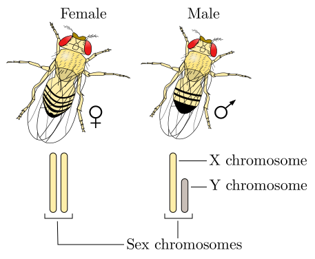
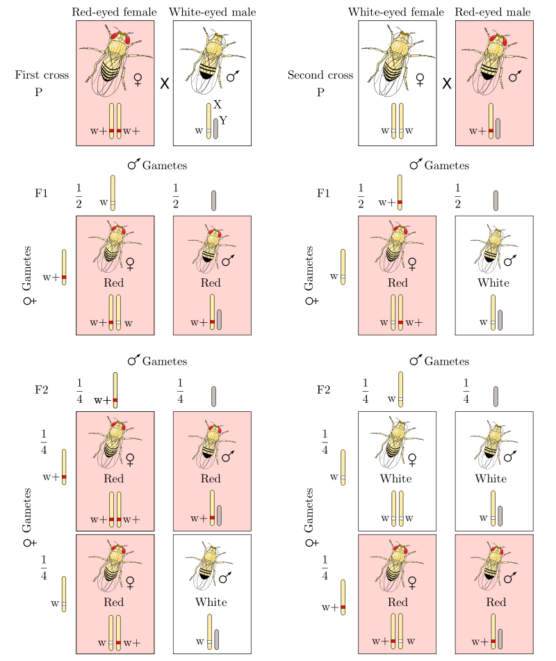
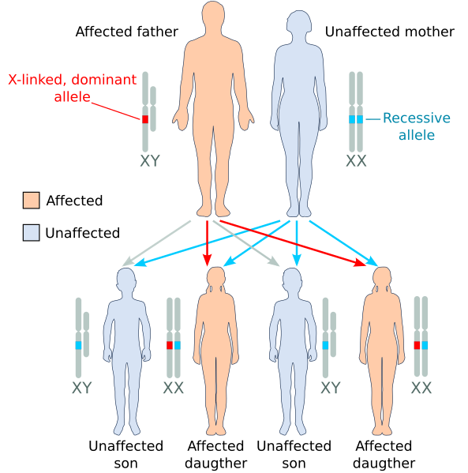
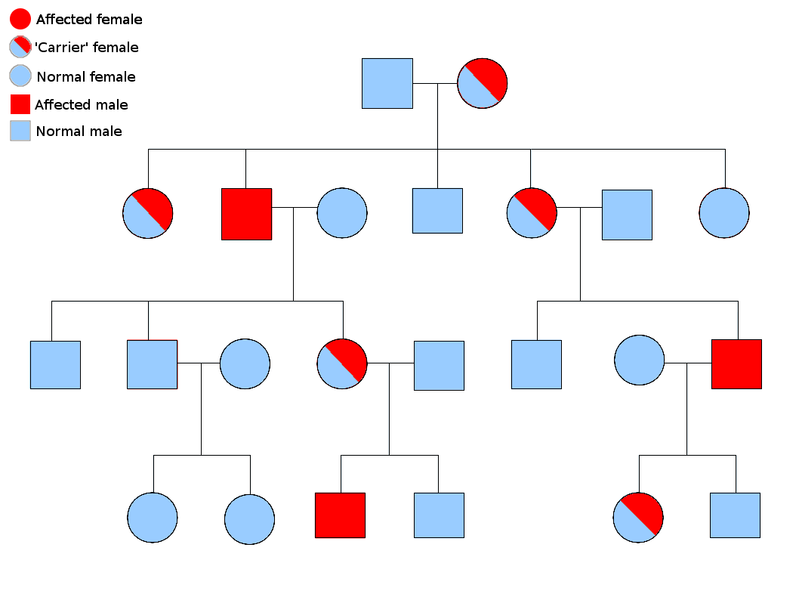
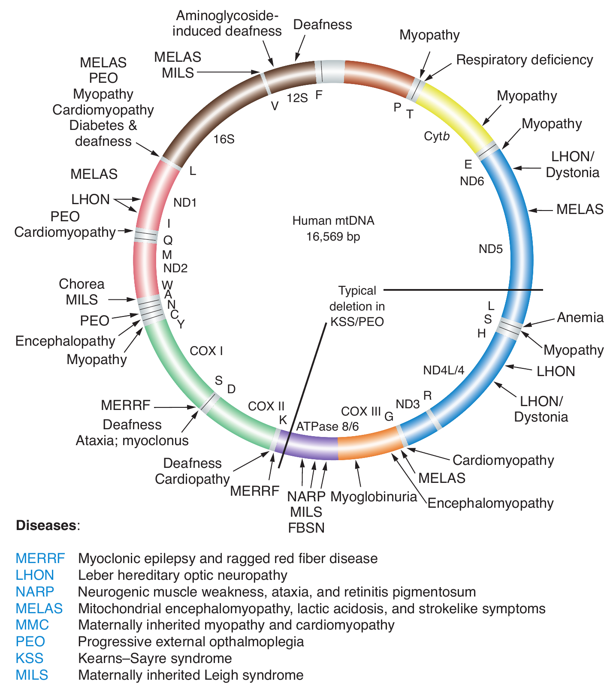
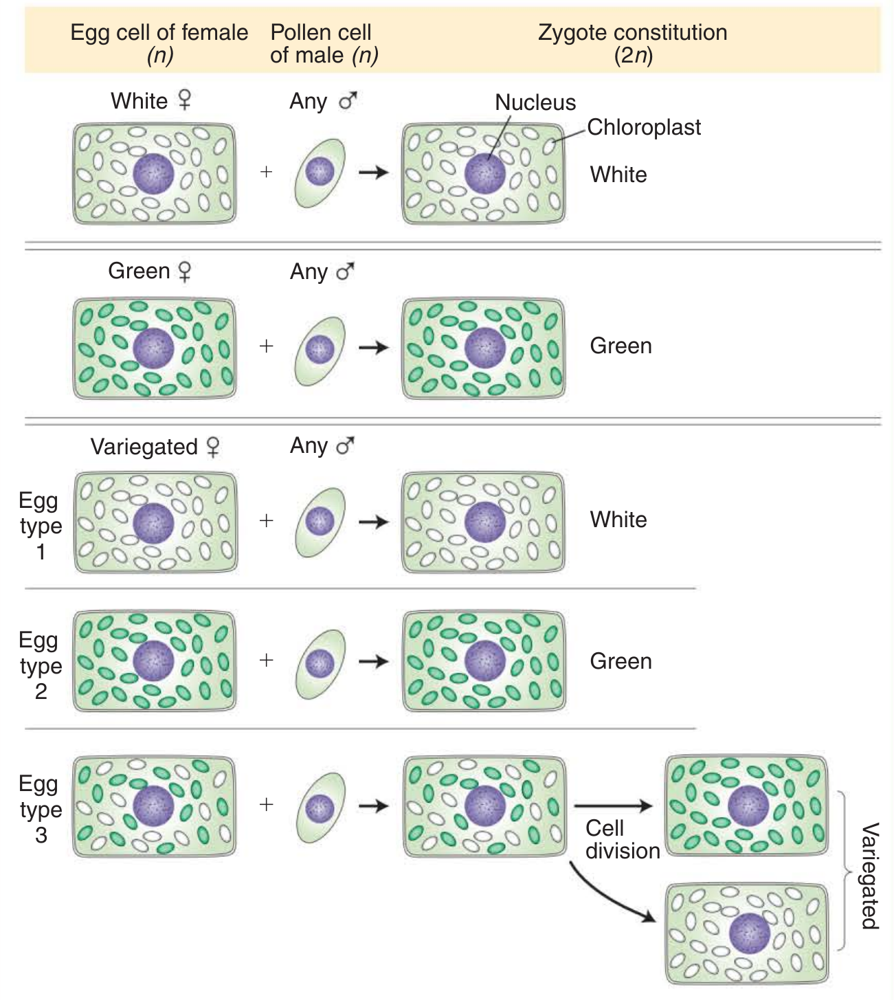
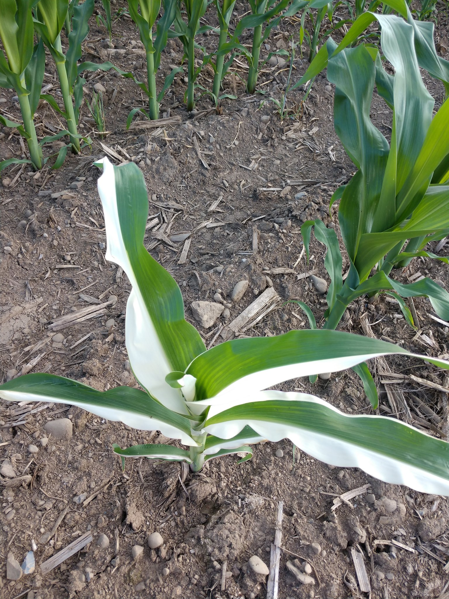
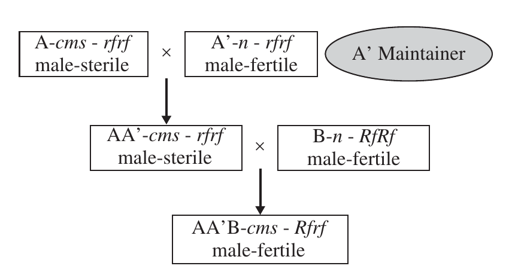

# Sex determination, sex linkage and extra-nuclear inheritance

## Sex determination

- A sex-determination system is a biological system that determines the development of sexual characteristics in an organism.
- Most organisms that create their offspring using sexual reproduction have two sexes.
- Occasionally, there are hermaphrodites in place of one or both sexes. There are also some species that are only one sex due to parthenogenesis, the act of a \female reproducing without fertilization.
- Sexual orientation of individual flowers and plants may be:
  - Flower: Unisexual and bisexual
  - Individual: Monoecious, dieoeious and hermaphrodite
- In many species, sex determination is genetic: males and females have different alleles or even different genes that specify their sexual morphology. 
- In animals this is often accompanied by chromosomal differences, generally through combinations of XY, ZW, XO, ZO chromosomes, or haplodiploidy.
- X and Y chromosomes can be divided into homologous and differential regions.

<!-- - The sexual differentiation is generally triggered by a main gene (a "sex locus"), with a multitude of other genes following in a domino effect.  -->

## Mechanisms of sex determination 

### Environmental sex determination

- In some cases, sex of a fetus is determined by environmental factors (e.g. temperature)
- Some species such as various plants and fish do not have a fixed sex, and instead go through life cycles and change sex based on genetic cues during corresponding life stages of their type. 
- This could be due to environmental factors,
  - Seasons
  - Association with \female
  - Egg size
  - Incubation temperature

- Larvae of sea worm _Bonelia_ are sexually undifferentiated. Those larvae thaat attach to the proboscis of \female worms develop into \male s. In contrast, those larvae that do not attach to \female worms and remain free develop into \female s.
- In sea worm _Dinophilus_, animals developed from eggs of relatively larger size are \female s, while those obtained from smaller eggs are \male s.
- Animals like turtles, alligators and crocodiles respond to egg incubation temperature during embryonic stages for differentiation. In some cases:
  - High ( \SIrange{30}{35}{\celsius}) temperature produces only \female s, 
  - Low ( \SIrange{23}{28}{\celsius}) temperature produce only \male s, and
  - Intermediate temperature ( \SIrange{28}{30}{\celsius}) might give rise to both \male s and \female s.

### Chromosomal sex determination

- In a vast majority of animals, \male and \female individuals ordinarily differ from each other in respect of either the number or the **morphology of the homologues of one chromosome pair**.
- This chromosome is referred to as sex chromosome or allosome.
- There are 2 types of sex chromosome, X and Y. 
- **X chromosome** is found in both \male s and \female s, although one sex has only one, while the other sex has two X chromosomes.
- **Y chromosome** ordinarily occurs only in one of the two sexes of a species, e.g., \male mice, drosophila, humans, \female birds, reptiles, etc.
- Y chromosome contains mostly heterochromatin while X chromosome contains euchromatin.
- Different mechanisms of chromosomal sex determination are:
  1. XX \female, X0 \male
  2. X0 \female, XX \male
  3. XX \female, XY \male
  4. XY \female, XX \male
  5. diploid (2n) \female, haploid (n) \male

#### XX/XO sex chromosome

- In grasshoppers, _Protenor_ and other orthopteran insects, \female s have two X chromosomes, while males have only one X (XX \female, X0 \male).
  - Thus somatic cell of \female s have one chromosome more than those of \male s.
  - Females are homogametic sex and \male s are heterogametic sex.
  - Union of a sperm having an X chromosome with any egg produces a zygote having two X chromomsomes (XX); such zygote develop into \female individuals. But when a sperm without an X chromosome fertilizes an eg, an XO zygote is obtained; such individuals would develop into males.
- In Fumea, females have only one X chromosome while males have two X chromosomes (X0 \female, XX \male)

#### XX/XY chromosome

- XX \female, XY \male
  - The system is found in most other mammals, as well as some insects (Hemiptera, Coleoptera, Diptera), some fishes and some amphibia. 
  - In this system, most females have two of the same kind of sex chromosome (XX), while most males have two distinct sex chromosomes (XY).
  - In some species, such as humans, organisms remain sex indifferent for a time after they're created; in others, however, such as fruit flies, sexual differentiation occurs as soon as the egg is fertilized.
  - \female are homogametic and males are heterogametic sex
- XY \female, XX \male
  - The system is operates in some birds, reptiles, some insects, e.g. silkworm, etc.
  - \male are homogametic and females are heterogametic sex.


```{r drosophila-xy-sex-determination, fig.cap="XY chromosome based sex determination system in Drosophila", out.width="60%"}

```

#### X or Y-centered sex determination

- In Y-centered sex determination, the SRY gene (residing on the Y chromosome) is the main gene in determining \male characteristics, but multiple genes are required to develop testes. Members of SRY-reliant species can have uncommon XY chromosomal combinations such as XXY and still live.
- Some species, such as fruit flies, use the presence of two X chromosomes to determine femaleness. Species that use the number of Xs to determine sex are nonviable with an extra X chromosome.
- Some fish have variants of the XY sex-determination system, as well as the regular system. For example, while having an XY format, _Xiphophorus nezahualcoyotl_ and _X. milleri_ also have a second Y chromosome, known as Y', that creates XY' females and YY' males.
- The platypus has ten sex chromosomes; males have an XYXYXYXYXY pattern while females have ten X chromosomes.

#### Haplodiploidy

- Mostly in hymenoptera, e.g. honey-bees, ants, termites females are diploid 2n and males are haploid (n)
- During spermatogenesis, all the n chromosomes of males regularly pass to a single pole at Anaphase I so that the opposite pole receives no chromosome. Thus all the sperms are regularly haploid.
- Normal oogenesis produces all haploid eggs.
- Fertilization of eggs produces diploid zygotes, which develop into diploid larvae.
  - Such larvae give rise to workers, which are sterile females.
  - Females fed on royal jelly develop into fertile females called queen.
- Unfertilized eggs develop parthenogenically to produce haploid larvae and ultimately fully fertile haploid males called drones.

### Molecular basis of sex determination

#### Geneic balance theory

- Bridges discovered XXY females and X0 males in _Drosophila_ while studying inheritance of vermilion eye gene in the X chromosome.
- This showed that XX and XY chromosome constitutions are not essential for femaleness and maleness, respectively, and that Y chromosome did not play a role in sex determination.
- Triploid females mated with normal diploid males result in aneuploid progeny. The progeny from such cross showed five different sex expressions. 
- By correlating the sex of an individual with its chromosome constitution, Bridges developed the geneic balance theory of sex determination. This theory fully explains sex determination in _Drosophila_.

$$
\text{Sex index} = \frac{\text{Number of X chromosomes}}{\text{Number of autosomal sets}} = \frac{X}{A}
$$


```{r geneic-balance}
crossing("Ploidy" = c("2n", "3n", "4n"), "Number of X chromosomes" = c(1, 2, 3, 4)) %>% 
  mutate("Number of autosomal sets" = as.integer(str_extract(Ploidy, "\\d")), 
         "Sex index (X/A)" = `Number of X chromosomes`/`Number of autosomal sets`) %>% 
  mutate("Sex expression"=case_when(
    `Sex index (X/A)` > 1 ~ "Super \\female",
    `Sex index (X/A)` == 1 ~ "\\female",
    `Sex index (X/A)` < 1 & `Sex index (X/A)` > 0.5 ~ "Intersex",
    `Sex index (X/A)` == 0.5 ~ "\\male",
    `Sex index (X/A)` < 0.5 ~ "Super \\male",
    TRUE ~ NA_character_
  )) %>% 
  knitr::kable(booktabs = TRUE, escape = FALSE) %>% 
  kableExtra::kable_styling(font_size = 8) %>% 
  kableExtra::column_spec(1:5, width = "7em")
```

### Sex determination mechanisms in plants

- Environmental: _Equisetum sp._
- Chromosomal:
  - Homomorphic chromosomes: Heterogametic \male ( _Asparagus_, Spinach), Heterogametic \female ( _Frageria elateria_)
  - Heteromorphic chromosomes: Heterogametic \male ( Active Y: _Silene latifolia_, X/autosome balance: _Rumex acetosa_, X1X1X2X2 - X1X2Y1Y2: _Humulus lupulus_)
- Genic:
  - Single gene: _Ecballium elaterium_
  - Muliple gene: _Mercurialis annua_

### Genic sex determination in Papaya

- In papaya, a single gene with three alleles ($m, M_1 and M_2$) is suggested to control the sex of an individual. \female plants are homozygous $mm$, while \male plants are heterozygous $M_1m$; the heterozygote $M_2m$ produces hermaphrodite condition. Genotypes $M_1M_1$, $M_1M_2$ and $M_2M_2$ are inviable (Table \ref{tab:papaya-sex-determination}).


```{r papaya-sex-determination}
tribble(~"Genotype", ~"Survival", ~"Sex expression",
        "$mm$", "Vital", "\\female", 
        "$M_1m$", "Vital", "\\male", 
        "$M_2m$", "Vital", "Hermaphrodite", 
        "$M_1M_1$, $M_1M_2$ and $M_2M_2$", "Lethal (all die)", NA) %>% 
  kable(caption = "Monogenic sex determination in Papaya; the gene m has three alleles, viz., m, $M_1$, $M_2$", booktabs = TRUE, escape = FALSE) %>% 
  kableExtra::kable_styling(font_size = 6) %>% 
  kableExtra::column_spec(1:3, width = c("6em", "5em", "6em"))
```


```{r papaya-sex-determination-crosses}
tribble(~"Genotype", ~"Sex expression",
        "\\female x \\male ($mm \\times M_1m$)", "1/2 \\male ($M_1m$), 1/2 \\female ($mm$)", 
        "\\female x hermaphrodite ($mm x M_2m$)", "1/2 Hermaphrodite ($M_2m$), 1/2 \\female ($mm$)", 
        "Hermaphrodite ($M_2m$) selfed", "1/4 $M_2M_2$ (inviable), 1/2 hermaphrodite ($M_2m$), 1/4 \\female ($mm$)") %>% 
  kable(caption = "Various cross combinations (in monogenic sex determination system in Papaya)", booktabs = TRUE, escape = FALSE) %>% 
  kableExtra::kable_styling(font_size = 6) %>% 
  kableExtra::column_spec(1:2, width = c("10em", "14em"))
```

## Sex linkage

- Sex linkage is the patterns of inheritance and presentation when a gene mutation (allele) is present on a sex chromosome (allosome) rather than a non-sex chromosome (autosome). 
- They are characteristically different from the autosomal forms of dominance and recessiveness as they are different depending on the sex of the individual.
- Since humans have several times as many genes on the \female X chromosome than on the \male Y chromosome, X-linked traits are much more common than Y-linked traits. 

```{r sex-linked-inheritance-drosophila, fig.cap="Experiment performed by Morgan on Drosophila"}

```


### X-linked traits

- Additionally, there are more X-linked recessive conditions than X-linked dominant, and X-linked recessive conditions affect males much more commonly, due to males only having the one X chromosome required for the condition to present.
- In humans, X-linked traits are inherited from a carrier or affected mother or from an affected father.
- A daughter has a 50% chance of being a carrier, however a son born to an affected father and a non-carrier mother will always be unaffected due to not inheriting the father's X chromosome. A daughter in that case, on the other hand will always be a carrier.
- Unless the condition is dominant she will not be always affected.
- The incidence of X-linked recessive conditions in females is the square of that in males: for example, if 1 in 20 males in a human population are red-green color blind, then 1 in 400 females in the population are expected to be color-blind (1/20)*(1/20).
- In classical genetics, a mating experiment called a reciprocal cross is performed to test if an animal's trait is sex-linked. 


```{r x-dominant-affected-father, fig.cap="\\textbf{Illustration of some X-linked heredity outcomes} \\newline (A) the affected father has one X-linked dominant allele, the mother is homozygous for the recessive allele: only daughters (all) will be affected. (B) the affected mother is heterozygous with one copy of the X-linked dominant allele: both daughters and sons will have 50\\% probability to be affected. (C) the heterozygous mother is called 'carrier' because she has one copy of the recessive allele: sons will have 50\\% probability to be affected, 50\\% of unaffected daughters will become carriers like their mother.", out.width="32%", fig.align='center'}

```


```{r sex-linked-inheritance, out.width="45%", fig.align='center'}

```

### X-linked dominant inheritance

- Each child of a mother affected with an X-linked dominant trait has a 50% chance of inheriting the mutation and thus being affected with the disorder. 
- If only the father is affected, 100% of the daughters will be affected, since they inherit their father's X chromosome, and 0% of the sons will be affected, since they inherit their father's Y chromosome.
- There are less X-linked dominant conditions than X-linked recessive, because dominance in X-linkage requires the condition to present with only a fraction of the gene expression of autosomal dominance, since roughly half (or as many as 90% in some cases) of a particular parent's X chromosomes are inactivated in females.
- Example: Coffin-Lowry Syndrom (CLS), Fragile X syndrome, Vitamin D resistant rickets

### X-linked recessive inheritance

- Females possessing one X-linked recessive mutation are considered carriers and will generally not manifest clinical symptoms of the disorder, although differences in X chromosome inactivation can lead to varying degrees of clinical expression in carrier females since some cells will express one X allele and some will express the other. 
- All males possessing an X-linked recessive mutation will be affected, since males have only a single X chromosome and therefore have only one copy of X-linked genes. 
- All offspring of a carrier \female have a 50% chance of inheriting the mutation if the father does not carry the recessive allele. 
- All \female children of an affected father will be carriers (assuming the mother is not affected or a carrier), as daughters possess their father's X chromosome.
- If the mother is not a carrier, no \male children of an affected father will be affected, as males only inherit their father's Y chromosome. 
- Examples: Color blindness, Duchenne muscular dystrophy, Haemophilia A and B, Hunter syndrome, Inherited nephrogenic diabetes insipidus, etc.

### Y-linked

- Various failures in SRY genes

### Sex-linked traits in other animals

- White eyes in Drosophila melanogaster flies—the first sex-linked gene discovered.
- Fur color in domestic cats: the gene that causes orange pigment is on the X chromosome; thus a Calico or tortoiseshell cat, with both black (or gray) and orange pigment, is nearly always \female.
- The first sex-linked gene ever discovered was the "lacticolor" X-linked recessive gene in the moth Abraxas grossulariata by Leonard Doncaster

### Sex-influenced traits

Sex-influenced or sex-conditioned traits are phenotypes affected by whether they appear in a \male or \female body. Even in a homozygous dominant or recessive \female the condition may not be expressed fully. Example: baldness in humans.

### Sex-limited traits

These are characters only expressed in one sex. They may be caused by genes on either autosomal or sex chromosomes. Examples: \female sterility in Drosophila; and many polymorphic characters in insects, especially in relation to mimicry. Closely linked genes on autosomes called "supergenes" are often responsible for the latter.

### Klinefelter syndrome

- Also known as 47, XXY or XXY, is the symptom that result from two or more X chromosomes in males.
- Primary features are: infertility and small testicles.
- Symptoms may be subtle and often non observable.
- Other symptoms may include: weaker muscles, greater height, poor coordination, less body hair, breast growth and lesser sexual interest.
- Symptoms are more severe if three or more X chromosomes are present XXXY, or XXXXY syndrome.

### Turner syndrome

- also known 45, X, is a genetic condition in which a female is partly or completely missing an X chromosome. 
- Signs and symptoms vary among those affected. Often, a short and webbed neck, low-set ears, low hairline at the back of the neck, short stature, and swollen hands and feet are seen at birth.
- They show impaired reproductive system (infertile) unless assisted with hormone treatment.

- Both the types of syndromes (Turner and Klinefelter) are non-inherited disorders.

## Extra nuclear inheritance

- It is universally accepted that genes showing **Mendlian inheritance** are located in chromosomes of eukaryotic nuclei. Hence, this form of inheritance pattern is sufficient evidence for a gene to be located on chromosomes.
- Such genes are called nuclear genes.
- A distinct subset of the genome is found in the mitochondria, and, in plants, also in the chloroplasts. These subsets are inherited independently of the nuclear genome.
- While working with _Mirabilis jalapa_ Carl Correns (1908) observed that leaf color was dependent only on the genotype of the maternal parent. He determined that the trait was transmitted through a character present in the cytoplasm of the ovule. 
- Later research by Ruth Sager and others identified DNA present in chloroplasts as being responsible for the unusual inheritance pattern observed.

### Nature of organellar inheritance

- They are present in multiple copies in each organelle. In higher plants, cpDNA is present in 20-40 copies per chloroplast. Yeast cells have ~4 genomes per mitochondrion.
- They are circular molecules of DNA. In few exceptional case, generally in lower eukaryotes, mtDNA is linear.
- They encode all the RNA species and some of the proteins required for organelle function.
- They are transcribed and translated within the organelles.
- In case of biparental inheritance, recombination does takes place between organellar genomes.
- Organelle DNA is replicated by a different DNA polymerase from that of nucleus.
- The DNA repair systems and other events that impinge on the fidelity of DNA sequences are different in organelles from those in nuclei.
- Accumulation of mutation is much faster in mtDNA than in nuclear genome in case of mammals, while in plants the reverse is the case.
- They DNA is folded within the nucleoid but does not have the type of histone-associated coiling shown by nuclear chromosomes.
- Most genes concern the chemical reactions taking place within the organelle itself: photosynthesis in chloroplasts and oxidative phosphorylation in mitochondria.
- According to the **endosymbiont theory**, mitochondria and chloroplasts were once free living organisms that were each taken up by a eukaryotic cell. Over time, mitochondria and chloroplasts formed a symbiotic relationship with their eukaryotic hosts. Although the transfer of a number of genes from these organelles to the nucleus prevents them from living independently, each still possesses genetic material in the form of double stranded DNA.
- It is the transmission of this organellar DNA that is responsible for the phenomenon of extranuclear inheritance. 
- Both chloroplasts and mitochondria are present in the cytoplasm of maternal gametes only. 
- Paternal gametes (sperm for example) do not have cytoplasmic mitochondria. Thus, the phenotype of traits linked to genes found in either chloroplasts or mitochondria are determined exclusively by the maternal parent.

#### Genes in organelles
  
```{r human-mitochondial-diseases, fig.cap="Map of human mtDNA shows loci of mutations leading to cytopathies", fig.align='center', out.width="60%"}
# pdftools::pdf_convert("./../../literatures/textbooks/Introduction to Genetic Analysis/Griffiths - An Introduction to Genetic Analysis 11th Edition c2015.pdf", pages = 142, format = "png", filenames = "../images/human_mitochondrial_genome_map.png", dpi = 300)

```


### Cytoplasmic/extranuclear/extrachromosomal/maternal inheritance (Non mendelian inheritance)

- The sum total of all genes present in the cytoplasm of a cell or an individual is known as _plasmon_, while all the genes in a plastic constitute a _plastome_, by analogy all genes present in mitochondria constitute a _chondriome_.
- All the available evidence indicates that plasmagenes are located in DNA present in mitochrondria (mtDNA) or chloroplast (cpDNA).
- Characteristic features of this type of inheritance are:
  1. Reciprocal differences
  2. Lack of segregation
  3. Irregular separation in biparental inheritance
  4. Somatic segregation
  5. Association with organelle DNA
  6. Mutagenesis
  7. Lack of association with a parasite, symbiont or virus.

```{r variegation-cytoplasmic-inheritance, fig.cap="The results of the \\textit{Mirabilis jalapa} crosses can be explained by autonomous chloroplast inheritance. The large, dark spheres represent nuclei. The smaller bodies represent chloroplasts, either green or white. Each egg cell is assumed to contain many chloroplasts, and each pollen cell is assumed to contain no chloroplasts. The first two crosses exhibit strict maternal inheritance. If, however, the maternal branch is variegated, three types of zygotes can result, depending on whether the egg cell contains only white, only green, or both green and white chloroplasts. In the last case, the resulting zygote can produce both green and white tissue, and so a variegated plant results.", fig.align='center', out.width="55%"}
# pdftools::pdf_convert("./../../literatures/textbooks/Introduction to Genetic Analysis/Griffiths - An Introduction to Genetic Analysis 11th Edition c2015.pdf", pages = 140, format = "png", filenames = "../images/variegation_cytoplasmic_inheritance.png", dpi = 300)

```


```{r maize-variegation, fig.cap="Many cases of white leaves are caused by mutations in chloroplast genes that control the production and deposition of the green pigment chlorophyll.", fig.align='center', out.width="40%"}

```

### \male sterility

- It is the incapacity of flowering plants to produce or release functional pollens. 
- Non functional pollen is caused by genetic or cytoplasmic factors.
- This phenomena is exploited in producing hybrids.

#### Genetic \male sterility

- While CMS is controlled by an extranuclear genome, nuclear genes may have the capability to restore fertility.
- Genetic (nuclear, genic) \male sterility is widespread in plants. The gene for sterility has been found in species including barley, cotton, soybean, tomato, potato, and lima bean. 
- It is believed that nearly all diploid and polyploidy plant species have at least one \male sterility locus.
- May be manifested as pollen abortion (pistillody) or abnormal anther development.
- Genetic \male sterility is often conditioned by a single recessive nuclear gene, _ms_, the dominant allele, _Ms_, conditioning normal anther and pollen development (Figure \ref{fig:gms-use}). 
- In alfalfa, however, two independently inherited genes have been reported
- The expression of the gene may vary with the environment. But to be useful, the system must be stable

<!-- ```{r gms-use, fig.cap="Genetic \\male sterility as used in practical breeding", fig.align='center', out.width="35%"} -->
<!-- # pdftools::pdf_convert("./../../references_plb/Principles of Plant Genetics and Breeding.pdf", pages = 118, format = "png", filenames = "./images/gms_use.png", dpi = 300) -->
<!-- knitr::include_graphics("./images/gms_use.png") -->
<!-- ``` -->

#### Cytoplasmic \male sterility

- Sometimes, \male sterility is controlled by the cytoplasm (mitochondrial gene) but may be influenced by nuclear genes. 
- A cytoplasm without sterility genes is described as normal (N) cytoplasm, while a cytoplasm that causes \male sterility is called a sterile ( _s_) cytoplasm or said to have cytoplasmic \male sterility (CMS) (Figure \ref{fig:cms-use}). 
- Transmitted through the egg only (maternal factor).
- Has been found in species including corn, sorghum, sugar beet, carrot, and flax. 
- The condition has been induced in species such as sorghum by transferring nuclear chromosomes into a foreign cytoplasm. - Has real advantages in breeding ornamental species because all the offspring is \male sterile, hence allowing them to remain fruitless.


<!-- ```{r cms-use, fig.cap="Cytoplasmic \\male sterility as applied in plant breeding (N, normal cytoplasm; s, sterile cytoplasm).", fig.align='center', out.width="40%"} -->
<!-- # pdftools::pdf_convert("./../../references_plb/Plant Breeding, 2nd Edition (2014).pdf", pages = 76, format = "png", filenames = "./images/cms_use.png", dpi = 300) -->
<!--  -->
<!-- ``` -->

- Hybrid seed production using CMS requires three types of genotypes;   
- \male fertile lines (called *B* lines; maintained by selfing) with no cytoplasmic \male sterility genes and which are homozygous for a dominant restorer gene (i.e. normal ( _n_) cytoplasm, _RfRf_) (Figure \ref{fig:cgms-systems});
  - cytoplasmic sterile \female lines with \male sterile cytoplasm but with no restorer genes (called *A* lines; maintained by crossing with isogeneic cytoplasmic \male fertile line);
  - '\male-fertile' \female lines (called *A'* lines or *A'* maintainer
lines; maintained by selfing) with normal cytoplasm and no restorer genes.
- Cytoplasmic \male sterility may be modified by the presence of fertility-restoring genes in the nucleus. 
- CMS is rendered ineffective when the dominant allele for the fertility-restoring gene ( _Rf_) occurs, making the anthers able to produce normal pollen.
- CMS is transmitted only through the egg, but fertility can be restored by _Rf_ genes in the nucleus. 
- Three kinds of progeny are possible following a cross, depending on the genotype of the pollen source. 
- The resulting progenies assume that the fertility gene will be responsible for fertility restoration.

<!-- ```{r cgms-systems, fig.cap="The three systems of cytoplasmic genetic \\male sterility. The three factors involved in CMS are the normal cytoplasm (N), the \\male sterile cytoplasm (S), and the fertility restorer (Rf, rf).", fig.align='center', out.width="28%"} -->
<!-- # pdftools::pdf_convert("./../../references_plb/Principles of Plant Genetics and Breeding.pdf", pages = 119, format = "png", filenames = "./images/cgms_systems.png", dpi = 300) -->
<!-- knitr::include_graphics("./images/cgms_systems.png") -->
<!-- ``` -->

### Maternal effects

- The development of some characters in several organisms is either goverened or markedly influenced by the genotype of the \female parent; this is known as **maternal effect**.
- Such characters are governed by **nuclear genes**. But due to the maternal effect, they show the following features:
  1. Reciprocal differences in $F_1$
  2. Which, in most cases, disappear in $F_2$
  3. Considerably smaller variation in $F_2$ as compared to that in $F_3$.
- Examples of maternal inheritance:
  1. Coiling in Limnaea: The direction of shell coiling in an individual is governed by the genotype of its \female parent and not by its own genotype. As a result, reciprocal crosses show differences in coiling in $F_1$ and there is no phenotypic segrgation in $F_2$. The phenotypic effect of segregation is observable in $F_3$ only.
  2. Some economically important traits as seed size, protein content in seeds, plant height, etc. show marked difference for $F_1$ progeny from reciprocal crosses.


$$
\begin{aligned}
& & DD (\text{Dextral } \female) & \times dd (\text{Sinistral } \male) &\\
& & & \downarrow & \\
& \mathrm{F_1} & & Dd (\text{Dextral}) & \\
& & & \downarrow & \\
& & Dd &\times Dd & \\
& & & \downarrow & \\
& \mathrm{F_2} & & 1 DD \hspace{1cm} & (\text{Dextral}) \\
& & & 2 Dd \hspace{1cm} & (\text{Dextral}) \\
& & & 1 dd \hspace{1cm} & (\text{Dextral}) \\
& \mathrm{F_3} 
& & DD \hspace{1cm} & (\text{Dextral}) \\
& & & 1 DD \hspace{1cm} & (\text{Dextral}) \\
& & & 2 Dd \hspace{1cm} & (\text{Dextral}) \\
& & & 1 dd \hspace{1cm} & (\text{Dextral}) \\
& & & dd \hspace{1cm} & (\text{Sinistral})
\end{aligned}
$$


$$
\begin{aligned}
& & dd (\text{Sinistral } \female) & \times DD (\text{Dextral } \male) &\\
& & & \downarrow & \\
& \mathrm{F_1} & & Dd (\text{Sinistral}) & \\
& & & \downarrow & \\
& & Dd &\times Dd &
\end{aligned}
$$

- Differences in reciprocal cross is due to:
  - All embryos develop inside maternal tissue
  - Some maternal genes affect embryo development
  - Maternal effects can be genetic or environmental
  - Can result from expression of genes in maternal tissue
  - Can result from inheritance of maternal cytoplasm (and organelles)
  - Can result from maternal environment (not genetic)
