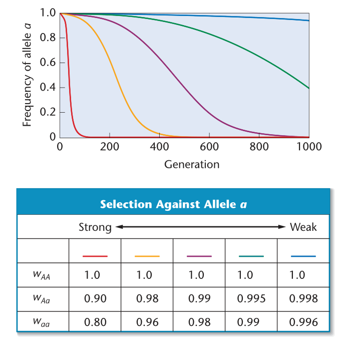
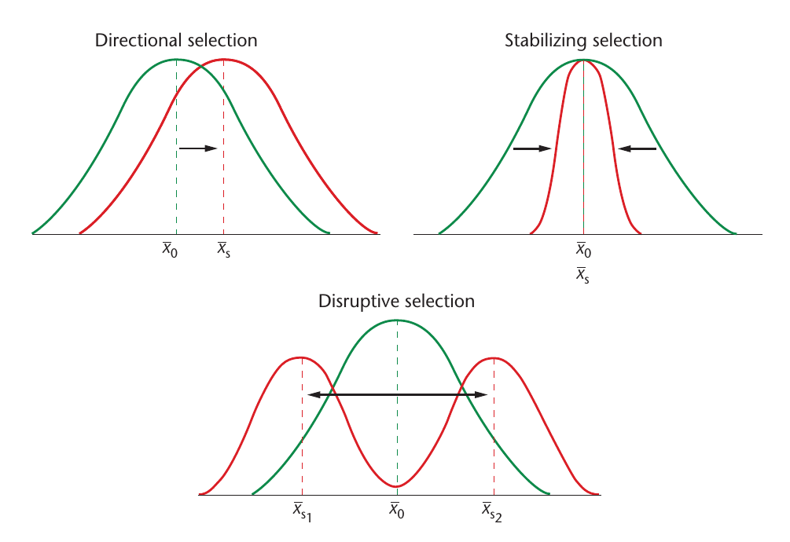

# Gene and genotype frequencies, hardy-weinberg equilibrium and population characteristics

## Gene and genotype frequencies

An allele is the bit of DNA at the place called locus (the place on a chromosome where an allele resides).
  - An allele is instantiation of a locus
  - But by orthology, a locus is not template for an allele
  - A locus is not tangible, rather a map describing where to find a tangible thing, an allele on a chromosome.
  - A diploid individual has two alleles at a particular autosomal locus.

## Allelic variation

Two alleles of a same locus may differ by:

1. By origin: For example genes occurring on same locus but on a different chromosome.

2. By state

  - It depends on the context they are put in, i.e. DNA sequence or amino acid sequence.
  - Same amino acid sequence in some alleles may arise due to different DNA sequences (redundancy of genetic code).
  - State may differ as protein sequence, the color of the pea or other genetically determined phenotypes of interest.

3. By descent

  - In practice, we are often concerned with relatively short time period in the past and are content to say that two alleles differ by descent, if they do not share a common ancestor, in say, the past 10 generations.
  - Two alleles, different by descent may or may not be different by state because of mutation.

- Converse of difference of alleles involves identity by origin, state or descent.

```{r identity-by-descent-difference-by-state, fig.cap="Two alleles in generation (n-2), (n-1) and n, that are identical by descent but differ in state.", out.width="95%"}
knitr::include_graphics("./drawings/identity-by-descent-difference-by-state.pdf")
```

- Diploid individual are said to be heterozygotes at a locus if two alleles at that locus are different by state.
- If we are studying proteins, we may call an individual homozygous at locus when the protein sequence of the two alleles are identical, even if their DNA sequences differ.

## Genotype and allele frequences

In "$A$" loci, suppose, two alleles $A_1$ and $A_2$ are present in a diploid organism. The genotype and genotypic frequency of segregating population will be:

```{r}
tribble(
  ~"Genotype", ~"$A_1A_1$", ~"$A_1A_2$", ~"$A_2A_2$",
  "Relative frequency", "$x_11$", "$x_12$", "$x_22$"
) %>% 
  knitr::kable(booktabs = TRUE, escape = FALSE, format = "latex") %>% 
  kableExtra::kable_styling()
```

As relative frequencies must add to 1,

$$
x_{11} + x_{12} + x_{22} = 1
$$
The order of subscripting heterozygous is arbitrary.

Frequency of $A_1$ allele in the population is $p = x_{11} + \frac{1}{2}x_{12}$, and
Frequency of $A_2$ allele in the population is $q = 1-p = x_{22} + \frac{1}{2}x_{12}$

Measure of each allele frequency can be thought of as independent events, for eg., for allele $p$ to be selected,

$$
p = (x_{11} \times 1) + (x_{12} \times \frac{1}{2}) + (x_{22} \times 0)
$$

For loci with more than two alleles, frequency of $i^{th}$ allele will be called $p_{i}$, frequency of $A_iA_j$ genotype will be called $x_{ij}$ for heterozygotes, $i \neq j$ and, by convention $i < j$. If there are "n" alleles,

$$
\begin{aligned}
1 &= x_{11} + x_{22} + ... + x_{nn} + x_{12} + x_{13} + ... + x_{(n-1)n} \\
&= \sum_{i = 1}^n \sum_{j \geq i}^n x_{ij}
\end{aligned}
$$

The frequency of $i^{th}$ allele is,

$$
p_i = x_{ii} + \frac{1}{2} \sum_{j = 1}^{i-1} x_{ji} + \frac{1}{2} \sum_{j = i + 1}^n x_{ij}
$$
**Question**

How may different genotypes are there at a locus with n alleles that differ by state ?

$\longrightarrow$ When there are n alleles, there are n homozygous genotypes, $A_iA_i$, for $i = 1,2,...,n$. If we first view an $A_iA_j$ heterozygote as distinct from an $A_jA_i$ heterozygote, then there are $n(n-1)$ such heterozygote. The actual number of heterozygotes will be one-half of this number, $\frac{n(n-1)}{2}$. Thus, the total number of genotypes is $n + \frac{n(n-1)}{2}$ = $\frac{n(n+1)}{2}$

## Hardy-Weinberg law

- In a random mating population (in which each male gamete has an equal chance of mating with any female gamete), when taken a loci with differences in alleles (A/a), following genotypes are possible: $AA$, $Aa$ and $aa$. 
- With the corresponding frequencies of $p^2$, $2pq$ and $q^2$, respectively for each of the genotypes, and bearing that gene frequencies must add up to unity, $p^2+2pq+q^2 = 1$. This mathematical relationship is called the **Hardy-Weinberg equilibrium**.
- Two scientists showed that the frequency of genotypes in a population depends on the frequency of genes in the preceding generation, not on the frequency of the genotypes.

- In each subsequent generation following thereafter, however, gene and genotypic frequencies will remain unchanged, provided that:
  1. Random mating occurs in a very large diploid population;
  2. Allele A and allele a are equally fit (one does not confer a superior trait than the other);
  3. There is no differential migration of one allele into or out of the population;
  4. The mutation rate of allele A is equal to that of allele a.

### Conservation of gene frequencies

- Let us presume that among humans, the difference between those who can and those who cannot taste the chemical phenyl-thiocarbamate (PTC) resides in a single gene difference with two alleles, $T$ and $t$.
- The allele for tasting, $T$, is dominant over $t$, so that heterozygotes, $Tt$ are tasters, and the only nontasters are $tt$.
- If we were to choose an initial population composed of an arbitary number of each genotype, we may ask what will be the frequency of these genes after many generations.
- Let us, for example, place upon an island a group of children in the ratio $.40TT:.40Tt:.20tt$. The gene frequencies in this newly formed population are therefore, $.4 + .2 = .6 T$, and $.2 + .2 = .4t$.
- Let us also assume that the number of individuals in the population is large, and the tasting or nontasting has no effect upon survival (viability), fertility, or attraction between the sexes.
- As these children mature, they will choose their mates at random from those of the opposite sex regardless of their tasting abilities.
- Matings between any two genotypes can then be predicted solely on the basis of the frequency of those genotypes in the population.
- Table \ref{tab:random-mating-monogene-gene-freq} shows matings in all possible combination.

```{r random-mating-monogene-gene-freq}
tribble(
  ~"TT", ~"Tt", ~"tt", 
  .16, .16, .08, 
  .16, .16, .08, 
  .08, .08, .04
) %>% 
  add_column(.before = 1, gametes = colnames(.)) %>% 
  kable(booktabs = TRUE, escape = TRUE, caption = "Types of random-mating combinations and their relative frequencies in a population containing .40TT, .40Tt, and .20tt genotypes") %>% 
  kableExtra::kable_styling(position = "center")
```


```{r}
tribble(~"Type of mating", ~"Frequency of mating", 
        "$TT \\times TT$", .16,
        "$TT \\times Tt$", .32,
        "$TT \\times tt$", .16,
        "$Tt \\times Tt$", .16,
        "$Tt \\times tt$", .16,
        "$tt \\times tt$", .04) %>% 
  add_column(.after = 2, TT = c("all(.16)", "1/2(.32)", NA, "1/4(.16)", NA, NA)) %>% 
  add_column(.after = 3, Tt = c(NA, "+1/2(.32)", "all (.16)", "+1/2 (.16)", "1/2(.16)", NA)) %>% 
  add_column(.after = 4, tt = c(NA, NA, NA, "+1/4(.16)", "+1/2(.16)", "all (.04)")) %>% 
  kable(booktabs = TRUE, escape = FALSE, caption = "Relative frequencies of the different kinds of offspring produced by the matings") %>% 
  kableExtra::kable_styling(position = "center", latex_options = "striped") %>% 
  kableExtra::add_header_above(header = c("Parents" = 2, "Offspring ratio" = 3))
```

- Note that although the frequencies of genotypes have been altered by random mating, the gene frequencies have not changed.
- For the $T$ gene frequency is equal to $.36 + 1/2(.48) = .60$, and the frequency of $t$ is $.16 + 1/2(.48) = .40$. 
- No matter what the initial frequencies of the three genotypes, the gene frequencies of the next generation will be the same as those of parental generation.

### Assertion

1. Under conditions of random mating ( _panmixis_) in a large population where all genotypes are equally viable, gene frequencies of a particular generation depend upon the gene frequencies of the previous generation and not upon the _genotype frequencies_.
2. The frequencies of different genotypes produced through random mating depend only upon the gene frequencies.
- After the first generation of random mating, genotype frequencies also remain stable. i.e., equilibrium.

```{r}
tribble(~"Type of mating", ~"Frequency of mating", 
        "$TT \\times TT$", "$p^2 \\times p^2 = p^4$",
        "$TT \\times Tt$", "$2 \\times p^2 \\times 2pq = 4p^3q$",
        "$TT \\times tt$", "$2 \\times p^2 \\times q^2 = 2p^2q^2$",
        "$Tt \\times Tt$", "$2pq \\times 2pq = 4p^2q^2$",
        "$Tt \\times tt$", "$2 \\times 2pq \\times q^2 = 4pq^3$",
        "$tt \\times tt$", "$q^2 \\times q^2 = q^4$") %>% 
  add_column(.after = 2, TT = c("$p^4$", "$2p^3q$", NA, "$p^2q^2$", NA, NA)) %>% 
  add_column(.after = 3, Tt = c(NA, "$2p^3q$", "$2p^2q^2$", "$2p^2q^2$", "$2pq^3$", NA)) %>% 
  add_column(.after = 4, tt = c(NA, NA, NA, "$p^2q^2$", "$2pq^3$", "$q^4$")) %>% 
  add_row("Type of mating" = NA,
          "Frequency of mating" = "$p^2(p^2 + 2pq + q^2) + 2pq(p^2 + 2pq + q^2) + q^2(p^2 + 2pq + q^2) = p^2 + 2pq + q^2 = (p + q)^2 = 1$",
          "TT" = "$p^4 + 2p^3q + p^2q^2 = p^2(p^2 + 2pq + q^2) = p^2$",
          "Tt" = "$2p^3q + 4p^2q^2 + 2pq^3 = 2pq(p^2 + 2pq + q^2) = 2pq$",
          "tt" = "$p^2q^2 + 2pq^3 + q^4 = q^2(p^2 + 2pq + q^2) = q^2$") %>%
  # mutate_at(c(2,3,4,5), ~replace(., 6, kableExtra::cell_spec(., underline = TRUE, format = "latex", escape = FALSE))) %>% # this has some troubles, use row spec instead
  kable(booktabs = TRUE, escape = FALSE, caption = "Mating combinations and frequencies of offspring produced under conditions of random mating when genotypic frequencies are $p^2TT$, $2pqTt$, and $q^2tt$") %>% 
  kableExtra::kable_styling(position = "center", latex_options = "striped", font_size = 6) %>% 
  kableExtra::column_spec(1:5, width = c("6em", "12em", "8em", "8em", "8em")) %>% 
  kableExtra::row_spec(6, hline_after = TRUE) %>% 
  kableExtra::add_header_above(header = c("Parents" = 2, "Offspring ratio" = 3))
```

### Hardy weinberg law for sex-linked locus

Let initial frequency of $A_1$ in females be $p_f$ and in males be $p_m$. (Following frequencies of alleles in successive generations, dynamics of direction and change could be understood. Then genotype equilibrium genotype frequencies in females and males may be calculated and presented.)

As male get their X-chromosomes from their mothers, the frequency of $A_1$ in males is always equal to the frequency in females in the previous generation. As a female gets one X from her mother and the other from her father, the frequency of allele in female is always the average of the male and female frequencies in the previous generation. Thus, the allele frequencies over the first three generation are,


```{r}
tribble(
  ~"Generation", ~"Female", ~"Male", ~"Female-male",
  1, "$p_f$", "$p_m$", "$p_f - p_m$",
  2, "$\frac{p_f + p_m}{2}$", "$p_f$", "$-\frac{p_f - p_m}{2}$",
  3, "$frac{p + \frac{p_f + p_m}{2}}{2}$", "$\frac{p_f + p_m}{2}$", "$\frac{p_f - p_m}{4}$"
) %>% 
  knitr::kable(escape = FALSE, booktabs = TRUE) %>% 
  kableExtra::kable_styling()
```

Two important things emerge from the table. First, the overall allele frequency,

$$
p = \frac{2}{3}p_f + \frac{1}{3}p_m
$$
does not change over time (convince yourself that this is so my calculating $p$ in generations 2 and 3). Second, the difference between the allele frequencies in female and males is halved each generation, as recorded in table. Taken together, these two observations show that eventually, the allele frequencies in males and females will converge to $p$. At that time, the genotype frequencies in females will be Hardy-Weinberg frequencies.


## Factors affecting gene frequency

- Two major types of process identified:
  1. Systematic: Predictable in both direction and in amount
  2. Dispersive: Predictable only in amount

### Migration

Migration is important in small populations. It entails the entry of individuals into an existing population from outside. Because plants are sedentary, migration, when it occurs naturally, is via pollen transfer (gamete migration). The impact that this immigration will have on the recipient population will depend on the immigration rate and the difference in gene frequency between the immigrants and natives. Mathematically, $\Delta q = m(q_m - q_o)$, where $\Delta q$ = the change in frequency of genes in the new mixed population, $m$ = number of immigrants, $q_m$ = the gene frequency of the immigrants, and $q_o$ = the gene frequency of the bost. Plant breeders employ this process to change frequencies when they undertake introgression of genes into their breeding populations. The breeding implication is that for open-pollinated (outbreeding) species, the frequency of the immigrant gene may be low, but its effect on the host gene and genotypes could be significant.

### Mutation

- Mutation creates new alleles, all other factors affecting gene frequency changes do not.
- Natural mutations are random (without regard for any benefit or disadvantage) and generally rare (natural mutations are of little importance to plant breeding).
- Effect of mutation is more pronounced in a small population.
A unique mutation (non-recurrent mutation) would have little impact on gene frequencies.
- Mutations are generally recessive in gene action, but the dominant condition may also be observed. Recurrent mutation (occurs repeatedly at a constant frequency) may impact gene frequency of the population.
- Knowing the rate of mutation, we can estimate the extent to which mutation can change allele frequencies from one generation to the next.
- Estimating mutation rates starts with a single homozygous individual by following the pedigree of its descendants for several generations. DNA sequence of the founding individual to the DNA sequences of the descendants several generations later and record any new mutations that have occurred.
- The number of observed mutations per genome per generation provides an estimate of the rate. Because one is looking for rather rare events, it is necessary to sequence billions of nucleotides to find just a few SNP mutations. In 2009, the SNP mutation rate for a part of the human Y chromosome was estimated by this approach to be $3.0 \times 10^{-8}$ mutations/nucleotide/generation, or about one mutation every 30 million bp. If we extrapolate to the entire human genome (3 billion bp), then each of us has inherited 100 new mutations from each of our parents.

Let's consider a simple model of mutation. Assume that we have two alleles at a single locus, call them $A_1$ and $A_2$, where $A_1$ can mutate to become $A_2$, and $A_2$ can undergo the reverse mutation to become $A_1$. Let $A_1$ mutate to $A_2$ at a frequency of $\mu_f$ per generation. We will call $\mu_f$ the forward mutation rate. Let $A_2$ mutate to $A_1$ at a frequency of $\mu_b$ per generation. We will call $\mu_b$ the backward mutation rate. Let the frequency of allele $A_1$ be $p_t$ at time $t$ in the population, and let the frequency of allele $A_2$ be $q_t$ at time $t$. In every generation, a proportion of the $A_1$ alleles will mutate to $A_2$ alleles. This proportion will be the forward mutation rate ($\mu_f$) times the frequency of allele $A_1$ ($p$), up. In every generation, a proportion of the $A_2$ alleles will mutate to $A_1$ alleles. This proportion will be the backward mutation rate ($\mu_b$) times the frequency of allele $A_2$ ($q$).

$$
f(A_1) = p_t \\
f(A_2) = q_t 
$$

- $A_1$ = avirulence allele,
- $A_2$ = virulence allele

$$
X \xrightleftharpoons[\text{backward }(\mu_b)]{\text{forward }(\mu_f)} Y
$$

$$
\Delta q = \mu_f p_t - \mu_b q_t
$$

What happens to the frequency of the $A_2$ allele under these conditions? In every generation, the frequency of the $A_2$ allele ($q$) will increase by up due to forward mutation. At the same time, the frequency of $A_2$ will decrease by $\mu_b q$ due to the backward mutation. The net change in $A_2$ will depend on the difference between the gain in $A_2$ and the loss in $A_2$. $\Delta q = \mu_f - \mu_b$ for one generation. To calculate the frequency of $A_2$ at generation $t+1$, add the change in ($q; \Delta q$) to the original frequency q at time t.


$$
\begin{aligned}
q_{(t+1)} &= q_t + \Delta q \\
q_{(t+1)} &= q_t + (\mu_f p_t - \mu_b q_t)
\end{aligned}
$$

Assume that $\mu_f = 1 \times 10^{-5}$ and $\mu_b = 1 \times 10^{-6}$ per generation. These are typical forward and backward mutation rates. Let the frequency of $A_1 (p) = 0.99$, and the frequency of $A_2 (q) = 0.01$. What is the new frequency of $A_2$ after one generation of mutation?

$$
\begin{aligned}
&= 0.01 + ((10^{-5})(0.99) - (10^{-6})(0.01)) \\
&= 0.01 + 9.89 \times 10^{-6} \\
&= 0.01001
\end{aligned}
$$

We find that there is not much change in the frequency of $A_2$ after one generation of mutation.

In general, after $t$ generations, the frequency of the $A_1$ (wild-type) allele will be

$p_t = p_0^{(1-\mu_f)t}$

To calculate the number of generations required to change allele frequencies by a given amount, solve for $t$, which gives:

$t = \frac{log(\frac{p_t}{p_0})}{log(1-u)}$

We can use this formula to calculate the number of generations needed to change allele frequencies under the assumption that mutation is the only evolutionary force acting on a population. To change the allele frequency by 1%, or 0.01, will take a long time. Assume that $\mu_f = 10^{-5}$ per generation (a high mutation rate). To move the frequency of $A_1$ from 1.00 to 0.99 will take 2000 generations. To move it from 0.10 to 0.09 will take 10,000 generations. In general, as the frequency of the wild-type allele decreases, it takes longer to accomplish the same amount of change.

This simple model should convince you that mutation is a very weak force when it comes to changing allele frequencies.

Assume a mutation rate of $\mu_f$ = 1 out of a million spores per generation or $1 x 10^{-6}$. This means that, on average, in a population of one million individuals (spores, bacterial cells, or virus particles), you can expect to find one mutant for any given locus per generation. In a population of 10 million individuals, you would expect to find 10 mutants for any locus. And in a population of 1 billion individuals, you expect to find 1000 mutants for any locus.

### Natural selection

Chief among the mechanisms transforming populations is natural selection, discovered independently by Alfred Russel Wallace and Charles Darwin. The Wallace–Darwin concept of natural selection can be summarized as follows:

1. Individuals of a species exhibit variations in phenotype.
2. Many of these variations are heritable.
3. Organisms tend to reproduce in an exponential fashion, although only a fraction of offspring survive.
4. In the struggle for survival, individuals with particular phenotypes will be more successful than others.

As a consequence of natural selection, traits that promote differential survival and reproduction will become more common (increase in frequency), and traits that confer a lowered ability for survival and reproduction will become less common.

Aberration to Hardy-Weinberg law constitutes genotypes do not have equal rates of survival or do not leave equal numbers of offspring, then allele frequencies may change from one generation to the next.

Let's imagine a population of 100 individuals in which the frequency of allele $A$ is 0.5 and that of $a$ is 0.5. Assuming the previous generation mated randomly, we find that the genotype frequencies in the present generation are

- $(0.5)^2 = 0.25$ for AA
- $2(0.5)(0.5) = 0.5$ for Aa, and
- $(0.5)^2 = 0.25$ for aa.

Because the population contains 100 individuals, we have 25 AA individuals, 50 Aa individuals and 25 aa individuals.

Now let us suppose that individual with different genotypes have different rates of survival:

- 100 percent of the 25 AA individuals survive to reproduce,
- 90 percent or $\frac{45}{50}$ of the Aa individuals survive to reproduce, and
- 80 percent or $\frac{20}{25}$ of the aa individuals survive to reproduce.

When the survivors reproduce, each contributes two gametes to the new gene pol, giving us $2(25) + 2(45) + 2(20) = 180$ gametes.

We have,

- 50 "A" gametes from AA individuals plus 45 A gametes from Aa individuals, so the frequency of allele A is $\frac{(50 + 45)}{180} = 0.53$
- 45 "a" gametes from Aa individuals, plus 40 a gametes from aa individuals, so the frequency of allele a is $\frac{45 + 40}{180} = 0.47$.

These differ from the frequencies we started with. The frequency of allele A has increased, whereas the frequency of allele a has declined.

Advantages in survival and reproduction ultimately translate into increased genetic contribution to future generations. An individual organism's genetic contribution to future generations is called its fitness. Genotypes associated with high rates of reproductive success are said to have high fitness, whereas genotypes associated with low rates of reproductive success are said to have low fitness.

Hardy-Weinberg analysis also allows us to examine fitness as a measure of the degree of natural selection. By convention, $w$ is used to represent fitness. Thus,

- $w_{AA}$ represents the relative fitness of genotype $AA$,
- $w_{Aa}$ represents the relative fitness of genotype $Aa$, and
- $w_{aa}$ represents the relative fitness of geneotype $aa$.

For the hypothetical case of strong selection (as selection rarely occurs at the scale of 10% or more!) shown earlier, $w_{AA}$ = 1, $w_{Aa}$ = 0.9 and $w_{aa}$ = 0.8.

Let us consider selection against deleterious alleles (homozygous lethal). Fitness values,

- $w_{AA}$ = 1
- $w_{Aa}$ = 1
- $w_{aa}$ = 0

As homozygous recessive individuals die without leaving offspring, the frequency of allele $a$ will decline. The decline in the frequency of allele $a$ is described by the equation

$$
q_g = \frac{q_0}{1 + gq_0}
$$
Where $q_g$ is the frequency of allele a in generation $g$, $q_0$ is the starting frequency of $a$ (i.e., the frequency of $a$ in generation 0), and g is the number of generations that have passed.

```{r natural-selection-recessive-lethal, fig.cap="Gene frequency change of a recessive lethal allele with an initial frequency of 0.5. Af first, because of the high percentage of 'aa' genotypes, the frequency of allele 'a' declines rapidly. The frequency of 'a' is halved in only two generations. By the sixth generation, the frequency is halved again. By now, however, the majority of a alleles are carried by heterozygotes. Because a is recessive, these heterozygotes are not selected against. Consequently, as more time passes, the frequency of allele a declines ever more slowly. As long as heterozygotes continue to mate, it is difficult for selection to completely eliminate a recessive allele from a population."}

cumulative_allele_freq <- function(q0, g){
  qg <- q0/(1 + g*q0)
  return(qg)
}


recessive_lethal_allele <- tribble(
  ~"Generation", ~"p", ~"q", ~"p_sq", ~"pq_twice", ~"q_sq",
  0, 0.50, 0.50, NA, NA, NA
) %>% 
  add_row(Generation = c(1:6,10,20,40,70,100)) %>% 
  mutate(q = map_dbl(Generation, ~cumulative_allele_freq(0.5, .x)),
         p = 1 - q,
         p_sq = p^2,
         q_sq = q^2,
         pq_twice = 2*p*q)

ggplot(recessive_lethal_allele, aes(Generation, q)) +
  geom_line() +
  theme_bw() +
  labs(x = "Generation",
       y = "q = Frequency of allele 'a'")
```

```{r natural-selection-variable-fitness, fig.cap="The outcome of different degrees of selection against a nonlethal recessive allele, $a$. In this case, the intensity of selection varies from strong (red curve) to weak (blue curve), as well as intermediate values (yellow, purple, and green curves). In each example, the frequency of the deleterious allele, $a$, starts at 0.99 and declines over time. However, the rate of decline depends heavily on the strength of selection. When selection is strong and only 90 percent of the heterozygotes and 80 percent of the $aa$ homozygotes survive (red curve), the frequency of allele $a$ drops from 0.99 to less than 0.01 in about 85 generations. However, when selection is weak, and 99.8 percent of the heterozygotes and 99.6 percent of the $aa$ homozygotes survive (blue curve), it takes 1000 generations for the frequency of allele $a$ to drop from 0.99 to 0.93. Two important conclusions can be drawn from this example. First, over thousands of generations, even weak selection can cause substantial changes in allele frequencies; because evolution generally occurs over a large number of generations, selection is a powerful force in evolutionary change. Second, for selection to produce rapid changes in allele frequencies, the differences in fitness among genotypes must be large."}

```

#### Types of natural selection

```{r selection-types, fig.cap="Types of natural selection and their impacts on phenotypic mean and variance. In each case, the mean of the original population $\\bar{x_{0}}$ (green) and the mean of the population following selection $\\bar{x_{x}}$ (red) is shown, along with changes in the amount of phenotypic variance.", out.width="90%"}
# pdftools::pdf_convert("E:\\deependra_files\\000readables\\Genetics_breeding\\general_textbooks", pages = 674,
#                       filenames = "selection_types.png", format = "png", dpi = 200)


```

In **directional selection** traits at one end of a spectrum of phenotypes present in the population become selected for or against, usually as a result of changes in the environment. A documented example comes from research by Peter and Rosemary Grant and their colleagues, who study the medium ground finches ( _Geospiza fortis_; Big-beaked birds survived at higer rates during periods of drought than small beaked ones because when food became scarce, the big-beaked birds were able to eat a greater variety of seeds, especially larger ones with hard shells.) of Daphne Major Island in the Galapagos Islands.

In directional selection, one phenotypic extreme is selected for. This causes an increase in the frequency of the favored allele as a result of differences in fitness (survival and reproduction) among the different phenotypes. This shift occurs independently of whether the allele in question is dominant or recessive. As a result, over time, the population mean shifts in the direction of one extreme phenotype.

**Stabilizing selection**, in contrast, selects for intermediate phenotypes, with those at both extremes being selected against. Over time, this will reduce the phenotypic variance in population but without a significant shift in the mean. One of the clearest demonstrations of stabilizing selection is from a study of human birth weight and survival which shows that infant mortality increases on either side of the optimal birth weight of 7.5 pounds. Stabilizing selection acts to keep a population well adapted to its current environment.

Negative selection against extremes of phenotypes results in increased fitness of the intermediate phenotype and a reduced level of variability, with little or no effect on the mean. Such selection favors maximum adaptation to the existing environment but reduces the phenotypic and genetic diversity of the population.

**Disruptive selection** is selection against intermediate phenotypes and selection for phenotypes at both extremes. This will result in a population with an increasingly bimodal distribution for a trait. In experiments using Drosophila, after several generations of disruptive artificial selection for bristle number, in which only flies with high- or low-bristle numbers were allowed to breed, most flies could be easily placed in a low- or high-bristle category. In natural populations, such a situation might exist for a population in a heterogeneous environment.

As disruptive selection proceeds, the number of individuals with intermediate phenotypes decreases, the total variance increases, and two distinct subpopulations form, each with its own mean value.

### Artificial selection

- Plant breeders impose selection to alter population gene frequencies. Its effect is the change in mean value of the progeny population from that of the parental population. This change may be greater or lesser than the population mean, depending on the trait of interest. For example, breeders aim for higher yield but may accept and select for less of a chemical factor in the plant that may be toxic in addition to the high yield. For selection to succeed:
  1. there must be phenotypic variation for the trait to allow differences between genotypes to be observed;
  2. the phenotypic variation must at least be partly genetic.

### Random genetic drift

- Non-directional forces that arises from variable sampling of the gene pool each generation is known as random genetic drift.
- It is caused by the fact that real population are limited in size rather than infinite, so that gene-frequency changes occur because of sampling errors.
- For instance, if only a few parents are chosen to begin a new generation, such a small sample of genes may deviate widely from the gene frequency of the previous generation.
- The extent of the deviation in both cases can be measured mathematically by the standard deviation of a proportion ($\sigma = \sqrt{\frac{pq}{N}}$). Here $p$ is the frequency of one allele, $q$ of the other, and $N$ the number of genes sampled.
- For diploid parents, each carrying two genes, $\sigma = \sqrt{\frac{pq}{2N}}$, where $N$ is the number of actual parents.
- For example, if we begin with a large diploid population, where $p = q = .5$, and continue this population each generation by using 5000 parents, then $\sigma = \sqrt{(.5)(.5)/10000} = \sqrt{.000025} = 0.05$. The values of such populations will therefore fluctuate mostly (68% of the time), around $.5 \pm .005$, or between $0.495$ and $0.505$. On the other hand, a choice of only two parents as "founders" will produce a standard deviation of $\sqrt{(.5)(.5)/4} = 0.25$ or values of $.5 \pm .25$ (.25 to .75).

### Mating system

1. Random mating

The assumption of random mating is met if all individuals in the population are equally likely as a choice when a mate is chosen. However, if a relative, a neighbor, or a phenotypically similar individual is a more likely mate than a random individual, then the assumption of random mating has been violated.

Three types of bias in mate choice that violate the assumption of random mating are assortative mating, isolation by distance, and inbreeding.

2. Non random (assortative) mating:
  - Assortative mating occurs if individuals choose mates based on resemblance to themselves.
  - Positive assortative mating: mating occurs such that the mating pair has the same phenotype more often than would occur by chance.
  - Negative assortative (disassortative) mating: may be genetic or phenotypic; entails mating individuals that are less closely related than they would under random mating (genotypic) or breeder may select individuals with contrasting phenotypes for mating (phenotypic).
  
One example of negative assortative mating is provided by the self-incompatibility, or $S$, locus in plants such as _Brassica_ (broccoli and its relatives). There are numerous alleles at the $S$ locus, $S_1, S_2, S_3$, and so forth. The stigma of a plant will not be receptive to pollen that carries either of its own two alleles (Figure 18-10). For example, the stigma of an $S_1/S_2$ heterozygote will not allow pollen grains carrying either an $S_1$ or $S_2$ allele to germinate and fertilize its ovules, although pollen grains carrying the $S_3$ or $S_4$ alleles can do so. This mechanism blocks self-fertilization, thereby enforcing cross-pollination. The S locus violates the Hardy–Weinberg law since homozygous genotypes at S are not formed.

