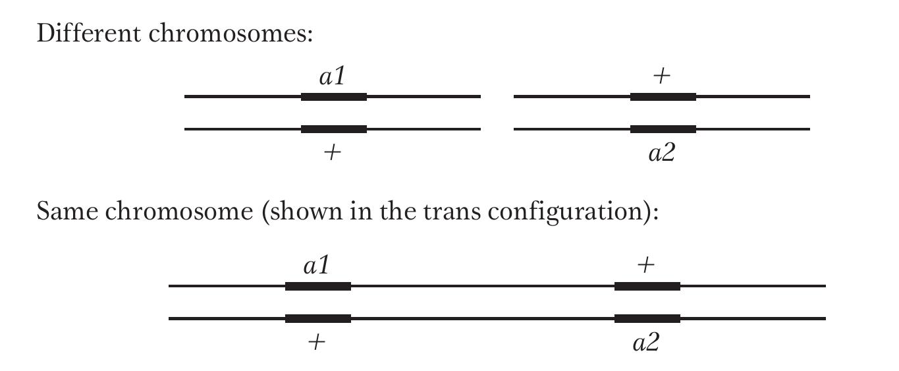
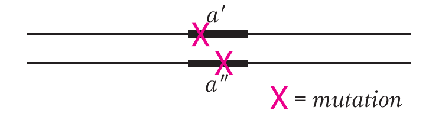
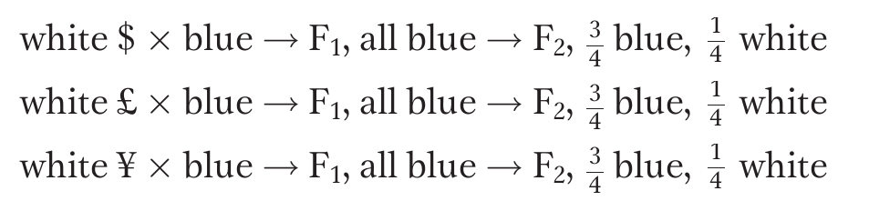
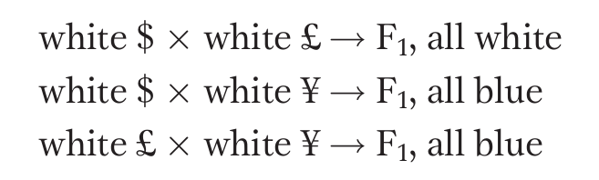

# Gene action and interaction

- In Mendelian phenotypic ratio, one gene is involved in expression of a single phenotype. 
- Some phenotype develop through gene interaction between two or more genes. i.e. two or more genes may also be involved in determination of a single trait and the phenotypic ratio deviates from the expected Mendelian phenotypic ratio. 
- There are a variety of phenotypic ratios which are the result of a variety of gene interaction. Steps in inferring gene interaction :
  1. Obtain many single-gene mutants and test for dominance
  2. Test the mutants for allelism
  3. Combine the mutants in pairs (the process is detailed in the section on Complementation test) to form double mutants to see if the genes interact.
- This double mutant may then be identified by looking for Mendelian ratios. For example, if a standard 9:3:3:1 Mendelian ratio is obtained, the phenotype present in only 1/16 of the progeny represents the double mutant (the "1" in 9:3:3:1).
- Gene interaction is inferred from the phenotype of the double mutant (doesn't mean in two genes): if the genes interact, then the phenotype differs from the simple combination of both single-gene mutant phenotypes.
- In cases in which the two mutants interact, a modified 9:3:3:1 Mendelian ratio will often result (such as 9:3:4 or 9:7). We can then also infer that the wild-type genes interact normally as well.

## Complementation test

- Determines whether two mutations belong to the same gene.
- Quicker approach when linkage mapping is time consuming.
- The decision whether members of a multiple allelic series are located in a single gene or in two or more separately but closely-linked genes is based on complementation test.
- When the trans-heterozygotes for two mutant alleles (affecting the same trait) have the mutant phenotype, they are placed in the same gene. But if they have the wild type phenotype, the mutant alleles are considered to be located in two different genes.
- In a diploid, the complementation test is performed by intercrossing two individuals that are homozygous for different recessive mutations.
- Next step is to observe whether the progeny have the wild-type phenotype. If the progeny are wild type, two recessive mutations must be in _different_ genes because the respective wild-type alleles provide wild-type function. In this case, the two mutations are said to have _complemented_.
- Suppose *a1* and *a2* are mutant alleles of two genes.
- Heterozygotes can be represented as follows, depending on whether genes are on the same or different chromosomes.

```{r gene-location, out.width="35%", fig.align='center'}
# pdftools::pdf_convert("~/Desktop/BSc_Ag_lectures/literatures/textbooks/Introduction to Genetic Analysis/Griffiths - An Introduction to Genetic Analysis 11th Edition c2015.pdf", pages = 253, filenames = "./../images/gene_location_chromosomes.png", dpi = 300)

```

- However, if the progeny are not wild type, then the recessive mutant must be alleles of the same gene. Because both alleles of the gene are mutants, there is no wild-type allele to help distinguish between two different mutant alleles of a gene whose wild-type allele is $a^+$ .
- These alleles could have different mutant sites within the same gene, but they would both be non functional.
- The heterozygote $a^\prime/a^{\prime \prime}$ would be

```{r gene-location-no-complementation, out.width="35%", fig.align='center'}
# pdftools::pdf_convert("~/Desktop/BSc_Ag_lectures/literatures/textbooks/Introduction to Genetic Analysis/Griffiths - An Introduction to Genetic Analysis 11th Edition c2015.pdf", pages = 254, filenames = "./../images/gene_location_chromosomes_nc.png", dpi = 300)

```

- At operational level, complementation is defined as the production of a wild type phenotype when two haploid genomes bearing different recessive mutations are united in the same cell.
- Let us take an example on harebell plants (genus _Campanula_). The wild-type flower color of this plant is blue. Let’s assume that, from a mutant hunt, we have obtained three white-petaled mutants and that they are available as homozygous pure-breeding strains. 
- They all look the same, and so we do not know whether they are genetically identical. 
- We will call the mutant strains $\$$, $\pounds$, and $\yen$ to avoid any symbolism using letters, which might imply dominance. When crossed with wild type, each mutant gives the same results in the $F_1$ and $F_2$ as follows:

```{r gene-complementation-ratios, out.width="35%", fig.align='center'}
# pdftools::pdf_convert("~/Desktop/BSc_Ag_lectures/literatures/textbooks/Introduction to Genetic Analysis/Griffiths - An Introduction to Genetic Analysis 11th Edition c2015.pdf", pages = 254, filenames = "./../images/gene_complementation_ratios1.png", dpi = 300)

```

- In each case, results show that the mutant condition is determined by the recessive allele of a single gene.
- However, are they three alleles of one gene, of two genes, or of three genes?
- Because the mutants are recessive, the question can be answered by the complementation test, which asks if the mutants complement one another.
- Let us intercross the mutants and assume following results are obtained:

```{r gene-complementation-ratios2, out.width="35%", fig.align='center'}
# pdftools::pdf_convert("~/Desktop/BSc_Ag_lectures/literatures/textbooks/Introduction to Genetic Analysis/Griffiths - An Introduction to Genetic Analysis 11th Edition c2015.pdf", pages = 254, filenames = "./../images/gene_complementation_ratios2.png", dpi = 300)

```

- From this set of results, we can conclude that mutants $\$$ and $\pounds$ must be caused by alleles of one gene (say, $w1$) because they do not complement, but $\yen$ must be caused by a mutant allele of another gene ($w2$) because $\yen$ complements both $\$$ and $\pounds$.


## Gene interaction types

- No interaction (9:3:3:1)
- Duplicate gene action (15:1)
- Complementary gene action (9:7)
- Supplementary gene action (9:3:4)
- Inhibitory gene action (13:3)
- Masking gene action (12:3:1)
- Polymeric gene action (9:6:1)
- Additive gene action (1:4:6:4:1)

```{r gene-action-interactions-data}
gene_action_interactions <- read_csv("./data/gene_interactions.csv", show_col_types = FALSE) %>% 
  filter(!is.na(`Type of gene/s`)) %>% 
  mutate(Individuals = if_else(condition = is.na(Individuals), 
                 NA_character_, 
                 paste0("$\\frac{", `Individuals`, "}" , "{", `Out of`, "}$"))) %>% 
  select(-`Out of`)

gene_action_interactions_splits <- gene_action_interactions %>% 
  group_split(`Phenomena type`)

gene_action_interactions_splits <- gene_action_interactions_splits %>% 
  map(.f = ~ .x %>% mutate(`Type of gene/s` = replace(`Type of gene/s`, duplicated(`Type of gene/s`), NA))) %>% 
  map(.f = ~ .x %>% replace_na())

gene_action_interactions_splits2 <- gene_action_interactions_splits %>% 
  map(.f = ~ .x %>% mutate(Genotypes = map(Genotypes, 
                                           function(stringy){
                                             str_extract_all(stringy, "\\d{1,2}") %>% 
                                               unlist() %>% 
                                               as.integer()
                                           })) %>%
        mutate(color_name = seq_along(Phenotypes)))

# # to see which color palette would be useful
# colorspace::swatchplot(c(colors()[seq(1, 120, by = 8)]))

color_profiles <- c(colors()[seq(1, 120, by = 8)]) %>% 
  enframe(name = "numeric_code", 
          value = "color_name") %>% 
  mutate(color_name = gplots::col2hex(color_name))

gene_action_interactions_splits2 <- gene_action_interactions_splits2 %>% 
  # map(~ .x %>% mutate(Genotypes = replace(Genotypes, is.na(Phenotypes), NA))) %>% # this is useless 
  map(~ .x %>% mutate(color_name = replace(color_name, is.na(Phenotypes),NA_integer_))) %>% 
  map(~ .x %>% mutate(color_name = recode(color_name, 
                                           !!!set_names(color_profiles$color_name, color_profiles$numeric_code))))

rotate <- function(x) t(apply(x, 2, rev))

```


```{r gene-action-interactions1}
# # use this for manual table setup
# gene_action_interactions[1:11,] %>%
#   filter(`Type of gene/s` == "Each gene pair affecting a different character") %>%
#   knitr::kable(caption = "Each gene pair affecting a different character",
#                booktabs = TRUE, escape = FALSE) %>%
#   kableExtra::kable_styling(bootstrap_options = "striped",font_size = 6) %>%
#   kableExtra::column_spec(1:6, width = c("8em", "4em", "22em", "4em", "6em", "8em")) %>%
#   kableExtra::collapse_rows(columns = c(1, 2),
#                             valign = "middle", latex_hline = "major",
#                             row_group_label_position = "stack")

# # or use this automatic table setup
gene_action_interactions_splits[[1]] %>%
  select(-2) %>% 
  knitr::kable(caption = "Each gene pair affecting a different character",
               booktabs = TRUE, escape = FALSE, longtable = TRUE) %>%
  kableExtra::kable_styling(latex_options = c("striped", "HOLD_position"), font_size = 8) %>%
  kableExtra::column_spec(1:5, width = c("8em", "14em", "4em", "5em", "6em"))
  # kableExtra::collapse_rows(columns = c(1),
  #                           valign = "middle", latex_hline = "major")
```

\renewcommand{\arraystretch}{2}

```{r gamete-three-combination}
# gamete types
gamete_types <- expand.grid(c("A", "a"), 
                            c("B", "b")) %>% 
  unite(col = "gamete_types", sep = "") %>% 
  pull("gamete_types")

# random mating of gametes
combination_genotypes <- crossing(gamete_types1 = gamete_types, gamete_types2 = gamete_types, 
                                  .name_repair = "universal") %>% 
  # group_by(gamete_types)
  unite(col = "genotype", remove = FALSE, sep = "") %>% 
  spread(key = gamete_types2, value = genotype) %>% 
  rename(gamete_types = gamete_types1)

# # number of unique genotypes
# ca <- c("AA", "Aa", "aa")
# cb <- c("BB", "Bb", "bb")
# unique_genotypes <- expand.grid(ca, cb) %>% 
#   unite(col = "all_gametes", sep = "") %>% 
#   pull(all_gametes) %>% 
#   unique()

# specify colors data frame
color_df <- gene_action_interactions_splits2[[1]][, c(6, 7)] %>% 
  unnest() %>% 
  na.omit() %>% 
  arrange(Genotypes) %>% 
  mutate(row = rep(c("ab", "aB", "Ab", "AB"), each = 4)) %>% 
  # group_by(row) %>% 
  mutate(col = rep(c("ab", "aB", "Ab", "AB"), times = 4)) %>% 
  # ungroup() %>% 
  select(-Genotypes) %>% 
  spread(key = `col`, value = `color_name`)

map2_dfc(.x = (combination_genotypes %>%
                 rename("Gamete" = gamete_types) %>% 
                 rotate() %>% 
                 rotate() %>% 
                 as_tibble() %>% 
                 select(Gamete, everything()))[, -1], 
         .y = color_df[, -1], 
         .f = ~kableExtra::cell_spec(.x, background = .y, format = "latex")) %>%
  add_column(.before = 1, "Gamete" = colnames(.)) %>% 
  kable(booktabs = TRUE, format = "latex", escape = FALSE, linesep = "") %>%
  kableExtra::kable_styling(font_size = 6, latex_options = "HOLD_position") %>% 
  kableExtra::column_spec(1:5, width = c("3em", "3em", "3em", "3em", "3em"))

```
  
\renewcommand{\arraystretch}{1}

<!-- ## -->

<!-- ```{r gene-action-interactions2} -->

<!-- # # or use this automatic table setup -->
<!-- gene_action_interactions_splits[[2]] %>% -->
<!--   select(-2) %>%  -->
<!--   knitr::kable(caption = "Each gene pair affecting a different character", -->
<!--                booktabs = TRUE, escape = FALSE) %>% -->
<!--   kableExtra::kable_styling(bootstrap_options = "striped", font_size = 6) %>% -->
<!--   kableExtra::column_spec(1:5, width = c("8em", "22em", "4em", "6em", "8em")) -->
<!--   # kableExtra::collapse_rows(columns = c(1), -->
<!--   #                           valign = "middle", latex_hline = "major") -->
<!-- ``` -->

<!-- ## -->

<!-- ```{r gene-action-interactions3} -->

<!-- # # or use this automatic table setup -->
<!-- gene_action_interactions_splits[[3]] %>% -->
<!--   select(-2) %>%  -->
<!--   knitr::kable(caption = "Each gene pair affecting a different character", -->
<!--                booktabs = TRUE, escape = FALSE) %>% -->
<!--   kableExtra::kable_styling(bootstrap_options = "striped", font_size = 6) %>% -->
<!--   kableExtra::column_spec(1:5, width = c("8em", "22em", "4em", "6em", "8em")) -->
<!--   # kableExtra::collapse_rows(columns = c(1), -->
<!--   #                           valign = "middle", latex_hline = "major") -->
<!-- ``` -->

### No interaction

- Two dominant genes controlling the development of a single trait.

```{r gene-action-interactions4}

# # or use this automatic table setup
gene_action_interactions_splits[[4]] %>%
  select(-2) %>% 
  knitr::kable(caption = "Each gene pair affecting the same character",
               booktabs = TRUE, escape = FALSE, longtable = TRUE) %>%
  kableExtra::kable_styling(latex_options = c("striped", "HOLD_position"), font_size = 8) %>%
  kableExtra::column_spec(1:5, width = c("8em", "22em", "5em", "6em", "8em"))
  # kableExtra::collapse_rows(columns = c(1),
  #                           valign = "middle", latex_hline = "major")
```

\renewcommand{\arraystretch}{2}

```{r gamete-three-combination4}
# gamete types
gamete_types <- expand.grid(c("A", "a"), 
                            c("B", "b")) %>% 
  unite(col = "gamete_types", sep = "") %>% 
  pull("gamete_types")

# random mating of gametes
combination_genotypes <- crossing(gamete_types1 = gamete_types, gamete_types2 = gamete_types, 
                                  .name_repair = "universal") %>% 
  # group_by(gamete_types)
  unite(col = "genotype", remove = FALSE, sep = "") %>% 
  spread(key = gamete_types2, value = genotype) %>% 
  rename(gamete_types = gamete_types1)

# # number of unique genotypes
# ca <- c("AA", "Aa", "aa")
# cb <- c("BB", "Bb", "bb")
# unique_genotypes <- expand.grid(ca, cb) %>% 
#   unite(col = "all_gametes", sep = "") %>% 
#   pull(all_gametes) %>% 
#   unique()

# specify colors data frame
color_df <- gene_action_interactions_splits2[[4]][, c(6, 7)] %>% 
  unnest() %>% 
  na.omit() %>% 
  arrange(Genotypes) %>% 
  mutate(row = rep(c("ab", "aB", "Ab", "AB"), each = 4)) %>% 
  # group_by(row) %>% 
  mutate(col = rep(c("ab", "aB", "Ab", "AB"), times = 4)) %>% 
  # ungroup() %>% 
  select(-Genotypes) %>% 
  spread(key = `col`, value = `color_name`)

map2_dfc(.x = (combination_genotypes %>%
                 rename("Gamete" = gamete_types) %>% 
                 rotate() %>% 
                 rotate() %>% 
                 as_tibble() %>% 
                 select(Gamete, everything()))[, -1], 
         .y = color_df[, -1], 
         .f = ~kableExtra::cell_spec(.x, background = .y, format = "latex")) %>%
  add_column(.before = 1, "Gamete" = colnames(.)) %>% 
  kable(booktabs = TRUE, format = "latex", escape = FALSE, linesep = "") %>%
  kableExtra::kable_styling(font_size = 6, latex_options = "HOLD_position") %>% 
  kableExtra::column_spec(1:5, width = c("2.5em", "3em", "3em", "3em", "3em"))

```

\renewcommand{\arraystretch}{1}

### Supplementary gene action

- The dominant allele of one gene produces a phenotypic effect.
- The dominant allele of the other gene does not produce any phenotypic effect on its own, but when present with dominant allele of the first gene, it modifies the phenotypic effect produced by the first gene.
- For e.g. development of grain (aleurone) color in maize producing 9:3:4 ratio in $F_2$.

```{r gene-action-interactions5}

# # or use this automatic table setup
gene_action_interactions_splits[[5]] %>%
  select(-2) %>% 
  knitr::kable(caption = "Each gene pair affecting the same character",
               booktabs = TRUE, escape = FALSE, longtable = TRUE) %>%
  kableExtra::kable_styling(latex_options = c("striped", "HOLD_position"), font_size = 8) %>%
  kableExtra::column_spec(1:5, width = c("8em", "22em", "4em", "6em", "8em"))
  # kableExtra::collapse_rows(columns = c(1),
  #                           valign = "middle", latex_hline = "major")
```


\renewcommand{\arraystretch}{2}

```{r gamete-three-combination5}
# gamete types
gamete_types <- expand.grid(c("A", "a"), 
                            c("B", "b")) %>% 
  unite(col = "gamete_types", sep = "") %>% 
  pull("gamete_types")

# random mating of gametes
combination_genotypes <- crossing(gamete_types1 = gamete_types, gamete_types2 = gamete_types, 
                                  .name_repair = "universal") %>% 
  # group_by(gamete_types)
  unite(col = "genotype", remove = FALSE, sep = "") %>% 
  spread(key = gamete_types2, value = genotype) %>% 
  rename(gamete_types = gamete_types1)

# specify colors data frame
color_df <- gene_action_interactions_splits2[[5]][, c(6, 7)] %>% 
  unnest() %>% 
  na.omit() %>% 
  arrange(Genotypes) %>% 
  mutate(row = rep(c("ab", "aB", "Ab", "AB"), each = 4)) %>% 
  # group_by(row) %>% 
  mutate(col = rep(c("ab", "aB", "Ab", "AB"), times = 4)) %>% 
  # ungroup() %>% 
  select(-Genotypes) %>% 
  spread(key = `col`, value = `color_name`)

map2_dfc(.x = (combination_genotypes %>%
                 rename("Gamete" = gamete_types) %>% 
                 rotate() %>% 
                 rotate() %>% 
                 as_tibble() %>% 
                 select(Gamete, everything()))[, -1], 
         .y = color_df[, -1], 
         .f = ~kableExtra::cell_spec(.x, background = .y, format = "latex")) %>%
  add_column(.before = 1, "Gamete" = colnames(.)) %>% 
  kable(booktabs = TRUE, format = "latex", escape = FALSE, linesep = "") %>%
  kableExtra::kable_styling(font_size = 6, latex_options = "HOLD_position") %>% 
  kableExtra::column_spec(1:5, width = c("2em", "3em", "3em", "3em", "3em"))

```

\renewcommand{\arraystretch}{1}

### Complementary gene action

- Production of one phenotype requires the presence of dominant alleles of both genes controlling the character.
- When any one of the two or both the genes are present in homozygous recessive state, the contrasting phenotype is produced.

```{r gene-action-interactions6}

# # or use this automatic table setup
gene_action_interactions_splits[[6]] %>%
  select(-2) %>% 
  knitr::kable(caption = "Each gene pair affecting the same character",
               booktabs = TRUE, escape = FALSE, longtable = TRUE) %>%
  kableExtra::kable_styling(latex_options = c("striped", "HOLD_position"), font_size = 8) %>%
  kableExtra::column_spec(1:5, width = c("8em", "22em", "5em", "6em", "8em"))
  # kableExtra::collapse_rows(columns = c(1),
  #                           valign = "middle", latex_hline = "major")
```


\renewcommand{\arraystretch}{2}

```{r gamete-three-combination6}
# gamete types
gamete_types <- expand.grid(c("A", "a"), 
                            c("B", "b")) %>% 
  unite(col = "gamete_types", sep = "") %>% 
  pull("gamete_types")

# random mating of gametes
combination_genotypes <- crossing(gamete_types1 = gamete_types, gamete_types2 = gamete_types, 
                                  .name_repair = "universal") %>% 
  # group_by(gamete_types)
  unite(col = "genotype", remove = FALSE, sep = "") %>% 
  spread(key = gamete_types2, value = genotype) %>% 
  rename(gamete_types = gamete_types1)

# specify colors data frame
color_df <- gene_action_interactions_splits2[[6]][, c(6, 7)] %>% 
  unnest() %>% 
  na.omit() %>% 
  arrange(Genotypes) %>% 
  mutate(row = rep(c("ab", "aB", "Ab", "AB"), each = 4)) %>% 
  # group_by(row) %>% 
  mutate(col = rep(c("ab", "aB", "Ab", "AB"), times = 4)) %>% 
  # ungroup() %>% 
  select(-Genotypes) %>% 
  spread(key = `col`, value = `color_name`)

map2_dfc(.x = (combination_genotypes %>%
                 rename("Gamete" = gamete_types) %>% 
                 rotate() %>% 
                 rotate() %>% 
                 as_tibble() %>% 
                 select(Gamete, everything()))[, -1], 
         .y = color_df[, -1], 
         .f = ~kableExtra::cell_spec(.x, background = .y, format = "latex")) %>%
  add_column(.before = 1, "Gamete" = colnames(.)) %>% 
  kable(booktabs = TRUE, format = "latex", escape = FALSE, linesep = "") %>%
  kableExtra::kable_styling(font_size = 6, latex_options = "HOLD_position") %>% 
  kableExtra::column_spec(1:5, width = c("2em", "3em", "3em", "3em", "3em"))

```

\renewcommand{\arraystretch}{1}

### Masking gene action

- Dominant alleles of the two genes affecting a character produce distinct phenotypes when they are alone. But when dominant alleles of both the genes are present together, the expression of dominant allele of one gene masks the expression of the other. When both the genes are present in recessive state, a different phenotype is produced.

```{r gene-action-interactions7}

# # or use this automatic table setup
gene_action_interactions_splits[[7]] %>%
  select(-2) %>% 
  knitr::kable(caption = "Each gene pair affecting the same character",
               booktabs = TRUE, escape = FALSE, longtable = TRUE) %>%
  kableExtra::kable_styling(latex_options = c("striped", "HOLD_position"), font_size = 8) %>%
  kableExtra::column_spec(1:5, width = c("8em", "22em", "5em", "6em", "8em"))
  # kableExtra::collapse_rows(columns = c(1),
  #                           valign = "middle", latex_hline = "major")
```


\renewcommand{\arraystretch}{2}

```{r gamete-three-combination7}
# gamete types
gamete_types <- expand.grid(c("A", "a"), 
                            c("B", "b")) %>% 
  unite(col = "gamete_types", sep = "") %>% 
  pull("gamete_types")

# random mating of gametes
combination_genotypes <- crossing(gamete_types1 = gamete_types, gamete_types2 = gamete_types, 
                                  .name_repair = "universal") %>% 
  # group_by(gamete_types)
  unite(col = "genotype", remove = FALSE, sep = "") %>% 
  spread(key = gamete_types2, value = genotype) %>% 
  rename(gamete_types = gamete_types1)

# specify colors data frame
color_df <- gene_action_interactions_splits2[[7]][, c(6, 7)] %>% 
  unnest() %>% 
  na.omit() %>% 
  arrange(Genotypes) %>% 
  mutate(row = rep(c("ab", "aB", "Ab", "AB"), each = 4)) %>% 
  # group_by(row) %>% 
  mutate(col = rep(c("ab", "aB", "Ab", "AB"), times = 4)) %>% 
  # ungroup() %>% 
  select(-Genotypes) %>% 
  spread(key = `col`, value = `color_name`)

map2_dfc(.x = (combination_genotypes %>%
                 rename("Gamete" = gamete_types) %>% 
                 rotate() %>% 
                 rotate() %>% 
                 as_tibble() %>% 
                 select(Gamete, everything()))[, -1], 
         .y = color_df[, -1], 
         .f = ~kableExtra::cell_spec(.x, background = .y, format = "latex")) %>%
  add_column(.before = 1, "Gamete" = colnames(.)) %>% 
  kable(booktabs = TRUE, format = "latex", escape = FALSE, linesep = "") %>%
  kableExtra::kable_styling(font_size = 6, latex_options = "HOLD_position") %>% 
  kableExtra::column_spec(1:5, width = c("2em", "3em", "3em", "3em", "3em"))

```

\renewcommand{\arraystretch}{1}

<!-- ## -->

<!-- ```{r gene-action-interactions8} -->

<!-- # # or use this automatic table setup -->
<!-- gene_action_interactions_splits[[8]] %>% -->
<!--   select(-2) %>%  -->
<!--   knitr::kable(caption = "Each gene pair affecting the same character", -->
<!--                booktabs = TRUE, escape = FALSE) %>% -->
<!--   kableExtra::kable_styling(bootstrap_options = "striped", font_size = 6) %>% -->
<!--   kableExtra::column_spec(1:5, width = c("8em", "22em", "4em", "6em", "8em")) -->
<!--   # kableExtra::collapse_rows(columns = c(1), -->
<!--   #                           valign = "middle", latex_hline = "major") -->
<!-- ``` -->

### Inhibitory gene action

- One dominant gene produces the concerned phenotype or the character, while its recessive allele produces the contrasting phenotype.
- The second gene has no effect of its own on the character in question, but it stops the expression of the dominant allele of the first gene.
- As a result, when two dominant genes are present togethe, they produce the same phenotype as that produced by the recessive homozygote of the first gene.
- The recessive allele of the second gene does not affect the development of the character in any way.
- For e.g. genes controlling seed color in maize.


```{r gene-action-interactions9}

# # or use this automatic table setup
gene_action_interactions_splits[[9]] %>%
  select(-2) %>% 
  knitr::kable(caption = "Each gene pair affecting the same character",
               booktabs = TRUE, escape = FALSE, longtable = TRUE) %>%
  kableExtra::kable_styling(bootstrap_options = c("striped", "HOLD_position"), font_size = 8) %>%
  kableExtra::column_spec(1:5, width = c("8em", "22em", "5em", "6em", "8em"))
  # kableExtra::collapse_rows(columns = c(1),
  #                           valign = "middle", latex_hline = "major")
```


\renewcommand{\arraystretch}{2}

```{r gamete-three-combination9}
# gamete types
gamete_types <- expand.grid(c("A", "a"), 
                            c("B", "b")) %>% 
  unite(col = "gamete_types", sep = "") %>% 
  pull("gamete_types")

# random mating of gametes
combination_genotypes <- crossing(gamete_types1 = gamete_types, gamete_types2 = gamete_types, 
                                  .name_repair = "universal") %>% 
  # group_by(gamete_types)
  unite(col = "genotype", remove = FALSE, sep = "") %>% 
  spread(key = gamete_types2, value = genotype) %>% 
  rename(gamete_types = gamete_types1)

# specify colors data frame
color_df <- gene_action_interactions_splits2[[9]][, c(6, 7)] %>% 
  unnest() %>% 
  na.omit() %>% 
  arrange(Genotypes) %>% 
  mutate(row = rep(c("ab", "aB", "Ab", "AB"), each = 4)) %>% 
  # group_by(row) %>% 
  mutate(col = rep(c("ab", "aB", "Ab", "AB"), times = 4)) %>% 
  # ungroup() %>% 
  select(-Genotypes) %>% 
  spread(key = `col`, value = `color_name`)

map2_dfc(.x = (combination_genotypes %>%
                 rename("Gamete" = gamete_types) %>% 
                 rotate() %>% 
                 rotate() %>% 
                 as_tibble() %>% 
                 select(Gamete, everything()))[, -1], 
         .y = color_df[, -1], 
         .f = ~kableExtra::cell_spec(.x, background = .y, format = "latex")) %>%
  add_column(.before = 1, "Gamete" = colnames(.)) %>% 
  kable(booktabs = TRUE, format = "latex", escape = FALSE, linesep = "") %>%
  kableExtra::kable_styling(font_size = 6, latex_options = "HOLD_position") %>% 
  kableExtra::column_spec(1:5, width = c("2em", "3em", "3em", "3em", "3em"))
```

\renewcommand{\arraystretch}{1}

### Polymeric gene action

- Two completely dominant genes controlling a character produce the same phenotype when their dominant alleles are alone. But when dominant alleles of both genes are present together, their phenotypic effect is enhanced as if the effect of the two genes are present together, their phenotypic effect is enhanced as if the effect of the two genes were cumulative or additive.

```{r gene-action-interactions10}

# # or use this automatic table setup
gene_action_interactions_splits[[10]] %>%
  select(-2) %>% 
  knitr::kable(caption = "Each gene pair affecting the same character",
               booktabs = TRUE, escape = FALSE, longtable = TRUE) %>%
  kableExtra::kable_styling(bootstrap_options = c("striped", "HOLD_position"), font_size = 8) %>%
  kableExtra::column_spec(1:5, width = c("8em", "22em", "5em", "6em", "8em"))
  # kableExtra::collapse_rows(columns = c(1),
  #                           valign = "middle", latex_hline = "major")
```


\renewcommand{\arraystretch}{2}

```{r gamete-three-combination10}
# gamete types
gamete_types <- expand.grid(c("A", "a"), 
                            c("B", "b")) %>% 
  unite(col = "gamete_types", sep = "") %>% 
  pull("gamete_types")

# random mating of gametes
combination_genotypes <- crossing(gamete_types1 = gamete_types, gamete_types2 = gamete_types, 
                                  .name_repair = "universal") %>% 
  # group_by(gamete_types)
  unite(col = "genotype", remove = FALSE, sep = "") %>% 
  spread(key = gamete_types2, value = genotype) %>% 
  rename(gamete_types = gamete_types1)

# specify colors data frame
color_df <- gene_action_interactions_splits2[[10]][, c(6, 7)] %>% 
  unnest() %>% 
  na.omit() %>% 
  arrange(Genotypes) %>% 
  mutate(row = rep(c("ab", "aB", "Ab", "AB"), each = 4)) %>% 
  # group_by(row) %>% 
  mutate(col = rep(c("ab", "aB", "Ab", "AB"), times = 4)) %>% 
  # ungroup() %>% 
  select(-Genotypes) %>% 
  spread(key = `col`, value = `color_name`)

map2_dfc(.x = (combination_genotypes %>%
                 rename("Gamete" = gamete_types) %>% 
                 rotate() %>% 
                 rotate() %>% 
                 as_tibble() %>% 
                 select(Gamete, everything()))[, -1], 
         .y = color_df[, -1], 
         .f = ~kableExtra::cell_spec(.x, background = .y, format = "latex")) %>%
  add_column(.before = 1, "Gamete" = colnames(.)) %>% 
  kable(booktabs = TRUE, format = "latex", escape = FALSE, linesep = "") %>%
  kableExtra::kable_styling(font_size = 6, latex_options = "HOLD_position") %>% 
  kableExtra::column_spec(1:5, width = c("2em", "3em", "3em", "3em", "3em"))
```

\renewcommand{\arraystretch}{1}

<!-- ## -->

<!-- ```{r gene-action-interactions11} -->

<!-- # # or use this automatic table setup -->
<!-- gene_action_interactions_splits[[11]] %>% -->
<!--   select(-2) %>%  -->
<!--   knitr::kable(caption = "Each gene pair affecting the same character", -->
<!--                booktabs = TRUE, escape = FALSE) %>% -->
<!--   kableExtra::kable_styling(bootstrap_options = "striped", font_size = 6) %>% -->
<!--   kableExtra::column_spec(1:5, width = c("8em", "22em", "4em", "6em", "8em")) -->
<!--   # kableExtra::collapse_rows(columns = c(1), -->
<!--   #                           valign = "middle", latex_hline = "major") -->
<!-- ``` -->

<!-- ## -->

<!-- ```{r gene-action-interactions12} -->

<!-- # # or use this automatic table setup -->
<!-- gene_action_interactions_splits[[12]] %>% -->
<!--   select(-2) %>%  -->
<!--   knitr::kable(caption = "Each gene pair affecting the same character", -->
<!--                booktabs = TRUE, escape = FALSE) %>% -->
<!--   kableExtra::kable_styling(bootstrap_options = "striped", font_size = 6) %>% -->
<!--   kableExtra::column_spec(1:5, width = c("8em", "22em", "4em", "6em", "8em")) -->
<!--   # kableExtra::collapse_rows(columns = c(1), -->
<!--   #                           valign = "middle", latex_hline = "major") -->
<!-- ``` -->

<!-- ## -->

<!-- ```{r gene-action-interactions13} -->

<!-- # # or use this automatic table setup -->
<!-- gene_action_interactions_splits[[13]] %>% -->
<!--   select(-2) %>%  -->
<!--   knitr::kable(caption = "Each gene pair affecting the same character", -->
<!--                booktabs = TRUE, escape = FALSE) %>% -->
<!--   kableExtra::kable_styling(bootstrap_options = "striped", font_size = 6) %>% -->
<!--   kableExtra::column_spec(1:5, width = c("8em", "22em", "4em", "6em", "8em")) -->
<!--   # kableExtra::collapse_rows(columns = c(1), -->
<!--   #                           valign = "middle", latex_hline = "major") -->
<!-- ``` -->

<!-- ## -->

<!-- ```{r gene-action-interactions14} -->

<!-- # # or use this automatic table setup -->
<!-- gene_action_interactions_splits[[14]] %>% -->
<!--   select(-2) %>%  -->
<!--   knitr::kable(caption = "Each gene pair affecting the same character", -->
<!--                booktabs = TRUE, escape = FALSE) %>% -->
<!--   kableExtra::kable_styling(bootstrap_options = "striped", font_size = 6) %>% -->
<!--   kableExtra::column_spec(1:5, width = c("8em", "22em", "4em", "6em", "8em")) -->
<!--   # kableExtra::collapse_rows(columns = c(1), -->
<!--   #                           valign = "middle", latex_hline = "major") -->
<!-- ``` -->

### Additive gene action

- Each positive allele of the two genes governing a trait produces equal and identical effect on the character.
- This gene action is the basis for **multiple factor hypothesis** and the gene action sometimes aka polygenic action.


```{r gene-action-interactions15}

# # or use this automatic table setup
gene_action_interactions_splits[[15]] %>%
  select(-2) %>% 
  knitr::kable(caption = "Each gene pair affecting the same character",
               booktabs = TRUE, escape = FALSE, longtable = TRUE) %>%
  kableExtra::kable_styling(bootstrap_options = c("striped", "HOLD_position"), font_size = 8) %>%
  kableExtra::column_spec(1:5, width = c("8em", "22em", "4em", "6em", "8em"))
  # kableExtra::collapse_rows(columns = c(1),
  #                           valign = "middle", latex_hline = "major")
```


\renewcommand{\arraystretch}{2}

```{r gamete-three-combination15}
# gamete types
gamete_types <- expand.grid(c("A", "a"), 
                            c("B", "b")) %>% 
  unite(col = "gamete_types", sep = "") %>% 
  pull("gamete_types")

# random mating of gametes
combination_genotypes <- crossing(gamete_types1 = gamete_types, gamete_types2 = gamete_types, 
                                  .name_repair = "universal") %>% 
  # group_by(gamete_types)
  unite(col = "genotype", remove = FALSE, sep = "") %>% 
  spread(key = gamete_types2, value = genotype) %>% 
  rename(gamete_types = gamete_types1)

# specify colors data frame
color_df <- gene_action_interactions_splits2[[15]][, c(6, 7)] %>% 
  unnest() %>% 
  na.omit() %>% 
  arrange(Genotypes) %>% 
  mutate(row = rep(c("ab", "aB", "Ab", "AB"), each = 4)) %>% 
  # group_by(row) %>% 
  mutate(col = rep(c("ab", "aB", "Ab", "AB"), times = 4)) %>% 
  # ungroup() %>% 
  select(-Genotypes) %>% 
  spread(key = `col`, value = `color_name`)

map2_dfc(.x = (combination_genotypes %>%
                 rename("Gamete" = gamete_types) %>% 
                 rotate() %>% 
                 rotate() %>% 
                 as_tibble() %>% 
                 select(Gamete, everything()))[, -1], 
         .y = color_df[, -1], 
         .f = ~kableExtra::cell_spec(.x, background = .y, format = "latex")) %>%
  add_column(.before = 1, "Gamete" = colnames(.)) %>% 
  kable(booktabs = TRUE, format = "latex", escape = FALSE, linesep = "") %>%
  kableExtra::kable_styling(font_size = 6, latex_options = "HOLD_position") %>% 
  kableExtra::column_spec(1:5, width = c("2em", "3em", "3em", "3em", "3em"))
```

\renewcommand{\arraystretch}{1}

