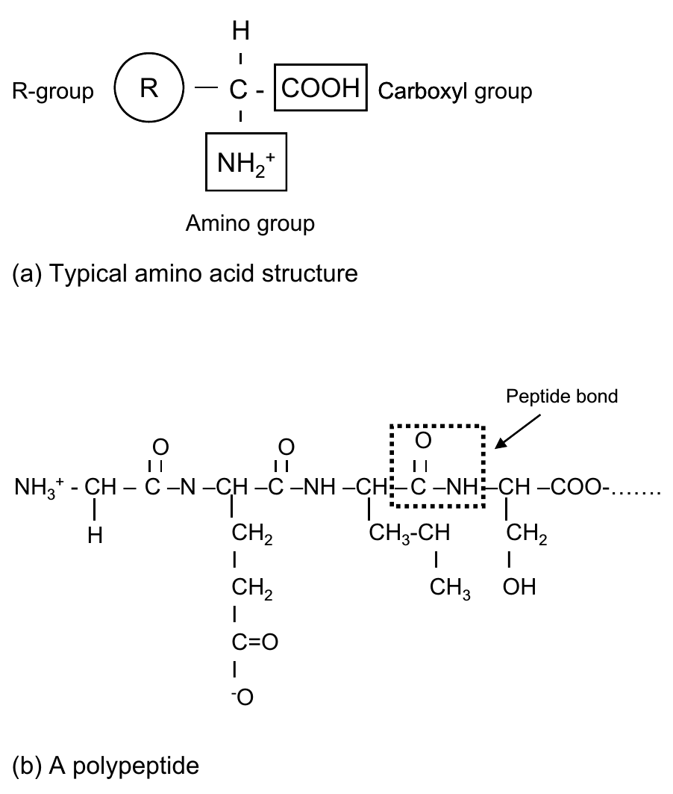
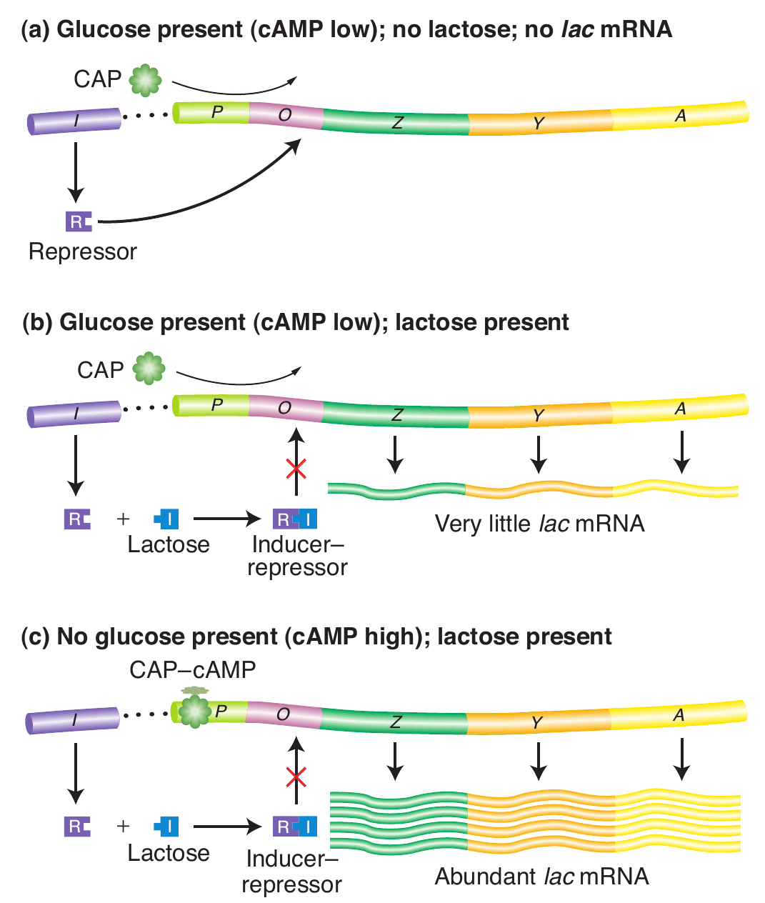

# Nucleic acids- DNA, RNA; replication, transcription, translation and genetic code and gene regulation

## Structure of DNA

- DNA is the universal, hereditary material (except in certain viruses – RNA viruses).
- The structure of the DNA molecule is a double helix (Figure \ref{fig:double-helix}). 
- The key features about the DNA molecule are:
  - It consists of two polynucleotide chains coiled around a central axis in a spiral fashion. The most common natural form of DNA is a right-handed double helix of diameter 2.0 nm, called the B-DNA. A left-handed form (Z-DNA) and an A-form of DNA also occur under certain conditions.
  - The polynucleotide chains are antiparallel; one chain runs in the $5^\prime$ to $3^\prime$ orientation and the other $3^\prime$ to $5^\prime$ (carbon atoms of a sugar are conventionally numbered from the end closest to the aldehyde or ketone).
  - The two bases in each base pair lie in the same plane. Each plane is perpendicular to the axis of the helix. There are 10 base pairs per helical turn.
  - The helix has two kinds of alternating external grooves; a deep groove (called the major groove) and a shallow groove (called the minor groove). 
  - The nitrogenous bases on one strand pair with those on the other strand in complementary fashion (A always pairs with T, while G pairs with C).

```{r double-helix, out.width="65%", fig.cap="The Watson-Crick model of the DNA double helix (B-form)"}
# pdftools::pdf_convert("../../literatures/textbooks/Introduction to Genetic Analysis/Griffiths - An Introduction to Genetic Analysis 11th Edition c2015.pdf",
#                       pages = 295,
#                       dpi = 300, format = "png",
#                       filenames = "../images/double_helix_dna.png")

knitr::include_graphics("./images/double_helix_dna.png")
```


```{r base-pairing, out.width="65%", fig.cap="Specific base pairing by the formation of hydrogen bonds between two antiparallel DNA strands. The molecular structure of the bases only allows the pairings AT and GC. An AT pair forms two hydrogen bonds; a GC pair forms three hydrogen bonds"}
# pdftools::pdf_convert("../../literatures/Plant Science Straussberger.pdf",
#                       pages = 31,
#                       dpi = 300, format = "png",
#                       filenames = "../images/complementary_base_pairing.png")

knitr::include_graphics("./images/complementary_base_pairing.png")
```


- In addition to these features, nature of code has following characteristics:
  - Complementary base pairing means that the replicate of each strand is given the base sequence of its complementary strand when DNA replicates. 
  - Because the strands are **antiparallel**, when two nucleotides are paired the sugar portions of these molecules lie in opposite directions (one upward and the other downward along the chain).
  - Because the strands are antiparallel, the convention for writing the sequence of bases in a strand is to start from the $\mathrm{5^{\prime}-P}$ terminus at the left (e.g., GAC refers to a trinucleotide $\mathrm{5^\prime-P^{\prime}-GAC-3^\prime-OH}$).
  - The conventional way of expressing the base composition of an organism is by the percentage of $\text{[G] + [C]}$. This value is approximately 50% for most eukaryotes with only minor variations among species. In simpler organisms, there are significant variations (e.g., 27% for _Clostridium_, 50% for _E. coli_, and 76% for _Sarcina_, all of these organisms being bacteria).
  - The chains of the double helix are held together by hydrogen bonds between base pairs in opposite strands. The bond between A and T is a double bond, while the bond between G and C is a triple hydrogen bond.

\begin{figure}
  \begin{center}
  \includegraphics[width=0.40\linewidth]{./images/nucleotide_blocks1.png}
  \end{center}
  
  \begin{center}
  \includegraphics[width=0.40\linewidth]{./images/nucleotide_blocks.png}
  \end{center}
  
  \caption{\newline Nucleotides are made up of three building blocks: a pyrimidine or purine base, a pentose, and phosphoric acid. The base is bonded to the pentose by an N-$\beta$-glycoside, either via N1 of the pyrimidine or via N9 of the purine. The phosphoric acid forms an ester with the primary alcohol group of the pentose. Up to two further phosphoric acid groups can be attached by anhydride bonds to the a phosphoric acid group. The glycoside made up of a base and a ribose is called a nucleoside, and that made up of a base and 2-deoxyribose is called a deoxynucleoside. Nucleotides can be nucleoside monophosphates, diphosphates, or triphosphates, as shown in the example using adenosine and its nucleotides. Deoxynucleotides are thus deoxynucleoside monophosphates, diphosphates, or triphosphates. The sugar in ribonucleic acid (RNA) is ribose, and in deoxyribonucleic acid (DNA) it is 2-deoxyribose. The carbon atoms of the sugar are indicated in the nucleosides and nucleotides (1, 2, 5,...). C1 forms the glycosidic bond. To simplify the chemical skeletal formula, the hydrogens attached to carbons are often omitted in complex formulas (e.g., rings).}
  \label{fig:nucleotide-blocks}
  
\end{figure}


## Replication of DNA

- Because essentially every cell in the body of an organism has the same genetic makeup, faithful replication of the genetic material at every cell division is crucial. Thus, the structual features of DNA must allow for faithful replication.
- The DNA double helix strands are so arranged in positive-negative relationship that identical duplication or replication of hereditary information is possible.
- Two strands separate and a base-complementary partner strand is newly formed with each strand. This mode of duplication is called semi-conservative mode.
- At least three different ways exist in which a parental DNA molecule might be related to the daughter molecules. These hypothetical modes of replication are called semi-conservative, conservative and dispersive modes.
  - In semiconservative replicaiton, the double helix of each daughter DNA molecule contains one strand from the original DNA molecule and one newly synthesized strand.
  - In conservative replication, the parent DNA molecule is conserved, and a single daughter double helix is produced consisting of two newly synthesized strands.
  - In dispersive replicaiton, daughter molecules consist of strands each containing segments of both parental DNA and newly synthesized DNA.
- Meselson and Stahl, in 1958, performed an experiment to correctly describe DNA replication. Their idea was to allow parental DNA molecules containing nucleotides of one density to replicate in medium containing nucleotides of different density. If DNA replicated semiconservatively, the daughter molecules should be half old and half new and therefore of intermediate density. They were able to distinguish DNA of different densities because the molecules can be separated from one another by a procedure called Cesium chloride gradient centrifugation. The experiment involving transfer of cells grown in $^{15} N$ to a $^{14} N$ medium confirmed the results
  - First generation produces a single intermediate DNA band and the second generation produces two bands: one intermediate and one light, matching the prediction of the semi-conservative model of DNA replication.


```{r dna-replication-mode, out.width="52%", fig.align='center'}
# pdftools::pdf_convert("../../literatures/Plant Science Straussberger.pdf",
#                       pages = 32,
#                       dpi = 300, format = "png",
#                       filenames = "../images/semi_conservative_replication.png")

knitr::include_graphics("./images/semi_conservative_replication.png")
```

**Steps in replication**

- Unwinding of DNA double helix by **hellicase** (analogous to a zipper that unzips)
- Prevention of knotting by relaxation enzyme (**topoisomerase I**)
- Two strands of a replication fork (one $3^{\prime}$ and the other $5^{\prime}$) need to be extended by different mechanisms because DNA polymerases can only extend the chain at former orientation. Only $3^\prime$ end is continually extended.
- Ligases are able to link $3^\prime$ ends with $5^\prime$ ends. Without these lagging strand sequences cannot be bonded and can be isolated as **Okazaki fragments**.
- DNA polymerase require a **primer**^[Primers are synthesized by a set of proteins called primosomes, of which a central component is an enzyme called primase, a type of RNA polymerase.] (RNA sequences) in order to start synthesis. These primers supply the $3^\prime$ end on which the DNA polymerase can build further.
- A sequence region replicated by a replicator is called a **replicon**.


```{r dna-replication-process, out.width="45%", fig.align='center'}
# pdftools::pdf_convert("../../literatures/textbooks/Introduction to Genetic Analysis/Griffiths - An Introduction to Genetic Analysis 10th Edition.pdf",
#                       pages = 295,
#                       dpi = 300, format = "png",
#                       filenames = "../images/dna_replication_process.png")

knitr::include_graphics("./images/dna_replication_process.png")
```

**Fidelity of DNA replication**

A different DNA (compared to DNA polymerase III), pol I, removes the RNA primers with its 5' - 3' exonuclease activity and fills in the gaps with its 5' - 3' polymerase activity. Another enzyme, DNA ligase, joins the 3' end of the gap filling DNA to the 5' end of the downstream Okazaki fragment. DNA ligase joins the broken pieces of DNA by catalyzing the formation of a phosphodiester bond between the 5'-phosphate end of one fragment and the adjacent 3'-OH group of another fragment.

A hallmark of DNA replication is its accuracy, also called fidelity: overall less than one error per $10^{10}$ nucleotides is inserted. Part of the reason for the accracy of DNA replication is that both DNA pol I and DNA pol III possess 3' - 5' exonuclease activity, which serves a "proofreading" function by excising erroneously inserted mismatched bases.

A mismatched base pair occurs when the 5' - 3' pol I activity inserts, for example "A" instead of a "G" next to a "C". The addition of an incorrect base is often due to a process called tautomerization. Each of the bases in DNA can appear in one of several forms called tautomers, which are isomers that differ in the position of their atoms and in the bonds in between the atoms. The forms are in equilibrium. The keto form of each base is normally present in DNA, but in rare instances a base may shift to the imino or enol form. The imino acide and keto forms may pair with the wrong base, forming a mispair. When a "C" shifts to it rare iminoform, such a mismatch is usually detected and removed by 3' - 5' exonuclease activity once the mismatched bases is removed the polymerase has another chance to add the correct complementary "G" base.

As expected, mutant strains lacking a function of 3' - 5' exonuclease have a higher rate of mutation. In addition, because primase lacks a proofreading function, the RNA primer is more likely than DNA to contain errors. The need to maintain high fidelity of replication is one reason that the RNA primers at the ends of okazaki fragments must be removed and replaced with DNA. Only after the RNA primer is gone does DNA pol I catalyze DNA synthesis to replace the primers.


## Structure of RNA

- Ribonucleic acid (RNA) is similar in structure to DNA. However, there are significant differences, the key ones being:
  - RNA consists of ribose sugar (in place of deoxyribose) and uracil in place of thymine.
  - Most RNA is predominantly single stranded (except in some viruses). Sometimes, the molecule folds back on itself to form double-stranded regions. Certain animal and plant viruses use RNA as their genetic material.
  - A typical cell contains about ten times more RNA than DNA.
  - Whereas DNA stores genetic information, RNA most often functions in the expression of the genetic information.
  - There are three major classes of RNA known to be involved in gene expression: ribosomal RNA (rRNA), messenger RNA (mRNA), and transfer RNA (tRNA). The site of protein synthesis, the ribosome, contains rRNA.

### mRNA

- Messenger RNA (mRNA) is the molecular carrier of genetic information from the DNA to ribosomes, where this DNA transcript or template is translated (the genetic information of DNA transcript is expressed) into proteins. 
- Because genes vary in size (number of nucleotides) the mRNA species are variable in length. 
- Eukaryotic RNA is transcribed as a primary transcript, a cap is added at the $5^\prime$ end, a poly(A) tail is added, and the introns are removed. 
- The mRNA is then transported from the nucleus to the endoplasmic reticulum for translation by ribosomes.


```{r mrna-processed, out.width="65%", fig.cap="Detailed structure of a processed eukaryotic mRNA. The cap structure is followed by $5^\\prime$ UTR, the protein encoding exongs, $3^\\prime$ UTR, and a poly(A) tail."}
# pdftools::pdf_convert("../../literatures/biotechnology/Biotechnology 2nd ed - David P. Clark, Nanette J. Pazdernik (AP, 2016).pdf",
#                       pages = 58,
#                       dpi = 300, format = "png",
#                       filenames = "../images/mrna_processed.png")

knitr::include_graphics("./images/mrna_processed.png")
```

### tRNA

- The structure of transfer RNA (tRNA) is very unique among the three key RNA molecules in the cell. 
- These molecules are small in size and very stable (range in size from 75–90 nucleotides). 
- A single-stranded tRNA molecule is able to fold back onto itself and undergo complementary base pairing in short stretches to form double strands. 
- This folding also creates four characteristic loops and a cloverleaf 2-D structure (Figure \ref{fig:ribonucleic-acids}).
  - Three loops are involved in translating the message of the mRNA. 
  - The anticodon loop (or simply anticodon) consists of a sequence of three bases that are complementary to the sequence of a codon on the mRNA.
- The stop codons do not have tRNA with anticodons for them. 
- Another feature of the tRNA molecule is the occurrence of the sequence pCpCpA- $3^\prime$ at the $3^\prime$ end. 
- The terminal adenine residue is the point of attachment for an amino acid and hence is called the amino acid attachment (or binding) site. 
- During protein synthesis, the amino acid corresponding to a particular mRNA codon that base pairs with the tRNA anticodon is attached to this terminal and transported to the appropriate segment of the mRNA.
- Ribosomes are the sites ("factories") of polypeptide synthesis (or protein synthesis).
- A bacterial cell may contain about 1000 ribosomes. 
- A ribosome consists of two subunits, which together form the monosome. The ribosomal particles are classified according to their sedimentation coefficient or rate (S). 
- Monosomes of bacteria are 70S (70S ribosomes) whereas eukaryotic monosomes are about 80S. 
- Because sedimentation coefficients are not additive, a 70S monosome in actuality comprises two subunits that are 50S and 30S, while an 80S monosome consists of 60S and 40S subunits. 
- A ribosome subunit consists of molecules of rRNA and proteins. 
- For example, the 50S subunit contains one 55 rRNA, one 235 rRNA molecule, and 32 different ribosomal proteins.

<!-- ```{r} -->
<!-- # pdftools::pdf_convert("../../literatures/Plant Science Straussberger.pdf", -->
<!-- #                       pages = 34, -->
<!-- #                       dpi = 300, format = "png", -->
<!-- #                       filenames = "../images/ribonucleic_acids.png") -->
<!-- ``` -->

\begin{figure}
  \begin{center}
  \includegraphics[width=0.6\linewidth]{./images/ribonucleic_acids_trna.png}
  \end{center}
  
  \begin{center}
  \includegraphics[width=0.6\linewidth]{./images/ribonucleic_acids_types.png}
  \end{center}
  
  \begin{center}
  \includegraphics[width=0.95\linewidth]{./images/ribonucleic_acids_viral_molecule.png}
  \end{center}

  \caption{\newline Ribonucleic acids. (a) 'Clover-leaf' structure of a transfer RNA (tRNA) molecule with the tyrosine-bearing tRNA ($tRNA^{Tyr}$) of yeast. The structure is stabilized by regions inside the single-stranded molecule that can swap base pairs; there are adjacent unpaired regions. Numerous bases of tRNAs (outlined in red) are modified; some important examples of modified bases are shown in (b). Adjacent there are methylated bases ($Me$). A base triplet, the anticodon, pairs with a complementary base triplet on the mRNA. The codon–anticodon sequence of triplets on the mRNA specifies the order of the amino acids in a protein. The D arm is named after the increased frequency of dihydrouracil ($UH_2$), and the TCC arm is named after the ubiquitous base sequence $5^{\prime} - T - \Psi - C - 3^{\prime}$. The V loop differs in size in different tRNAs. The amino acid acceptor arm and the anticodon arm are important for the recognition of the right tRNAs and their amino acids by the aminoacyl-tRNA-synthetases. The anticodon arm 'presents' the anticodon simultaneously with the mRNA codon so that base pairing can occur on the ribosome. The $\mathrm{T\Psi C}$ arm and the D arm are probably especially significant for the bonding of the tRNA to the ribosome. (c) Example of a ring-shaped closed RNA molecule. The potato spindle tuber viroid consists of a covalently closed ring of 359 nucleotides. The structure is stabilized by intramolecular base pairs, represented here as simple lines (for clarity)}
  \label{fig:ribonucleic-acids}

\end{figure}


## Expression of genetic information

### Genetic code

- The "Central dogma of biology" states that genetic information flow is generally unidirectional from DNA to proteins, except in special cases (Figure ). 
- This flow, mediated by transcription (copying of the DNA template by synthesizing the RNA molecule) and translation (synthesis of a polypeptide using the genetic information encoded in an mRNA molecule) and preceded by replication (the process of DNA synthesis), can now be reversed in vitro (in the test tube) by scientists.
- Thus, once a protein is known, the nucleotide sequence in the prescribing DNA strand can be determined and synthesized (the product is called a complementary DNA or cDNA). Production of cDNA is a technique used in genetic engineering.
- A key question in genetics is how the information of the DNA is interpreted to produce protein.
- The sequence of bases in the polynucleotide chain holds the key to DNA function because it represents the genetic code (the set of rules giving the correspondence between mRNA and amino acids in a protein) for the synthesis of corresponding amino acids that constitute proteins.
- DNA does not code for adult traits directly, there being no genes for adult traits as such. Instead, genes code for various developmental processes. 
- The variety of protein products in a cell undertake catalytic and structural activities that eventually result in an adult phenotype.
- There are about twenty commonly occurring amino acids. 
- According to the prescribed sequence (based on the genetic code), amino acids are joined together by **peptide bonds** to form polypeptide chains (Figure \ref{fig:polypeptides-amino}). 
- The genetic code is a triplet code. 
- Three adjacent bases form a code for an amino acid. 
- Each trinucleotide sequence is called a codon (Figure \ref{fig:universality}). 
- The genetic code is read from a fixed starting point of the DNA strand.
- The genetic code is said to be degenerate because nearly all amino acids are specified by at least two codons. 

```{r universality, fig.cap="The genetic code is universal for all life forms", out.width="45%"}

knitr::include_graphics("./images/nucleotide_codons.jpg")
```


- Some (serine, arginine, leucine) are encoded by six different codons. 
- Only tryptophan and methionine are encoded by single codons.
- Further, for a set of codons encoding the same amino acid, the first two letters in the figure is the same, with only the third being different (called the **wobble hypothesis**).
- Consequently, at least 30 different tRNA species are required to account for the 61 different triplets in the coding dictionary in just 17 (the three remaining triplets include termination codons or signals – UAG, UAA, UGA).

### Transcription: RNA synthesis

- The genetic information of the DNA template is copied by the process of transcription (or RNA synthesis) to produce an RNA sequence (mRNA).
- The transactions of DNA and RNA take place through the matching of complementary bases and the binding of various proteins to specific sites on the DNA or RNA.
- The DNA strand that is transcribed is called the **template strand**. 
- The process starts with a recognition of a special DNA sequence (called a promoter) and binding to it by an enzyme, a process called template binding. 
- RNA polymerase II carries out the transcription in eukaryotes.
- Transcription factors control its activity.
- The RNA chain then grows (chain elongation) in the $3^\prime$ direction (Starting at $5^\prime$).
- Binding and activity of RNA polymerase II are controlled by cis-regulatory regions and by trans-acting regulatory factors (transcription factors).
- General transcription factors (GTFs) are necessary for RNAP II to transcribe DNA, and Specific TFs affect the efficiency or rate of RNAP II transcription.
- Promotor region is located at a gene's $5^\prime$ end (using the coding strand as a reference) -- upstream from transcription start site or the **ORF**.
- Promoter is composed of core promoter and proximal promotor elements, that define when and where a gene is transcribed.
- Nucleotide sequences are numerically designated based on transcription initiation site as reference point ("+" ve and "-" ve, former referring to downstream sequences, and latter to the upstream sequences)


```{r gene-transcription, out.width="60%", fig.cap="(a) The promoter lies 'upstream' (toward the $5^\\prime$ end) of the initiation point and coding sequences. (b) Promoters have regions of similar sequences, as indicated by the yellow shading in seven different promoter sequences in \\textit{E. coli}. Spaces (dots) are inserted in the sequences to optimize the alignment of the common sequences. Numbers refer to the number of bases before (-) or after (+) the RNA synthesis initiation point. The consensus sequence for most E. coli promoters is at the bottom."}
# pdftools::pdf_convert("../../literatures/textbooks/Introduction to Genetic Analysis/Griffiths - An Introduction to Genetic Analysis 11th Edition c2015.pdf",
#                       pages = 325,
#                       dpi = 300, format = "png",
#                       filenames = "../images/gene_transcription.png")

knitr::include_graphics("./images/gene_transcription.png")
```

- An RNA polymerase holoenzyme binds to the DNA at **consensus sequence**, then unwinds the DNA double helix and begins the synthesis of an RNA molecule.
- RNA polymerase holoenzyme is a multisubunit complex is composed of the five subunits of the core enzyme (two subunits of a, one of $\beta$, one of $\beta^\prime$, and one of $\omega$) + a subunit called sigma ($\sigma$) factor.
- Although ATG (AUG in the mRNA) sequence is the initiation codon translated as protein, mRNA sequence consists of portion of the genes starting from +1 site, which are well upstream of the AUG sequence.
- The intervening part is referred to as $5^\prime$ untranslated (UTR) region. Similarly occurs a sequence to the $3^\prime$ region of the transcribed RNA, called $3^\prime$ UTR region.
- As the RNA polymerase moves along the DNA, it unwinds the DNA ahead of it and rewinds the DNA that has already been transcribed. In this way, it maintains a region of single-stranded DNA, called a **transcription bubble**.


```{r gene-transcription-prokaryotes1, out.width="70%", fig.cap="(a-b) In transcription initiation, $\\sigma$ subunit positions prokaryotic RNA polymerase for transcription initiation"}
# pdftools::pdf_convert("../../literatures/textbooks/Introduction to Genetic Analysis/Griffiths - An Introduction to Genetic Analysis 11th Edition c2015.pdf",
#                       pages = 326,
#                       dpi = 300, format = "png",
#                       filenames = "../images/gene_transcription_prokaryotes.png")

knitr::include_graphics("./images/gene_transcription_prokaryotes1.png")
```


```{r gene-transcription-prokaryotes2, out.width="70%", fig.cap="(a) Elongation: Synthesis of an RNA strand complementary to the single-strand region of the DNA template strand. DNA that is unwound ahead of RNA polymerase is rewound after it has been transcribed."}
# pdftools::pdf_convert("../../literatures/textbooks/Introduction to Genetic Analysis/Griffiths - An Introduction to Genetic Analysis 11th Edition c2015.pdf",
#                       pages = 326,
#                       dpi = 300, format = "png",
#                       filenames = "../images/gene_transcription_prokaryotes.png")

knitr::include_graphics("./images/gene_transcription_prokaryotes2.png")
```


```{r gene-transcription-prokaryotes3, out.width="70%", fig.cap="(b) Termination: The intrinsic mechanism shown here is one of two ways used to end RNA synthesis and release the completed RNA transcript and RNA polymerase from the DNA."}
# pdftools::pdf_convert("../../literatures/textbooks/Introduction to Genetic Analysis/Griffiths - An Introduction to Genetic Analysis 11th Edition c2015.pdf",
#                       pages = 326,
#                       dpi = 300, format = "png",
#                       filenames = "../images/gene_transcription_prokaryotes.png")
knitr::include_graphics("./images/gene_transcription_prokaryotes3.png")
```


- The first product of transcription in eukaryotes is called a **pre-mRNA**, part of a group of molecules called heterogeneous nuclear DNA (hmRNA).
- This molecule undergoes severe alterations to remove non-coding parts (**introns**) of the sequence, leaving the coding parts (**exons**) to produce the mRNA, which is typically about 25% of the original length of the pre-mRNA. 
- After removing the introns, the splicing or linking of the pieces results in different types of mRNA (called **alternative splicing**). Consequently, different kinds of proteins may be encoded by the same gene (Figure \ref{fig:mrna-alternative-splicing}). 
- The mRNA is transported to the ribosomes.


```{r mrna-alternative-splicing, out.width="65%", fig.cap="The pre-mRNA transcript of the rat $\\alpha$-tropomyosin gene is alternatively spliced in different cell types. The light green boxes represent introns; the other colors represent exons. Polyadenylation signals are indicated by an A. Dashed lines in the mature mRNAs indicate regions that have been removed by splicing."}
# pdftools::pdf_convert("../../literatures/textbooks/Introduction to Genetic Analysis/Griffiths - An Introduction to Genetic Analysis 11th Edition c2015.pdf",
#                       pages = 332,
#                       dpi = 300, format = "png",
#                       filenames = "../images/alternative_splicing.png")

knitr::include_graphics("./images/alternative_splicing.png")
```

### Translation: protein synthesis

- Protein synthesis consists of three steps-initiation, elongation, and termination. 
- Translation starts with the formation of an initiation complex that includes initiation factors that bind to the small rRNA subunit and then to the mRNA. 
- The next step is to set the reading frame for accurate translation. 
- The AUG triplet is usually the initiation point. 
- The large subunit binds to the complex. The sequence of the next triplet determines what charged tRNA (has an amino acid attached) will be attached. 
- The process is repeated until the whole mRNA is translated, adjacent amino acids being linked by peptide bonds. 

- The termination of translation occurs when the elongation process encounters a stop codon or termination codon. 
- The interval between the start and stop codons that encodes an amino acid for insertion into a polypeptide chain is called the open reading frame (ORF).
- Each gene codes for one polypeptide. Some proteins comprise more than one polypeptide (have multiple subunits).
- All genes do not code for proteins and, further, all genes in a cell are not actively transcribing mRNA all of the time. Also, most enzymes are proteins, but all proteins are not enzymes.

```{r polypeptides-amino, out.width="40%", fig.cap="(a) The basic structure of an amino acid consists of three units - an amino group, a carboxyl group, and a side chain (R) that distinguishes among the different amino acids. (b) A polypeptide chain is formed by linking many amino acids together; adjacent amino acids are linked by a peptide bond."}
# pdftools::pdf_convert("../../literatures/plant_breeding/Principles of Plant Genetics and Breeding.pdf",
#                       pages = 703,
#                       dpi = 300, format = "png",
#                       filenames = "../images/polypeptides_amino_acid.png")


```


```{r translation-prokaryotes, out.width="60%", fig.cap="(A) Initiation. Initiation of translation begins with the association of the small ribosome subunit with the Shine–Dalgarno sequence (S-D sequence) on the mRNA. Next, initiation factors IF1, IF2, and IF3 (not shown) charge or connect the initiator tRNA with fMet. The charged initiator tRNA ($tRNA^{ifMet}$) associates with the small ribosome subunit and finds the start codon. Finally, the large ribosomal subunit joins the small subunit and situates the initiator tRNA at the P site. (B) Elongation. During elongation, peptide bonds are formed between the amino acids at the A-site and the P-site. The movement of the ribosome along the mRNA and addition of a new tRNA to the A-site are controlled by elongation factors (also not shown). (C) Termination. Termination requires release factors. The various components dissociate. The completed protein folds into its proper three-dimensional shape."}
# pdftools::pdf_convert("../../literatures/biotechnology/Biotechnology 2nd ed - David P. Clark, Nanette J. Pazdernik (AP, 2016).pdf",
#                       pages = 62,
#                       dpi = 300, format = "png",
#                       filenames = "../images/translation_prokaryotes.png")


```

## Gene regulation

- Gene action/gene expression, in classical sense refers to the production of the concerned trait or phenotype by a gene.
- The expression of gene may be assayed in terms of RNA production, protein/enzyme activity or the specific phenotype produced.
- Gene regulation is a critical activity for cellular adaptation, variation, differentiation, growth and development. 
- It is not enough for a gene to only be expressed but its expression must be regulated such that it is expressed at the right time only and to the desired extent. 
- Regulation entails the "turning on" and "turning off" of genes. 
- Some genes are turned on all the time (called **constitutive expression**), while others are turned on only some of the time (called **differential expression**).

### Regulation of transcription

- It was discovered around 1890 that yeast cells that were cultured in a medium containing lactose began lactose fermentation immediately.
- Likewise, bacteria have evolved regulatory systems that couple the expression of gene products to sensor systems that detect the relevant compound in a bacterium's local environment.
- The cell has devised mechanisms to shut down (repress) the transcription of all genes encoding enzymes that are not needed at a given time and to turn on (activate) those genes encoding enzymes that are needed.
- Regulation of transcription depends mainly on two types of protein–DNA interactions (near the site where transcription begins)
  1. One interaction determines where transcription begins.
    - The DNA that participates in this interaction is a DNA segment called the promoter, and the protein that binds to this site is RNA polymerase. 
    - When RNA polymerase binds to the promoter DNA, transcription can start a few bases away from the promoter site. 
    - Every gene must have a promoter or it cannot be transcribed.
  2. Other interaction determines whether promoter-driven transcription takes place
    - DNA segments near the promoter serve as binding sites for sequence-specific regulatory proteins called **activators** and **repressors**. 
    - In bacteria, most binding sites for repressors are termed **operators**. 
    - For some genes, an activator protein must bind to its target DNA site as a necessary prerequisite for transcription to begin. Such instances are sometimes referred to as **positive regulation** because the presence of the bound protein is required for transcription
    - For other genes, a repressor protein must be prevented from binding to its target site as a necessary prerequisite for transcription to begin (**negative regulation**).
- Often, a DNA-bound activator protein physically helps tether RNA polymerase to its nearby promoter so that polymerase may begin transcribing (Figure \ref{fig:gene-regulation-states}). 
- A DNA-bound repressor protein typically acts either by physically interfering with the binding of RNA polymerase to its promoter (blocking transcription initiation) or by impeding the movement of RNA polymerase along the DNA chain (blocking transcription) (Figure \ref{fig:gene-regulation-states})
- Together, these regulatory proteins and their binding sites constitute genetic switches that control the efficient changes in gene expression that occur in response to environmental conditions.

```{r gene-regulation-states, out.width="85%", fig.cap="The binding of regulatory proteins can either activate or block transcription"}
# pdftools::pdf_convert("../../literatures/textbooks/Introduction to Genetic Analysis/Griffiths - An Introduction to Genetic Analysis 11th Edition c2015.pdf",
#                       pages = 427,
#                       dpi = 300, format = "png",
#                       filenames = "../images/gene_regulation_states_up_down.png")

knitr::include_graphics("./images/gene_regulation_states_up_down.png")
```

- Both activator and repressor proteins must be able to recognize when environmental conditions are appropriate for their actions and act accordingly.
- For activator or repressor proteins to do their job, each must be able to exist in two states:
  - one that can bind its DNA targets, and 
  - another that cannot
- For many regulatory proteins, DNA binding is effected through the interaction of two different sites in the three-dimensional structure of the protein. 
  - One site is the DNA-binding domain 
  - The other site, the **allosteric site**, acts as a sensor that sets the DNA-binding domain in one of two modes: functional or nonfunctional
- The allosteric site interacts with small molecules called allosteric effectors.

### Gene regulation in Prokaryotes

- The expression of a gene may be subject to regulation at one or more of the following levels:
  1. gene amplification, destruction or distribution,
  2. transcription, 
  3. post-transcription, 
  4. translation,
  5. post-translation

#### _lac_ regulatory circuit

- Francois Jacob and Jacques Monad in 1950s showed how lactose metabolism is genetically regulated.
- **The _lac_ structural genes**
  - Lactose metabolism requires two enzygmes:
    1. a permease to transport lactose into the cell and
    2. $\beta$-galactosidase to modify lactose into allolactose and to cleave the lactose molecule to yield glucose and galactose.
  - The structures of the $\beta$-galactosidase and permease proteins are encoded by two adjacent sequences, Z and Y, respectively.
  - A third contiguous sequence encodes transacetylase enzyme (which is not required for lactose metabolism) and forms part of structural gene system Z, Y and A.
  - All three genes are transcribed into a single mRNA molecule ("all or none").
  - Such genes are said to be coordinately controlled genes.
    
**Regulatory components of the _lac_ system**

- Regulatory components include a gene encoding transcription regulatory protein and two binding sites on DNA: one for regulatory protein and the other for RNA polymerase
1. _The gene for the Lac repressor_: A fourth gene (besides structural Z, Y, and A), the I gene, encodes the Lac repressor protein. It resides close to Z, Y, and A genes but this proximity is not important for its function.
2. _The lac promoter site_: P
3. _The lac operator site_: The operator (O) is the site on the DNA to which the Lac repressor binds. It is located between the promoter and the Z gene near the point at which transcription of the multigenic mRNA begins.

**Induction of the _lac_ system**

- The P, O, Z, Y, and A segments (Figure \ref{fig:lac-gene-system}) together constitute an operon, defined as a segment of DNA that encodes a multigenic mRNA as well as an adjacent common promoter and regulatory region. 
- The _lacI_ gene, encoding the Lac repressor, is _not_ considered part of the _lac_ operon itself, but the interaction between the Lac repressor and the _lac_ operator site is crucial to proper regulation of the _lac_ operon.
- The Lac repressor has a DNA-binding site that can recognize the operator DNA sequence and an allosteric site that binds allolactose or analogs of lactose that are useful experimentally.
- The repressor will bind tightly only to the O site on the DNA near the genes that it is controlling and not to other sequences distributed throughout the chromosome.
- By binding to the operator, the repressor prevents transcription by RNA polymerase that has bound to the adjacent promoter site; the _lac_ operon is switched "off"
- When allolactose or its analogs bind to the repressor protein, the protein undergoes an _allosteric transition_, a change in shape. This slight alteration in shape in turn alters the DNA-binding site so that the repressor no longer has high affinity for the operator.
- Thus, in response to binding allolactose, the repressor falls off the DNA, allowing RNA polymerase to proceed (transcribe the gene): the _lac_ operon is switched "on".
- The repressor's response to allolactose satisfies one requirement for such a control system -- that the presence of lactose stimulates the synthesis of genes needed for its processing. The relief of repression for systems such as lac is termed **induction**
- Allolactose and its analogs that allosterically inactivate the repressor, leading to the expression of the lac genes, are termed **inducers**.

```{r lac-gene-system, out.width="48%", fig.cap="Regulation of the lac operon. The I gene continually makes repressor. (a) In the absence of lactose, the repressor binds to the O (operator) region and blocks transcription. (b) The binding of lactose changes the shape of the repressor so that the repressor no longer binds to O and falls off the DNA. The RNA polymerase is then able to transcribe the Z, Y, and A structural genes, and so the three enzymes are produced."}
# pdftools::pdf_convert("../../literatures/textbooks/Introduction to Genetic Analysis/Griffiths - An Introduction to Genetic Analysis 11th Edition c2015.pdf",
#                       pages = 429,
#                       dpi = 300, format = "png",
#                       filenames = "../images/lac_gene_system.png")


```

#### Summary

- In the absence of an inducer (allolactose or an analog), the Lac repressor binds to the lac operator site and prevents transcription of the lac operon by blocking the movement of RNA polymerase. 
- In this sense, the Lac repressor acts as a roadblock on the DNA. Consequently, all the structural genes of the lac operon (the Z, Y, and A genes) are repressed, and there are very few molecules of $\beta$-galactosidase, permease, or transacetylase in the cell. 
- In contrast, when an inducer is present, it binds to the allosteric site of each Lac repressor subunit, thereby inactivating the site that binds to the operator. The Lac repressor falls off the DNA, allowing the transcription of the structural genes of the lac operon to begin. 
- The enzymes $\beta$-galactosidase, permease, and transacetylase now appear in the cell in a coordinated fashion. 
- So, when lactose is present in the environment of a bacterial cell, the cell produces the enzymes needed to metabolize it. But when no lactose is present, resources are not wasted.
- Operator mutations reveal that such a site is cis-acting, that is, it regulates the expression of an adjacent transcription unit on the same DNA molecule.
- In contrast, mutations in the gene encoding a repressor protein reveal that this protein is trans-acting; that is, it can act on any copy of the target DNA.
- The lac operon has an added level of control so that the operon is inactive in the presence of glucose even if lactose also is present. 
- An allosteric effector, cAMP, binds to the activator CAP to permit the induction of the lac operon. 
- However, high concentrations of glucose catabolites inhibit production of cAMP, thus failing to produce cAMP-CAP and thereby failing to activate the lac operon.
- Generalizing from the lac operon model, we can envision DNA as occupied by regulatory proteins binding to the operator sites that they control. 
- The exact pattern of binding will depend on which genes are turned on or off and whether activators or repressors regulate particular operons.


```{r positive-negative-lac-operon-control, out.width="45%", fig.cap="The lac operon is controlled jointly by the Lac repressor (negative control) and the catabolite activator protein (CAP; positive control). Large amounts of mRNA are produced only when lactose is present to inactivate the repressor, and low glucose levels promote the formation of the CAP-cAMP complex, which positively regulates transcription."}
# pdftools::pdf_convert("../../literatures/textbooks/Introduction to Genetic Analysis/Griffiths - An Introduction to Genetic Analysis 11th Edition c2015.pdf",
#                       pages = 438,
#                       dpi = 300, format = "png",
#                       filenames = "../images/positive_negative_lac_operon_control.png")


```


```{r}
tribble(
  ~"Feature", ~"Negative control", ~"Positive control",
  "Default state of operon", "Transcribed", "Not transcribed", 
  "Interaction of regulator protein with operator/promoter", "Prevents transcription", "Initiates transcription", 
  "Inactive regulator protein produces", "Recessive constitutivity", "Recessive uninducibility or superrepression", 
  "Defective operator/DNA binding site produces", "Dominant constitutivity", "Dominant super-repression/uninducibility"
) %>% 
  knitr::kable(booktabs = TRUE, caption = "A comparison between negative and positive controls of transcription") %>% 
  kableExtra::kable_styling(position = "center", font_size = 6, latex_options = "striped") %>% 
  kableExtra::column_spec(1:3, width = c("11em", rep("7em", 2)))
```


```{r}
tribble(
  ~"Feature", ~"Inducible system", ~"Repressible system",
  "Regulator protein (negative state)", "Active (binds to operator)", "Inactive (does not bind to operator)", 
  "Regulator protein after association with effector", "Becomes inactive", "Becomes active", 
  "Transcription of the operon in the presence of effector", "Occurs", "Does not occur", 
  "Effector termed as", "Inducer", "Corepresor", 
  "Active operon is termed as", "Induced", "Derepressed", 
  "An operon that can not become active is called", "Uninducible", "Super-repressed"
) %>% 
  knitr::kable(booktabs = TRUE, caption = "Comparison between inducible and repressible operons") %>% 
  kableExtra::kable_styling(position = "center", font_size = 6, latex_options = "striped") %>% 
  kableExtra::column_spec(1:3, width = c("9em", rep("7em", 2)))
```


### Gene regulation in Eukaryotes

- Six potential levels for regulation of gene expression exist in eukaryotes, regulation of:
  1. activation of gene structure,
  2. transcription, 
  3. gene replication
  4. RNA processing and transport, 
  4. mRNA stability, 
  5. translation, and
  6. protein activity. 

- Unlike that of a monocistronic gene (lacks introns; has one transcriptional unit and one translational unit) as occurs in bacteria, eukaryotic genes are polycistronic (split genes with introns). 
- The mRNA is called polycistronic mRNA, coding for multiple proteins involved in the same regulatory pathway (e.g., the lac operon).
- Genes that encode the primary structures of proteins required by all cells for enzymatic or structural functions are called structural genes.
- A typical scheme eukaryotic gene transcription is shown in Figure \ref{fig:eukaryotic-transcription}.

```{r eukaryotic-transcription, fig.cap="Formation of the preinitiation complex usually begins with the binding of the TATA-binding protein (TBP), which then recruits the other general transcription factors (GTFs) and RNA polymerase II to the transcription start site. Transcription begins after the phosphorylation of carboxyl terminal domain (CTD) of RNA polymerase II.", out.width="32%"}
# pdftools::pdf_convert("../../literatures/textbooks/Introduction to Genetic Analysis/Griffiths - An Introduction to Genetic Analysis 11th Edition c2015.pdf",
#                       pages = 330,
#                       dpi = 300, format = "png",
#                       filenames = "../images/eukaryotic_transcription_initiation_complex.png")

knitr::include_graphics("./images/eukaryotic_transcription_initiation_complex.png")
```


- In prokaryotes, DNA is essentially naked and is readily available for transcription but in eukaryotes, DNA is packed in chromatin fibers composed of typical nucleosomes.
- The region of chromatin being transcribed must undergoe changes that make the DNA accessible to RNA polymerase.
- Transcriptional genes contain nucleosomes.
- Active chromatin has the following features:
  1. It has $\sim 200$ bp regions or sites at which DNA is 1000 times more sensitive to DNAase I (and other nucleases, and to chemical agents) than is the bulk of chromatin; these sites are called **DNAase I hypersensitive sites**. The region of hypersensitivity extends several kilobases.
  2. DNAase I hypersensitive sites lack typical nucleosome organization.
  3. Such sites appear in the $5^\prime$ regions of all genes before their transcription begins; most likely they are a prerequisite for initiation of transcription
  4. Presumably these sites result from binding of specific regulatory proteins, e.g. transcription factors, to DNA.
  5. Their formation may involve histone modification
  6. The mechanism that regulates their formation is not known.

For a much detailed discussion of the topic Eukaryotic gene regulation, refer to lecture note by the title: Chromosome and genetic control mechanism in eukaryotes (Genetics of population, $5^{th}$ semester, BScAg)
