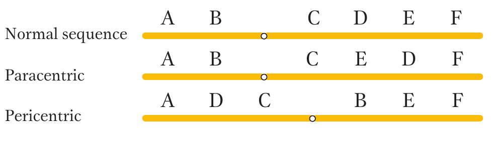
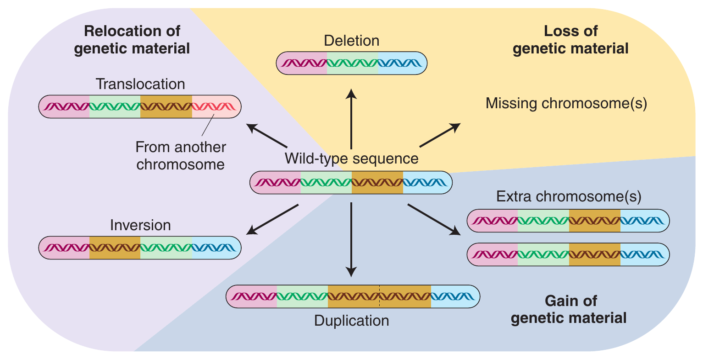

# Mutation, chromosomal aberrations and transposable genetic elements

## Mutation

- Discovery of the mutagentic effects of X-rays on the fruit fly (Drosophila) by H. Muller in the 1920s.
- In 1928, H. Stubbe demonstrated the use of mutagenesis in producing mutants in tomatoes, soybeans, and other crops.
- In terms of origin, mutations may be spontaneous (natural) or induced (artificial, with the aid of agents). 
- Spontaneous mutations arise at the very low rate of about 10-5 or 10-6 per generation for most loci in most organisms. This translates to 1 in 100, 000 or 1 in 1, 000, 000 gametes that may carry a newly mutated allele at any locus. They are caused by mistakes in molecular processes associated with the replication of DNA, recombination, and nuclear division.

### Types of Mutation

- On the basis of structural change produced:
  - Ploidy variation:
    - changes in chromosome number (grain or loss in complete sets of chromosomes or parts of a set).
  - Chromosome structure variation
    - changes in chromosome structure (e.g., duplications of segments, translocation of segments).
  - Gene mutation
    - changes in nucleotide constitution of DNA (by deletion or substitution).
- On the basis of origin:
  - Nuclear DNA or chromosomes, or 
  - Extra-nuclear (cytoplasmic) genetic systems.
- On the basis of function:
  - Mutations that convert the wild type (the common phenotype) to the mutant form (the rare phenotype) are called forward mutations, while those that change a mutant phenotype to wild phenotype are called reverse mutations.

### Forward and backward mutation

- Forward mutations are more common than reverse mutations.
- Recessive mutations are the most common types of mutations; However, recessive alleles in a diploid are expressed only when they are in homozygous state.
- Consequently, an organism may accumulate a genetic load (the sum of deleterious genes that are carried, mostly hidden, in the genome and may be transmitted to descendants)
- Induced versus Spontaneous Mutation:
  - Spontaneous mutations produce novel alleles for the evolutionary process. These are carried over in a series of evolutionary process.
  - Mutagenesis can used to create new alleles that can be incorporated to existing cultivars under guidance of artificial selection.
  - The frequency of spontaneous mutation is low.

### Somatic and gametic mutation

- On the basis of cell type:
  - *Gametic mutations* are heritable from one generation to the next and expressed in the entire plant.
  - *Somatic mutations* affect only a portion of plant thus resulting in a condition called chimera (Chimera consists of two genetically distinct tissues).
- It is also well known that cells at the G2 (gap phase) and M (mitosis) stages are more sensitive to radiation than those at the G1 and S (synthesis) stages.
- What happens in tillering species?
- Why is commercial use of chimera not feasible?

### Recessive and dominant mutation

- On the basis of functional expression:
  - Recessive mutation. change of a dominant allele to a recessive allele (A $\rightarrow$ a).
  - Dominant mutation. change of a recessive allele to a dominant allele (a $\rightarrow$ A).
- In open pollinated species, mutant alleles may be accumulated without much adverse effects. However, upon Inbreeding leads to depression.
- Why using recessive genes in breeding takes a longer time?

## Gene mutation and types

- Gene mutations entails a change in the nucleotide constitution of the DNA sequence, adding or deleting nucleotides.
- DNA consists of four bases: A-T, C-G.

**Transition**

- Mutation by transition entails the conversion of one purine base to another purine (or a pyrimidine to another pyrimidine).
- Consequently, one normal base pair is converted to another pair, that is genetically incorrect.

**Transversion**

- Involves the substitution of a purine by a pyrimidine and vice versa.
- Chemical mutagen such as NO has been known to cause deamination of adenine to hypoxanthin, cytosine or uracil and guanine to xanthine.

**Tautomeric shift**

- It is known that each of the bases of DNA can exist in rare states as a result of the redistribution of electrons and protons in the molecules, events called tautomeric shifts.

```{r point-mutation-types, out.width="55%", fig.cap="Point mutations within the coding region of a gene vary in their effects on protein function. Proteins with synonymous and missense mutations are usually still functional."}
# pdftools::pdf_convert("../../literatures/textbooks/Introduction to Genetic Analysis/Griffiths - An Introduction to Genetic Analysis 11th Edition c2015.pdf",
#                       pages = 609,
#                       dpi = 300, format = "png",
#                       filenames = "../images/point_mutation_type.png")

knitr::include_graphics("./images/point_mutation_type.png")
```

**Effect of base analogue**

- Certain analogues of the naturally occurring bases in the DNA molecule have been shown to have mutagenic effects. For example, the natural base thymine (T), a 5-methyluracil, has a structural analog, 5-bromouracil (5-BU). The two bases are so similar that 5-BU can substitute for T during replication, leading to base pair transition.

**Functional or non-functional changes in protein due to base changes**

- Silent mutation: Because the genetic code is degenerate (one amino acid can be coded by more than one triplet), a change from ACG $\rightarrow$ CGG has no effect as both triplets code for arginine.

- Neutral mutation: This kind of mutation involves an altered triplet code that codes for a different but chemically equivalent amino acid. For example, CAC may change to CGC, altering histidine to a chemically equivalent amino acid, arginine. The change causes a change in the primary structure of the protein (amino acid sequence) but the form of the resultant protein may be unchanged.

- Missense mutation: Unlike neutral mutations, a missense mutation results when an altered triplet codes for a different amino acid. Not all missense mutations lead to appreciable protein changes. For example, an amino acid may be replaced by another of very similar chemical properties, thereby altering the structure without impacting its normal function (a neutral mutation). Also, the amino acid substitution could occur in a region of the protein which does not significantly affect the protein secondary structure or function. On the other hand, some missense mutations have devastating consequences. For example, in hemoglobin of humans, a change of GAG (Glu) to GTG (Val) results in serious consequences (sickle cell anemia). 

- Nonsense mutation: A nonsense mutation causes an existing amino acid to be changed to a stop codon (e.g., TAA, TAG), resulting in premature termination of protein synthesis.

**Frame shift mutation**

- **Insertion–deletion** mutations (indels) may cause significant changes in the amino acid composition of a protein, and hence in its function.
- For example, GAG-CCG-CAA-CTT-C (corresponding to Glu-Pro-Glu-Leu) may be altered by deletion of G that shifts the reading frame to the right by one nucleotide to produce AGC-CGC-AAC-TTC (corresponding to Ser-Arg-Asi-Phe).
- Frameshift mutations typically result in complete loss of normal protein structure and function.

## Genomic mutation

- Errors in cell division resulting from disorders in the spindle mechanism may result in improper distribution of chromosomes to daughter cells. 
- Such errors may cause some cell division products to inherit more or less of the normal chromosome number. These errors, called chromosomal mutations, are of two main kinds: 
  - euploidy (cells inherit additional complete set of the basic chromosome set – n) and 
  - aneuploidy (certain chromosomes are missing from the basic set or added to the set in some cell division products).

- Changes in chromosome number are of two basic types: 
  - changes in whole chromosome sets, resulting in a condition called aberrant **euploidy**, and 
  - changes in parts of chromosome sets, resulting in a condition called **aneuploidy**.


```{r ploidy-variation}
ploidy <- tribble(
  ~"Ploidy", ~"Name", ~"Designation", ~"Constitution", ~"Number of chromosomes",
  "Euploids", "Monoploids", "n", "ABC", 3, 
  "Euploids", "Diploids", "2n", "AABBCC", 6,
  "Euploids", "Triploids", "3n", "AAABBBCCC", 9, 
  "Euploids", "Tetraploids", "4n", "AAAABBBBCCCC", 12,
  "Aneuploids", "Monosomic", "2n-1", "ABBCC", 5, 
  "Aneuploids", "Monosomic", "2n-1", "AABCC", 5,
  "Aneuploids", "Monosomic", "2n-1", "AABBC", 5,
  "Aneuploids", "Trisomic", "2n+1", "AAABBCC", 7,
  "Aneuploids", "Trisomic", "2n+1", "AABBBCC", 7,
  "Aneuploids", "Trisomic", "2n+1", "AABBCCC", 7
) 

# ploidy %>% write_csv("./../data/ploidy_states.csv", "")

ploidy %>% 
  kable(booktabs = TRUE, caption = "Chromosome Constitutions in a Normally Diploid Organism with Three Chromosomes (Identified as A, B, and C) in the Basic Set") %>% 
  kableExtra::kable_styling(position = "center", font_size = 6, latex_options = "striped") %>% 
  kableExtra::collapse_rows(columns = 1:2, valign = "top", latex_hline = "major")
```


```{r genomic-mutation-cause, out.width="60%", fig.cap="Trisomy or triploidy as a major cause of genomic mutation. The three homologous chromosomes of a triploid may pair in two ways at meiosis, as a trivalent or as a bivalent plus a univalent."}
# pdftools::pdf_convert("../../literatures/textbooks/Introduction to Genetic Analysis/Griffiths - An Introduction to Genetic Analysis 11th Edition c2015.pdf",
#                       pages = 647,
#                       dpi = 300, format = "png",
#                       filenames = "../images/triploidy_trisomy_causes_mutation.png")


```

### Euploidy

- Organisms with multiples of the basic chromosome set (genome) are referred to as euploid.
- Polyploids are individual organisms that have more than two chromosome sets. They can be represented by 3n (triploid), 4n (tetraploid), 5n (pentaploid), 6n (hexaploid), and so forth.
- An individual member of a normally diploid species that has only one chromosome set (n) is called a monoploid to distinguish it from an individual member of a normally haploid species (also n).
- In most species monoploid zygotes fail to develop (Male bees, wasps and ants are the exception), this is because virtually all members of diploid species carry genetic load.
- Polyploids are often larger and have larger component parts than their diploid relatives.
- **Autopolyploids** have multiple chromosome sets originating from within one species. 
- **Allopolyploids** have sets from two or more different species
- Allopolyploids have **homeologous** chromosomes while autopolyploids have **homologous** chromosomes.
- Polyploids with odd numbers of chromosome sets, such as triploids, are sterile or highly infertile because their gametes and offspring are aneuploid.
- Autotetraploids arise by the doubling of a 2n complement to 4n. This doubling can occur spontaneously, but it can also be induced artificially by applying chemical agents that disrupt microtubule polymerization

```{r colchicine-polyploidy, out.width="75%", fig.cap="Colchicine may be applied to generate a tetraploid from a diploid. Colchicine added to mitotic cells during metaphase and anaphase disrupts spindle-fiber formation, preventing the migration of chromatids after the centromere has split. A single cell is created that contains pairs of identical chromosomes that are homozygous at all loci."}
# pdftools::pdf_convert("../../literatures/textbooks/Introduction to Genetic Analysis/Griffiths - An Introduction to Genetic Analysis 11th Edition c2015.pdf",
#                       pages = 648,
#                       dpi = 300, format = "png",
#                       filenames = "../images/colchicine_treatment_polyploidy.png")

knitr::include_graphics("./images/colchicine_treatment_polyploidy.png")
```


- The prototypic allopolyploid was an allotetraploid synthesized by Georgi Karpechenko in 1928. 
- He wanted to make a fertile hybrid that would have the leaves of the cabbage (Brassica) and the roots of the radish (Raphanus), because they were the agriculturally important parts of each plant. 
- Each of these two species has 18 chromosomes, and so $2n_1=2n_2 = 18$, and $n_1 = n_2 = 9$. The species are related closely enough to allow intercrossing. Fusion of an n1 and an n2 gamete produced a viable hybrid progeny individual of constitution $n_1 + n_2 = 18$. However, this hybrid was functionally sterile because the 9 chromosomes from the cabbage parent were different enough from the radish chromosomes that pairs did not synapse and segregate normally at meiosis, and thus the hybrid could not produce functional gametes.


```{r origin-of-raphanobrassica, out.width="85%", fig.cap="In the progeny of a cross of cabbage (Brassica) and radish (Raphanus), the fertile amphidiploid arose from spontaneous doubling in the 2n = 18 sterile hybrid."}
# pdftools::pdf_convert("../../literatures/textbooks/Introduction to Genetic Analysis/Griffiths - An Introduction to Genetic Analysis 11th Edition c2015.pdf",
#                       pages = 649,
#                       dpi = 300, format = "png",
#                       filenames = "../images/raphanobrassica_hybrid.png")

knitr::include_graphics("./images/raphanobrassica_hybrid.png")
```


```{r origin-of-brassica, out.width="80%", fig.cap="Allopolyploidy is important in the production of new species. In the example shown, three diploid species of Brassica (light green boxes) were crossed in different combinations to produce their allopolyploids (tan boxes). Some of the agricultural derivatives of some of the species are shown within the boxes."}
# pdftools::pdf_convert("../../literatures/textbooks/Introduction to Genetic Analysis/Griffiths - An Introduction to Genetic Analysis 11th Edition c2015.pdf",
#                       pages = 650,
#                       dpi = 300, format = "png",
#                       filenames = "../images/origin_three_allopolyploid_brassica.png")


```


### Aneuploidy

- Aneuploidy is the second major category of chromosomal aberrations in which the chromosome number is abnormal.
- Generally, the aneuploid chromosome set differs from the wild type by only one chromosome or by a small number of chromosomes.
- Aneuploid nomenclature is based on the number of copies of the specific chromosome in the aneuploid state. 
- For autosomes in diploid organisms, the aneuploid $2n+1$ is trisomic, $2n-1$ is monosomic, and $2n-2$ (the "-2" represents the loss of both homologs of a chromosome) is nullisomic.
- In haploids, n + 1 is disomic.
- Special notation is used to describe sex-chromosome aneuploids because it must deal with the two different chromosomes. The notation merely lists the copies of each sex chromosome, such as XXY, XYY, XXX, or XO (the 'O' stands for absence of a chromosome).
- Aneuploid organisms result mainly from nondisjunction in a parental meiosis.

## Changes in chromosome structure/Chromosome rearrangements

### Chromosomal rearrangements occur due to breakage and rejoin

- Each chromosome is a single double-stranded DNA molecule.
- The first event in the production of a chromosomal rearrangement is the generation of two or more double-stranded breaks in the chromosomes of a cell.
- Double-stranded breaks are potentially lethal, unless they are repaired.
- Repair systems in the cell correct the double-stranded breaks by joining broken ends back together.
- If the two ends of the same break are rejoined, the original DNA order is restored. If the ends of two different breaks are rejoined, one result is one or another type of chromosomal rearrangement.
- The only chromosomal rearrangements that survive meiosis are those that produce DNA molecules that have one centromere and two telomeres. If a rearrangement produces a chromosome that lacks a centromere, such an (**acentric chromosome**) will not be inherited. If a rearrangement produces a chromosome with two centromeres (**dicentric chromosome**), such chromosome will be pulled simultaneous to opposite poles at anaphase, forming anaphase bridge. These will not be incorporated into either progeny cell. If a chromosome lacks telomere, it cannot replicate properly.
- If rearrangement duplicates or deletes a segment of chromosome, gene balance may be affected. Larger abberation will cause pronounced phenotypic abnormalities.


```{r four-chromosomal-rearrangements, out.width="80%", fig.cap="Each of the four types of chromosomal rearrangements can be produced by either of two basic mechanisms: chromosome breakage and rejoining or crossing over between repetitive DNA. Chromosome regions are numbered 1 through 10. Homologous chromosomes are the same color."}
# pdftools::pdf_convert("../../literatures/textbooks/Introduction to Genetic Analysis/Griffiths - An Introduction to Genetic Analysis 11th Edition c2015.pdf",
#                       pages = 661,
#                       dpi = 300, format = "png",
#                       filenames = "../images/chromosomal_rearrangements.png")

knitr::include_graphics("./images/chromosomal_rearrangements.png")
```

### Inversion types

```{r inversion-types, out.width="60%", fig.cap="Inversions are of two basic types. If the centromere is outside the inversion, the inversion is said to be paracentric. Inversions spanning the centromere are pericentric."}
# pdftools::pdf_convert("../../literatures/textbooks/Introduction to Genetic Analysis/Griffiths - An Introduction to Genetic Analysis 11th Edition c2015.pdf",
#                       pages = 668,
#                       dpi = 300, format = "png",
#                       filenames = "../images/inversion_types.png")


```


```{r paracentric-inversion, out.width="56%", fig.cap="Paracentric inversion can lead to deletion types"}
# pdftools::pdf_convert("../../literatures/textbooks/Introduction to Genetic Analysis/Griffiths - An Introduction to Genetic Analysis 11th Edition c2015.pdf",
#                       pages = 670,
#                       dpi = 300, format = "png",
#                       filenames = "../images/paracentric_inversion.png")

knitr::include_graphics("./images/paracentric_inversion.png")
```


```{r pericentric-inversion, out.width="80%", fig.cap="Pericentric inversion can lead to deletion-duplication products"}
# pdftools::pdf_convert("../../literatures/textbooks/Introduction to Genetic Analysis/Griffiths - An Introduction to Genetic Analysis 11th Edition c2015.pdf",
#                       pages = 671,
#                       dpi = 300, format = "png",
#                       filenames = "../images/pericentric_inversion.png")

knitr::include_graphics("./images/pericentric_inversion.png")
```


## Chromosomal aberrations

- Gene mutations are never detectable microscopically. In contrast, many chromosome mutations can be detected by microscopy, by genetic or molecular analysis, or by a combination of all techniques.
- Chromosome mutations can be divided into:
  - Changes in chromosome number
  - Changes in chromosome structure
- Changes in chromosome number are not associated with structural alterations of any of the DNA molecules of the cell.

### Significance of chromosomal aberrations

- They can be sources of insight into how genes act in concert on a genomic scale
- They reveal several important features of meiosis and chromosome architecture
- They constitute useful tools for experimental genomic manipulation
- They are sources of insight into evolutionary processes
- Chromosomal mutations are regularly found in humans, and some of these mutations cause genetic disease.
- Plant breeders have routinely manipulated chromosome number to improve commercially important agricultural crops


```{r chromosomal-aberration-types, out.width="65%", fig.cap="The illustration is divided into three colored regions to depict the main types of chromosome mutations that can occur: the loss, gain, or relocation of entire chromosomes or chromosome segments. The wild-type chromosome is shown in the center."}
# pdftools::pdf_convert("../../literatures/textbooks/Introduction to Genetic Analysis/Griffiths - An Introduction to Genetic Analysis 11th Edition c2015.pdf",
#                       pages = 645,
#                       dpi = 300, format = "png",
#                       filenames = "../images/types_of_chromosome_mutations.png")


```

## Mutagenic agents

### Physical mutagens

- The principal physical mutagens are ionizing radiations. 
- X-rays were first to be used to induce mutations. Since then, various subatomic particles (neutrons, protons, beta particles, alpha particles)
- Gamma radiation from radioactive cobalt (60Co) is widely used. It is very penetrating and dangerous.
- The relative biological effectiveness (RBE) of fast neutrons is higher than for gamma rays and X-rays.
- The dosage of radiation is commonly measured in Roentgen (r or R) units.
- The exposure may be chronic (continuous low dose administered for a long period) or acute (high dose over a short period).
- The radiation energy is transferred directly or indirectly to the DNA in cells through physical and chemical processes (collision, excitation, and ionization), causing damage to the cellular components that can generate erroneous base replacements during reconstitution, changing the genetic code and causing mutations. 
- Ultraviolet rays exhibit less penetration power and are used only for the treatment of single cells or small cell clusters.

### Chemical mutagens

- Chemical mutagens are generally milder in their effect on plant material. 
- They can be applied without complicated equipment or facilities. The ratio of mutational to undesirable modifications is generally higher for chemical mutagens than for physical mutagens. 
- Usually, the material is soaked in a solution of the mutagen to induce mutations. 
- Chemical mutagens are generally carcinogenic and must be used with great caution. 
- One of the most effective chemical mutagenic groups is that of alkylating agents (they react with the DNA by alkylating the phosphate groups as well as the purines and pyrimidines).
- Another group is the base analogues (they are closely related to the DNA bases and can be wrongly incorporated during replication); examples are 5-bromouracil and maleic hydrazide. 
- sodium azide ($NaN_3$), which inhibits the activity of cellular respiration enzymes;
- antibiotics (streptomycin, mitomycin C, and actinomycin D), which cause chromosomal breaks;
- Other chemical mutagens commonly used are ethyl methane sulfonate (EMS) and diethylsulfonate (DES). 
- The half-life (time taken for degradation of half the initial amount of alkylating agent) for EMS in water is about 93 hours at $20.8^\circ C$ but only 10 hours at $37.8^\circ C$.
- Mutation breeding programs examine large segregating populations to increase the chance of finding the typically rare desirable mutational events. An efficient method of screening should be developed for a mutation breeding program. Proper choice of mutation and method of treatment. Mutagens, as previously discussed, vary in various properties including source, ease of use, penetration of tissue, and safety. Some are suitable for soft tissues, whereas others are suited to hard tissue.

## Transposable genetic elements/Jumping genes

- The phenomenon of transposable elements (genes with the capacity to relocate within the genome), creates new variability.
- Transposable genetic elements (transposable elements, **transposons**, or "jumping genes") are known to be nearly universal in occurrence. 
- These mobile genetic units relocate within the genome by the process called **transposition**. 
- The presence of transposable elements indicates that genetic information is not fixed within the genome of an organism. 
- Barbara McClintock, working with corn in the 1940s, was the first to detect transposable elements, which she initially identified as controlling elements (20 years ahead of the discovery of transposable elements in prokaryotes). 
- Controlling elements may be grouped into families. The members of each family may be divided into two classes: autonomous elements or non-autonomous elements. 
- **Autonomous elements** have the ability to transpose whereas the non-autonomous elements are stable (but can transpose with the aid of an autonomous element through **trans-activation**).
- McClintock studied two mutations: dissociation ( _Ds_) and activator ( _Ac_). The _Ds_ element is located on chromosome 9. 
- _Ac_ is capable of autonomous movement, but _Ds_ moves only in the presence of _Ac_. 
- _Ds_ has the effect of causing chromosome breakage at a point on the chromosome adjacent to its location (Figure \ref{fig:jumping-genes}). 
- The _Ac_ element has an open reading frame. 
- The activities of corn transposable elements are developmentally regulated. That is, the transposable elements transpose and promote genetic rearrangements at only certain specific times and frequencies during plant development. 
- Transposition involving the _Ac_-_Ds_ system is observed in corn as spots of colored aleurone. 
- A gene required for the synthesis of anthocyanin pigment is inactivated in some cells whereas other cells have normal genes, resulting in spots of pigment in the kernel (genetic mosaicism).


```{r jumping-genes, fig.cap="New phenotpyes in corn are produced through the movement of the \\textit{Ds} transposable element on chromosome 9. (a) A chromosome fragment is lost through breakage at the \\textit{Ds} locus. Recessive alleles on the homologous chromosome are expressed, producing the colorless sector in the kernel. (b) Insertion of Ds in the gene (top) creates colorless corn kernel cells. Excision of \\textit{Ds} from the \\textit{C} gene through the action of \\textit{Ac} in cells and their mitotic decendents allow color to be expressed again, producing the spotted phenotype.", out.width="60%"}
# pdftools::pdf_convert("../../literatures/textbooks/Introduction to Genetic Analysis/Griffiths - An Introduction to Genetic Analysis 10th Edition.pdf",
#                       pages = 552,
#                       dpi = 300, format = "png",
#                       filenames = "../images/maize_transposable_elements.png")


```


```{r te-phenotypes, fig.cap="Phenotypes produced by transposable genetic elements in maize."}
# pdftools::pdf_convert("../../literatures/textbooks/Introduction to Genetic Analysis/Griffiths - An Introduction to Genetic Analysis 10th Edition.pdf",
#                       pages = 553,
#                       dpi = 300, format = "png",
#                       filenames = "../images/maize_te_phenotypes.png")


```
