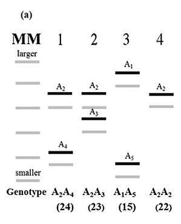

# Recent advances, techniques and in plant breeding

## Marker assisted selection

Individual genes contributing to complex plant traits can sometimes be discovered through their association with genetic markers^[Plant Biotechnology and Genetics: Principles, Techniques and Applications, edited by C. Neal Stewart, Jr. (Chapter 3, pp. 68)]. This procedure, called QTL analysis, provides the foundation for a more efficient type of genetic selection called MAS (Figure \ref{fig:mas-scheme}).

Rather than selecting traits, which are the outcome of many genes, MAS is based on selecting specific alleles at marker loci that are known to be linked to the genes that cause the desired trait. The theoretical advantages of MAS are that it,

(a) Avoids errors caused by environmental variance;
(b) Can be applied at a juvenile stage before a trait is expressed;
(c) Can be applied on a single plant, whereas phenotypic selection of some traits might require seed or tissue from many plants to be effective;
(d) may be less expensive than phenotypic selection (in terms of cost incurred in allotting field for phenotype testing and the time factor).

Although MAS does not replace the requirement for parent selection, sexual recombination, and breeding strategies, it can significantly increase the efficiency by which superior genotypes are selected.

The theoretical advantages of MAS may not always be relevant, and it is often argued that phenotypic selection is faster and cheaper than MAS for many traits. Some of the factors that can limit the effectiveness (or possibility) of using MAS include

a. Some breeding facilities lack the equipment and people trained to apply MAS
b. Incomplete linkage between a marker and a target QTL may reduce the effectiveness of MAS
c. The marker must be polymorphic on the parents, and
d. MAS is effective only if the alleles being selected are important relative to other alleles in the population.

The last factor is the key to the success or failure of every MAS application. It may seem like an obvious statement, but MAS relies on the ability to predict the value of alleles. The quality of those predictions rests on many factors, but a key factor is the behavior of an allele in the presence of other alleles and other physical environments where it has not yet been tested. For example, a breeder might identify that allele $A_1$ at locus A has a positive effect on yield. But this prediction would be made in a limited set of environments, and with a limited set of germplasm. A breeder who crossed a parent containing allele $A_1$ with a new parent containing allele $A_4$, and selected for $A_1$ using a linked marker, might never discover that allele $A_4$ is actually better than allele $A_1$, or perhaps that allele $A_1$ causes plants to be susceptible to a disease that was not present when $A_1$ was first characterized. For these reasons, MAS should never be applied independently from phenotypic selection.

```{r mas-scheme, fig.cap="A simplified strategy for marker-assisted selection (MAS). Here, a significant association between a QTL (Q) and a molecular marker allele (M) is identified in an experimental population. This information is applied in future populations in order to select Q indirectly through its linkage to M."}

```

### Characteristics of molecular markers and their genomic applicability in plant breeding programs

```{r marker-characteristics}
tribble(
  ~"Techniques", ~"Technical principles", ~"Recommendations from applications", ~"Advantages", ~"Disadvantages",
  "RFLP", "Restriction enzyme digestion of DNA followed by electrophoresis and binding with specific probes", "Isolation of regions of interest; Genetic mapping; Genotyping", "High specificity of hybridization probes to loci of interest", "Technical and operational difficulties, requiring professional skills",
  "RAPD", "Random amplification of sequences located between pairs of 10 bp primers", "Genotyping; Genetic mapping", "Application ease", "Low reproducibility between laboratories",
  "SSR", "Amplification of regions with repetitive sequences of DNA", "MAS; Genotyping; Genetic mapping", "After the identification of polymorphism, available for use", "Require knowledge of the regions that are intended to discriminate",
  "AFLPs", "Restriction enzyme genome digestion, connection of adapters, and PCR primers with selective bases at two stages of amplification", "Genetic mapping; Genotyping requires large number of molecular markers", "Greater capacity of generating loci randomly distributed throughout genome; Generation of secondary marker for application in MAS", "High cost of implementation; Need for efficient PCR technology",
  "SCARs", "Amplification of a polymorphic region derived from a molecular marker (secondary marker)", "Positional cloning; MAS", "High discriminatory power of polymorphic sequences; Reproducibility; Operability", "Dependent on primary marker",
  "CAPs", "Fragmentation of the sequence of a marker and reamplification", "Specific genotyping; MAS", "Possibility to better discriminate the polymorphic locus", "Dependent on primary marker"
) %>% 
  knitr::kable(caption = "Molecular markers and the associated techniques, advangates and limitations", booktabs = TRUE) %>% 
  kableExtra::kable_styling(latex_options = "striped")
```

## PCR technology and PCR based markers

- An in vitro technique that enables DNA fragments to be copied in a process that is referred to as *amplification*.
- Usefulness is because sufficient DNA can be generated to characterize and analyze it.
  - e.g.: tracking disease processes by characterizing genetic fingerprints of pathogenic organisms
- The polymerase chain reaction makes copies of dissociated DNA or single - stranded copies of mRNA.

### Steps

- Denaturing of the target sequence so that the polynucleotide is in a single stranded, unwound form. For DNA, this requires a temperature of \SIrange{94}{96}{\celsius} for 5 min.
- Hybridization so that the primers bind to complementary bases that flank the regions on either side of the polynucleotide of interest. This step requires about 30 s and is carried out at \SIrange{30}{65}{\celsius}.
- Polymerization (i.e., polynucleotide or DNA synthesis) by DNA polymerase. The enzyme reads the template strand between the flanking primers, and matches the bases with complementary ribonucleotides, which are then incorporated into the primer strand. This is carried out at \SIrange{72}{80}{\celsius} for several minutes at pH = 8.4 in Tris buffer containing ribonucleotides representing all 4 bases (A, G, C, T).

```{r pcr-steps, fig.cap="Graphical representation of amplifying a target DNA sequence through the polymerase chain reaction (PCR) [reproduced from Brown (2006), Fig. 9.2] .", out.width="52%"}

knitr::include_graphics("./images/pcr_steps.png")
```

### Ingredients: Thermally tolerant DNA polymerase

- Polymerase from the thermophilic bacterium _Thermus aquaticus_ resolved issues of specificity and speed. 
- _T. aquaticus_ (abbreviated _Taq_) is found in hotsprings and grows at \SI{75}{\celsius}. Its enzyme has an optimum temperature of \SI{72}{\celsius} and is sufficiently stable at \SI{96}{\celsius} so that fresh Taq enzyme does not need to be added after each cycle.
- Taq polymerase allows primer annealing and extension to be carried out at temperatures significantly higher than those for E. coli polymerase. This reduces imperfect annealing and subsequent amplification of an imperfect (nonspecific) product.
- This enabled researchers to design and build automated PCR machines, and thereby accelerated the rapid application of this technology.

### Classic protocol and methodology

**Classic protocol**(Watson et al. ( 1992, p. 8))

The standard PCR is typically done in a 50 - or 100 $\mu l$ volume and, in addition to the sample DNA, contains 50 mM KCl, 10 mM Tris/HCl (pH 8.4 at room temp.), 1.5 mM MgCl 2, 100 $\mu$g/ml gelatin, 0.25 $\mu$M of each primer, 200 $\mu$M of each deoxynucleotide triphosphate (dATP, dCTP, dGTP, and dTTP), and 2.5 units of Taq polymerase. The type of the DNA sample will be variable but it will usually have between $10^2$ to $10^5$ copies of the template (e.g., 0.1 $\mu$g DNA). A few drops of mineral oil are often added to seal the reaction and prevent condensation ... The amplification can be conveniently performed in a DNA Thermal Cycler (Perkin -Elmer Instruments) using the "Step-Cycle" program set to denature at \SI{94}{\celsius} for 20 sec, anneal at \SI{55}{\celsius} for 20 sec, and extend at  \SI{72}{\celsius} for 30 sec for a total of 30 cycles. (The "Step-Cycle" program causes the instrument to heat and cool to the target temperatures as quickly as possible. In the current instrument, this results in a heating rate of about  \SI{0.3}{\celsius} per sec and a cooling rate of about \SI{1}{\celsius} per sec, for an overall single cycle time of approximately 3.75 min).

- A sequence of a small stretch of nucleotides on either side of the target must be known, these flanking sequences are then used to specify and synthesize single-stranded oligonucleotide fragments, or primers (~20 bp).
- A mixture of the template sequence (primers), Taq polymerase, triphosphorylated deoxyribonucleotides, and buffer then doubles the amount of DNA each cycle.
- The amount of DNA is doubled during each cycle, with n cycles producing $2^n$ as present to begin with.
- Rate of misincorporation: 1 base out of 10,000 - 1 base out of 200,000 per PCR cycle.
- This limitation was overcome for sequencing long fragments of genomic DNA through use of in vivo DNA amplification using yeast or BACs.

### Applications

- Detection of pathogenic microorganisms ( _H. pylori_, tuberculosis, chlamydia, viral meningitis, viral hepatitis, AIDs, etc.)
- Disease epidemiology and forcasting.
- Crime detection and forensic application.
- Crop variety characterization by DNA fingerprinting.

**PCR based markers**

### Microsatellite (SSR, STR) marker

- They are repeated sequences that occur in tandem and vary from 1 to 6 base pairs (bp) in length.
- Classified based on size, type of repeat unit, location within genome.
- Abundant and well distributed in eukaryotic genome.
- Distinguished by wide variations in repeat number resulting from dynamic and complex mutagenic events such as unequal crossing over, retrotransposition, and DNA polymerase slippage.
- Use as molecular markers is possible due to the great polymorphism of repeatitive regions resulting from mutagenic events coupled with the fact that the DNA sequences flanking these repetitions are normally preserved between individuals of the same species. This feature allows the design of specific primers (20-30 bp in length) for the sequence adjacent to the polymorphic microsatellite, so that it is possible to amplify this region by means of a PCR reaction.
- Microsatellite constitutes a highly variable multi-allelic genetic locus that has high information content because it permits differentiation between homozygous and heterozygous loci/organism (codominant expression).
- Used mostly in genetic mapping studies, in identification of QTL (Quantitive trait loci), in diversity studies, in germplasm banks, in MAS, and more recently in genome wide selection.
- A major setback with use of SSR is the need to isolate and develop markers specific to each species.

```{r ssr-marker-genetic-basis}

```

```{r ssr-marker-genetic-basis-inference, fig.cap="Allele identification for a microsatellite locus of a diploid organism from bands in a polyacrylamide or agarose gel. After obtaining the data set by gel or capillary electrophoresis, the next step is the determination of the genotype of each individual. For this, following gel electrophoresis various sizes of the alleles are converted into numerical units or labels (1, 2, ..., 5)"}

```


### AFLP marker

The technique for using these markers consists essentially of four steps and is based on selective amplification of a subset of genomic fragments generated after digestion of genomic DNA with restriction enzymes. This technique combines universal applicability with high discriminatory power and reproducibility, making it an important tool in genetic studies of crops that have low rates of DNA polymorphism.

```{r aflp-marker-genetic-basis, fig.cap="Diagram representing the AFLP marker technique, which involves four basic steps. (A) DNA digestion, (B) ligation of specific adapters; (C) fragment selection via PCR; and (D) gel electrophoresis for visualizing polymorphisms.", out.width="80%"}

```

### DArT marker

```{r dart-marker-genetic-basis, fig.cap="DArT marker technique. (A) The genomic DNA pool is cleaved by restriction enzymes. The resulting fragments are linked to adapters and amplified by PCR using selective primers. Fragments of the genomic representation are cloned, purified, and arrayed on a solid support, forming the diversity panel. (B) The DNAs of the individuals to be genotyped are subjected to complexity reduction using the same methodology used to obtain the genomic representation. The fragments are labeled with fluorescent dyes and used as probes for hybridization in the diversity panel. A fragment of the vector labeled with another fluorescent dye serves as a reference in the hybridization. (C) For some species, another panel, the genotyping array, is built before making the genotyping of the population. This allows the DNA of some individuals belonging to the DNA pool to be used as a probe and hybridized in the diversity panel. Clones that present polymorphism are arrayed in a new solid support, and this array is used to analyze all the individuals of the population.", out.width="80%"}

```

### Progression of molecular and marker based technologies in plant breeding

```{r molecular-markers-development, fig.cap="Methodologies of genetics; molecular markers and researchers who contributed to the generation of new technologies with application in plant breeding.", out.width="90%"}

```

